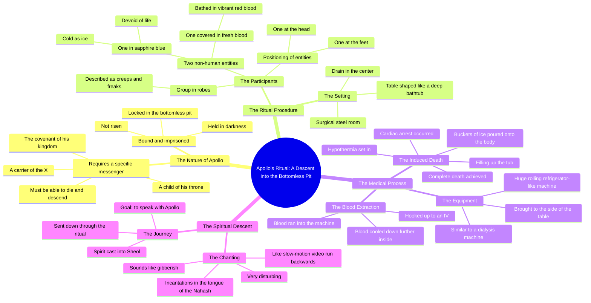

# Speaking With Apollo Using Tech to Reach the Underworld

> 🌐 **Read this in:** [English](../../en/2026-08/tiktok-transcript-7-2k-views-32k-reactions-speaking-with-the-god-apollo-using-f166.md) · **中文**

> **Creator:** [@The Confessionals](https://www.tiktok.com/@The Confessionals) · **Views:** 993.3K · **Posted:** 2026-08-11 · **Niche:** entertainment
>
> **TL;DR:** Immediately subverts a familiar myth, creating intrigue and a promise of hidden knowledge.

[Watch original video →](https://www.facebook.com/share/r/1c47Dkcydz/?mibextid=wwXIfr)

## Why This Went Viral

## 钩子（前3秒）
- **逐字开场白：**“阿波罗有一种截然不同的方式，因为他仍被束缚着。他并未复活。”
- **钩子模式：**大胆断言 + 神话对比（“仍被束缚”与隐含的“复活”——直指基督教复活意象的讽刺）。
- **为何能让人停下滚动：**第一句话就抛出一个具体而冷门的名字（阿波罗），并附上神学反转。观众瞬间心想：“等等，他刚才说了什么？”——这种认知摩擦触发回放，并让人想听完整段背景。

## 情绪节奏
- **节拍：**困惑（神话断言）→ 好奇（“X的载体”条件）→ 不安（手术钢、长袍、“怪胎、异类”）→ 恐惧（浑身是血的身影）→ 震惊（宝蓝色、“冷如冰”的身影）→ 紧张飙升（透析机 + 冰桶）→ 恐怖（低体温症 → 心脏骤停 → “他们把血抽了出来”）→ 高潮：“他们用这个仪式把我的灵魂打下界，去和阿波罗对话。”
- **悬念点：**对浑身是血的实体的描述——“他不是人，不像其他那些”——打破了世俗仪式的框架，暗示某种超自然的存在。
- **高潮：**死亡瞬间和被“投入阴间”——整个故事是一个缓慢铺垫，最终导向与异教神祇面对面的濒死体验。
- **共鸣：**最后一句将恐怖与目的相连——“去和他说话”——让这场折磨看起来像一次使命，而非单纯的酷刑。

## 关键词密度
1. **血**（6次以上）——驱动本能性的、算法层面的“冲击价值”和高互动（评论、分享）。
2. **阿波罗**（3次）——小众神话关键词，吸引神秘学/宗教好奇类搜索。
3. **无底坑 / 阴间**（3次）——圣经 + 冥界语言，激发评论区宗教争论。
4. **死亡 / 死去 / 心脏骤停**（3次）——高情绪词汇，推动“这是真的吗？”的讨论。
5. **仪式 / 咒语**（2次）——神秘学关键词密度，迎合暗黑内容算法。
6. **浑身是血 / 浸在血中**（2次）——画面感极强的意象，增加观看时长（人们会回拉去想象画面）。
7. **不是人**（2次）——超自然钩子，制造好奇心缺口。

**算法驱动词：**血、死亡、仪式——这些是高留存恐怖关键词。
**情绪牵引：**阿波罗、阴间、“X的载体”——这些营造出一种秘传知识的氛围，让观众觉得自己被引入了一个隐藏真相。

## 为何能传播
- **“秘传知识”框架：**讲述者将故事包装成内部信息（“你必须成为X的载体”）——这让观众感到被赋予特权，并倾向于分享以显示自己“知情”。
- **层层递进的视觉具体性：**从“手术钢房间”到“五加仑血”再到“滚动式冷藏柜”——每一个具体细节都让故事显得像目击者亲述，从而在评论区点燃“这是真的吗？”的争论（第一大互动驱动力）。
- **反转结局：**整个故事看似恐怖传说，但最后一句揭示它其实是一场*使命*——“去和阿波罗说话”。这重新定义了所有内容，迫使观众重看。
- **宗教摩擦：**开头的对比（“仍被束缚，并未复活”）直接挑战基督教复活观——这保证了信徒、怀疑者和神秘学好奇者之间的评论分裂。
- **节奏控制：**讲述者拖长细节（浑身是血的身影、蓝色身影、机器）——这最大化观看时长，因为观众在等待回报，而回报直到最后才出现。

## 你可以借鉴什么
- **以对熟悉信念的反驳开场：**用一个翻转常识的大胆断言开头（例如，“大多数人以为X，但实际上Y”）——它在前2秒就迫使观众产生心理上的二次反应。
- **用“你必须”制造内部通道感：**将内容表述为一种准入要求（“如果你想知道，你必须……”）——这让观众觉得自己被招募，而不仅仅是被娱乐。
- **以重新定义一切的反转收尾：**构建一个漫长而详细的铺垫，然后在最后一句翻转观众刚刚听到的一切的含义。这保证回放、分享和评论争论——短视频病毒式传播的三大支柱。

## Mind Map

## Full Transcript (Generated by [我们用的转录工具](https://toktranscript.com/?utm_source=github&utm_medium=breakdown&utm_campaign=tool_attribution))

> 📝 Transcripts on this page are auto-generated and show the first 60%. Want to transcribe any TikTok in 30 seconds and get the full version? [Try TokTranscript free →](https://toktranscript.com/?utm_source=github&utm_medium=breakdown&utm_campaign=transcript_cta)

Apollo has a very different approach because he is still bound. He is not risen. He is in darkness in the bottomless pit and locked up. And if you want to go talk to him, you have to be a carrier of the X, which is the covenant of his kingdom, a child of his throne, and be able to die, go down into the bottomless pit and talk to him. So they literally performed a medical procedure, like a table like this, all surgical steel room and it was deep like a bathtub with a drain in the center. And they laid me inside there and they brought in a group of people dressed in robes, but nothing special like dudes, creeps, freaks. But then they brought in a different thing who was completely covered in blood. Like it wasn't huge quantities of blood, like five gallons of five gallon buckets worth of I know how much blood it takes to cover a person. And he was covered in blood. Like he had stood under a shower and bathed in blood, red vibrant fresh blood And he was not human not like the others And then another one of those came in all in blue like sapphire blue cold as ice devoid of life not charged up whatsoever And one stood at my feet and the other stood at my head. And they began to bring in this piece of equipment, which was huge, like a ro

*[Read the full transcript on TokTranscript →](https://toktranscript.com/plaza/tiktok-transcript-7-2k-views-32k-reactions-speaking-with-the-god-apollo-using-f166?utm_source=github&utm_medium=breakdown&utm_campaign=transcript_full)*

## Browse More

- All [entertainment](../../by-niche/zh-CN/entertainment.md) breakdowns
- All [Mythological twist](../../by-pattern/zh-CN/hook-mythological-twist.md) examples

## Video Info

| | |
|---|---|
| Creator | [@The Confessionals](https://www.tiktok.com/@The Confessionals) |
| Original video | [https://www.facebook.com/share/r/1c47Dkcydz/?mibextid=wwXIfr](https://www.facebook.com/share/r/1c47Dkcydz/?mibextid=wwXIfr) |
| Original title | 7.2K views · 32K reactions | Speaking with the god Apollo using technology to reach the Underworld 770: The Devil Runs The Finders Club #apollo #fallenangel #occult | The Confessionals |
| Views | 993.3K (993252) |
| Posted | 2026-08-11 |
| Duration | 0s |
| Niche | `entertainment` |
| Hook pattern | `Mythological twist` |
| Original language | `en` (this page translated by AI) |
| Available languages | en, zh-CN |
| Generated | 2026-08-12 by [TokTranscript](https://toktranscript.com/) |

---

*This breakdown is for educational analysis under fair use. Original video © [@The Confessionals](https://www.tiktok.com/@The Confessionals). All transcripts are auto-generated and may contain errors.*

*Want to analyze your own TikToks like this? [TokTranscript 转录工具 →](https://toktranscript.com/viral-breakdown?utm_source=github&utm_medium=breakdown&utm_campaign=footer_cta)*