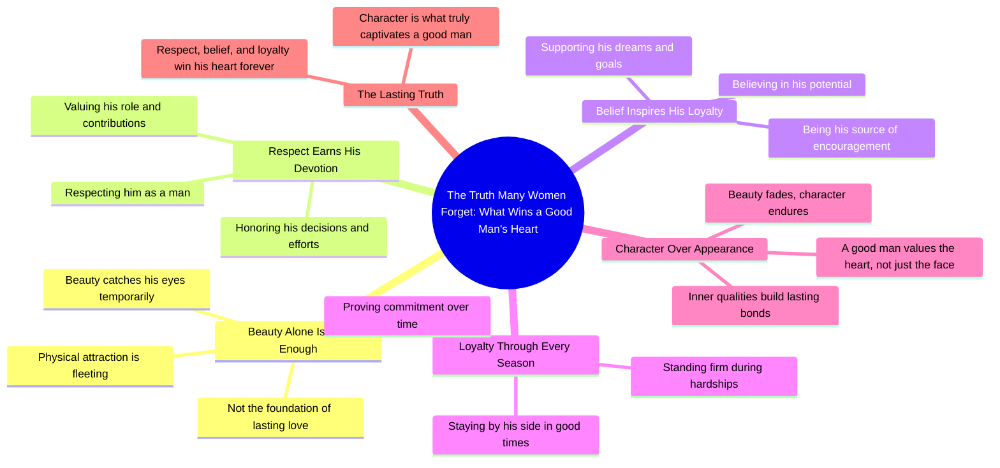

# Why Good Men Value Character Over Beauty

> 🌐 **Read this in:** [English](../../en/2026-08/tiktok-transcript-720k-views-27k-reactions-the-truth-many-women-forget-a-goodm-9834.md) · **中文**

> **Creator:** [@Stella Rain Talks](https://www.tiktok.com/@Stella Rain Talks) · **Views:** 315.7K · **Posted:** 2026-08-30 · **Niche:** other
>
> **TL;DR:** Starts with a bold, contrarian statement that challenges common assumptions and immediately grabs attention.

[Watch original video →](https://www.facebook.com/share/r/1Bn5PdxWeS/)

## Why This Went Viral

## 钩子（前3秒）
- **逐字开场白：** “许多女性遗忘的真相。”
- **钩子模式：** 大胆断言 + 好奇心缺口（一个被框定为观众所缺失的“秘密真相”）。
- **为何能阻止滑动：** 它以权威且近乎纠正的语气直接挑战观众当前的思维模式。“遗忘”一词暗示观众内心深处早已知道这一点，从而制造即时的认知失调——他们必须观看以确认或反驳。

## 情感节奏
1. **挑战/好奇**（“许多女性遗忘的真相”）——带来轻微的自尊刺痛，吸引注意力。
2. **张力/驳斥**（“一个好男人不会仅被美貌打动”）——拆解常见假设，抬高赌注。
3. **认同/共鸣**（“他记住的是那个尊重他、相信他、始终忠诚的女人”）——从负面转向正面，提供一个清晰、令人向往的替代方案。
4. **高潮/解决**（“美貌或许能吸引他的目光，但品格才能永远赢得他的心”）——以一句干净、可引用的对比呈现回报，感觉像一堂人生课。
- **高潮时刻：** 最后一句，其中“目光”与“心”的对比如同一记情感麦克风掉落。

## 关键词密度
- **“女人/女性”** — 3次（直接针对受众）
- **“美貌”** — 2次（推动初始对比，搜索量与情感吸引力高）
- **“品格”** — 1次（道德上的制衡点，极具分享性）
- **“尊重 / 相信 / 保持忠诚”** — 3个动作动词（情感吸引力，描绘行为清单）
- **“心 / 目光”** — 2次（隐喻锚点，易于视觉化）
- **“真相 / 遗忘”** — 2次（算法触达：“真相”是高互动关键词；“遗忘”触发好奇心）

## 为何能广泛传播
- **普遍的情感关系张力：** 文案触及许多女性持有的恐惧（美貌不够）以及许多男性感到的挫败（自己的品格未被重视）。它同时验证了双方，使其跨越性别界限具有分享性。
- **可引用的结尾句：** “美貌或许能吸引他的目光，但品格才能永远赢得他的心”是一句独立的格言——观众会截图、转发或用作文案。它天生就是为被提取而设计的。
- **道德高地框架：** 视频将观众定位为“知晓真相的人”与“遗忘真相的世界”相对。这种我们与他们对立的框架驱动评论（认同、争论、个人故事），从而提升算法分发。
- **低门槛、高共鸣的形式：** 无视觉、无故事，只有直接陈述。它可作为文字覆盖视频、配音或幻灯片——易于混剪，延长其生命周期。
- **15秒内的情感闭环：** 弧线完整（挑战 → 认同 → 解决）。观众感到“这很满足”，并分享以将这种感觉传递给他人。

## 你可以借鉴的
- **以纠正性断言开场，而非提问。** “许多女性遗忘的真相”优于“你知道男人想要什么吗？”因为它暗示观众已经错过了某些东西——这是更强的好奇心触发器。
- **用两部分对比作为结尾句。** 将你的回报结构为“X或许会[做Y]，但Z[做W]。”这使要点即刻难忘，且可复制粘贴分享。
- **锚定行为动词，而非形容词。** 不要说“善良且忠诚”，而说“尊重他、相信他、保持忠诚”。具体行动创造心理清单，驱动诸如“这正是我所做的”或“这正是我在寻找的”之类的评论。

## Mind Map

## Full Transcript (Generated by [TokTranscript](https://toktranscript.com/?utm_source=github&utm_medium=breakdown&utm_campaign=tool_attribution))

> 📝 Transcripts on this page are auto-generated and show the first 60%. Want to transcribe any TikTok in 30 seconds and get the full version? [Try TokTranscript free →](https://toktranscript.com/?utm_source=github&utm_medium=breakdown&utm_campaign=transcript_cta)

The truth many women forget. A good man is not impressed by beauty alone. He remembers the woman who respected him, believed in him, and stayed lo

*[Read the full transcript on TokTranscript →](https://toktranscript.com/plaza/tiktok-transcript-720k-views-27k-reactions-the-truth-many-women-forget-a-goodm-9834?utm_source=github&utm_medium=breakdown&utm_campaign=transcript_full)*

## Browse More

- All [other](../../by-niche/zh-CN/other.md) breakdowns
- All [Contrarian truth](../../by-pattern/zh-CN/hook-contrarian-truth.md) examples

## Video Info

| | |
|---|---|
| Creator | [@Stella Rain Talks](https://www.tiktok.com/@Stella Rain Talks) |
| Original video | [https://www.facebook.com/share/r/1Bn5PdxWeS/](https://www.facebook.com/share/r/1Bn5PdxWeS/) |
| Original title | 720K views · 27K reactions | the truth many women forget a Goodman is not impressed by beauty alone. #relatable #relationships #podcast | Stella Rain Talks |
| Views | 315.7K (315744) |
| Posted | 2026-08-30 |
| Duration | 0s |
| Niche | `other` |
| Hook pattern | `Contrarian truth` |
| Original language | `en` (this page translated by AI) |
| Available languages | en, zh-CN |
| Generated | 2026-08-31 by [TokTranscript](https://toktranscript.com/) |

---

*This breakdown is for educational analysis under fair use. Original video © [@Stella Rain Talks](https://www.tiktok.com/@Stella Rain Talks). All transcripts are auto-generated and may contain errors.*

*Want to analyze your own TikToks like this? [免费 TikTok 文稿生成器 →](https://toktranscript.com/viral-breakdown?utm_source=github&utm_medium=breakdown&utm_campaign=footer_cta)*