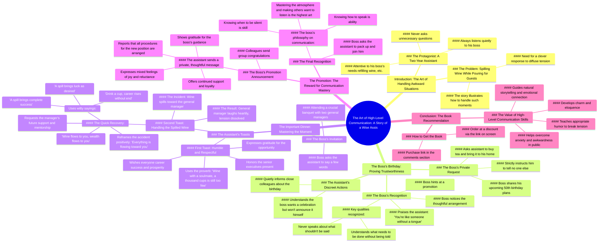

# What High EQ People Say When They Spill Wine

> 🌐 **Read this in:** [English](../../en/2026-08/tiktok-transcript-778k-views-8-5k-reactions-l-l-m-ly-r-u-khi-m-i-kh-ch-ng-i-eq-51c5.md) · **中文**

> **Creator:** [@Người Có EQ](https://www.tiktok.com/@Người Có EQ) · **Views:** 364.3K · **Posted:** 2026-08-15 · **Niche:** entertainment
>
> **TL;DR:** Poses a relatable social dilemma and promises a story that will reveal the answer, immediately engaging viewers.

[Watch original video →](https://www.facebook.com/reel/27835576512738112)

## Why This Went Viral

## 钩子（前3秒）
- **逐字开场白：** “如果在给客人倒酒时不小心把酒洒在桌上，你应该说什么来化解尴尬？”
- **钩子模式：** 提问+场景（一个具体的、人人都有共鸣的社交困境）
- **为何能让人停下滑动：** 它提出了一个普遍的、高风险的社交难题，每个人都害怕遇到。观众立刻想到“我经历过”或“我需要知道这个”——瞬间制造了一个信息缺口，迫使人们想要得到答案。

## 情绪节奏
1. **好奇/兴趣** — 开场问题制造了一个未解的社交谜题。
2. **紧张感** — 助理的沉默和老板的考验营造出一种安静、悬疑的铺垫（“他都沉默倾听，从不随意追问”）。
3. **认同/共鸣** — 生日场景让人感到熟悉；观众认出了“安静靠谱”这一典型形象。
4. **释然+笑声** — 洒酒时刻：“酒洒向您这边，财气也流向您这边”——一个巧妙的转折，用幽默化解了紧张。
5. **认可/自豪** — 老板的升职和助理的回报（“会说话是能力，懂沉默是本事”）带来了令人满意的道德回报。
6. **高潮：** 洒酒敬酒——这是钩子的具体体现，在高风险场景中兑现了承诺的解决方案。
7. **行动号召的转换** — 情绪高点立即被转化为书籍推销。

## 关键词密度
- **“老板”** — 出现约15次；推动层级权力动态，这是越南职场文化的核心主题。
- **“沉默倾听”** — 重复3次以上；这是被奖励的核心美德。
- **“懂”** — 频繁重复；情感吸引力——情商的价值。
- **“酒”** — 在钩子和高潮中重复出现；将叙事串联起来，也是关键场景的直接触发点。
- **“能力”/“本事”** — 用于道德总结；通过励志关键词扩大算法触达。
- **“沟通的艺术”** — 直接连接到书籍产品；自我提升受众的SEO关键词。

## 为何能传播
1. **钩子是一个每个成年人都害怕的“社交紧急情况”。** 在商务晚宴上洒酒是一个人人都会尴尬的瞬间。文案的开场白（“你应该说什么来化解……”）承诺了一个救生圈——观众会把它分享给“需要这个”的朋友。
2. **这是一个道德回报明确的寓言故事。** 沉默助理获得升职的故事（“你应该再进一步”）验证了观众相信耐心和安静的实力终会获胜的信念。这种“正义弧线”触发了分享冲动——人们会分享让他们觉得自己有智慧的内容。
3. **洒酒台词是一句值得引用的“金句”。** “酒洒向您这边，财气也流向您这边”是一句现成的敬酒词，人们想要复用。这是一个语言技巧——观众截图、记住，并作为“生活妙招”分享。
4. **转折恰好落在紧张感达到顶峰的时刻。** 老板的考验（“你说几句吧”）制造了一个生死攸关的时刻。助理的化解如此流畅，感觉像魔术——这种“他是怎么做到的？”的反应推动了评论和收藏。
5. **行动号召无缝融入道德启示中。** 书籍推销（《顶级沟通的艺术》）不是打断——而是故事中自然得出的“经验教训”。这让广告感觉像一份礼物，而不是广告，从而提高了完播率和分享率。

## 你可以借鉴什么
1. **以“社交紧急情况”问题开场。** 不要从你的产品或你的故事开始。从一个你的受众害怕的、具体的、高焦虑场景开始——然后承诺解决方案就在故事里。（例如：“当老板问了一个你不知道答案的问题时，你会说什么？”）
2. **构建一个“安静实力”的角色弧线。** 展示一个通过少做而非多做而获胜的主角。喧闹紧张的世界与冷静敏锐的英雄之间的对比制造了叙事张力，让观众一直看到最后。
3. **在高潮处创造一句可引用的“金句”。** 设计一句如此巧妙且可复用的话，让观众觉得必须截图或分享。（例如：“酒洒向您这边，财气也流向您这边”）——然后把你的产品作为这句智慧的“来源”附着上去。

## Mind Map

## Full Transcript (Generated by [TokTranscript](https://toktranscript.com/?utm_source=github&utm_medium=breakdown&utm_campaign=tool_attribution))

> 📝 Transcripts on this page are auto-generated and show the first 60%. Want to transcribe any TikTok in 30 seconds and get the full version? [Try TokTranscript free →](https://toktranscript.com/?utm_source=github&utm_medium=breakdown&utm_campaign=transcript_cta)

Nếu đang rót rượu mời khách mà lỡ tay làm rượu đổ ra bàn, bạn nên nói gì để hóa giải tình hữu ngược ngủ? Nghe xong câu chuyện sau, bạn sẽ hiểu. Một chàng trai đã làm trợ lý cho sếp được 2 năm. Bất kể sếp nói gì, anh đều im lặng lắng nghe, không bao giờ tùy tiện hỏi lại. Cha của sếp hết, anh rót đầy. Rượu của sếp cả, anh châm thêm. Một hôm, sếp nói, ngày kia tôi có việc nên không đến công ty. Công việc tôi đã sắp sếp cả rồi, cậu cứ theo đó mà làm. Lúc này, người trợ lý mới lên tiếng, Bè nói, ngày kia cậu đến tiệm trà, mua ít trà rồi mang đến nhà tôi. Mấy ông bạn học cũ cứ nằng nặc đòi tổ chức sinh nhật 50 tuổi cho tôi, nên đành phải tiếp đãi một bữa. Nhưng chuyện này cậu biết là được rồi, tuyệt đối không được nói cho ai khác. Người trợ lý gật đầu rồi đi. Anh hiểu sếp không muốn tự mình thông báo sinh nhật, nhưng cũng không muốn ngày vui của mình trôi qua quá nhạt léo. Vì vậy, hãy anh âm thầm báo cho một số đồng nghiệp thân thiết trong công ty. h t s s nh s c m nh nghi th thi N n sau ng tr l th ch M h s nhi h M n tr t h ch tr l nh m n nay ch d m m c C bi v sao kh Người trợ lý mỉm cười, lắc đầu. Sếp nói, vì cậu giống như không có lưỡi. Chuyện không nên nói, cậu tuyệt đối không nói. Chuyện cần làm, cậu lại hiểu rất rõ. Cậu nên tiến thêm một bước nữa đi. Người trợ lý vẫn im lặng lắng nghe, sau đó gật đầu nói. Em xin nghe theo sự sắp xếp của sếp Hôm sau, sếp dẫn anh đi dự một bữa tiệc quan trọng Món ăn vừa được dọn lên, sếp liền nói Hôm nay vui quá, lại có cả hai vị tổng giám đốc đáng kín ở đây Cậu hãy nói vài câu đi Người trợ lý đứng dậy, nâng ly rồi nói Cảm ơn sếp đã cho em tham gia bữa tiệc hôm nay Em rất vinh dựng được làm quen với các vị tiền bối Và hy vọng sau này sẽ có thêm nhiều cơ hội để học hỏi, giao lưu sâu hơn Hôm nay được ngồi cùng bàn với các bậc tiền bối cũng là một duyên phận Cổ nhân có câu Rượu gặp chi kỷ, ngàn ly còn thiếu Em xin kín các bậc tiền bối một ly Chúc mọi người sự nghiệp hành thông Tài lộc rồi rào và mọi việc đều được như ý X nghe xong r h l Sau m v t gi n T mu c ri v c m ly Ng tr l v v d r r nh v l m ra b Tuy nhi anh kh h b r m l t n Ngài xem, dạo này thứ gì cũng muốn đổ về phía ngài Rượu đổ về phía ngài, tài lộc cũng đổ về phía ngài Cả bàn tiệc bật cười, anh nâng ly rồi nói tiếp Tục ngữ có câu, cụ một ly may mắn như ý Đổ một ly, thành công mỹ mãn Uống một ly, sự nghiệp thăng tiến không ngừng Lý này em xin kính ngài, đồng thời xin được hưởng một chút may mắn của ngài Sau này, mong ngài đừng quên nâng đỡ em nhé Vị tổng

*[Read the full transcript on TokTranscript →](https://toktranscript.com/plaza/tiktok-transcript-778k-views-8-5k-reactions-l-l-m-ly-r-u-khi-m-i-kh-ch-ng-i-eq-51c5?utm_source=github&utm_medium=breakdown&utm_campaign=transcript_full)*

## Browse More

- All [entertainment](../../by-niche/zh-CN/entertainment.md) breakdowns
- All [Scenario question + promise of story](../../by-pattern/zh-CN/hook-scenario-question-promise-of-story.md) examples

## Video Info

| | |
|---|---|
| Creator | [@Người Có EQ](https://www.tiktok.com/@Người Có EQ) |
| Original video | [https://www.facebook.com/reel/27835576512738112](https://www.facebook.com/reel/27835576512738112) |
| Original title | 778K views · 8.5K reactions | Lỡ làm đổ ly rượu khi mời khách, người EQ cao sẽ nói gì? #baihoccuocsong #congso #SEP #giaotiep #sachhay #nguoicoeq | Người Có EQ |
| Views | 364.3K (364301) |
| Posted | 2026-08-15 |
| Duration | 0s |
| Niche | `entertainment` |
| Hook pattern | `Scenario question + promise of story` |
| Original language | `en` (this page translated by AI) |
| Available languages | en, zh-CN |
| Generated | 2026-08-16 by [TokTranscript](https://toktranscript.com/) |

---

*This breakdown is for educational analysis under fair use. Original video © [@Người Có EQ](https://www.tiktok.com/@Người Có EQ). All transcripts are auto-generated and may contain errors.*

*Want to analyze your own TikToks like this? [TokTranscript 转录工具 →](https://toktranscript.com/viral-breakdown?utm_source=github&utm_medium=breakdown&utm_campaign=footer_cta)*