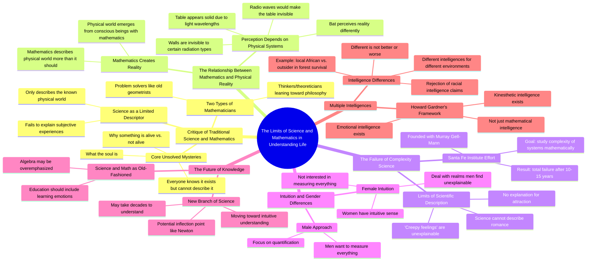

# Jeffrey Epstein and the Simulation Theory Explained

> 🌐 **Read this in:** [English](../../en/2026-08/tiktok-transcript-839k-views-12k-reactions-jeffrey-epstein-is-why-the-simulati-b896.md) · **中文**

> **Creator:** [@Jonah Rogers](https://www.tiktok.com/@Jonah Rogers) · **Views:** 528.2K · **Posted:** 2026-08-24 · **Niche:** other
>
> **TL;DR:** Starts with a bold, contrarian claim that immediately challenges the audience's assumptions.

[Watch original video →](https://www.facebook.com/share/v/1BVtkEbdqt/?mibextid=wwXIfr)

## Why This Went Viral

## 钩子（前3秒）
- **逐字开场：** “哲学家不会数学，而他们中的一些人是数学家。”
- **钩子模式：** 大胆断言/反常识陈述——立即将两个智力阵营对立起来。
- **为何能阻止滑动：** 这是一个挑衅性的、近乎侮辱性的概括，以面无表情的权威口吻说出。观众立刻想，“这不对”或“等等，真的吗？”——必须看下去才知道走向何方。

## 情绪节奏
1. **挑衅**（0–3秒）：“哲学家不会数学”——引发争论和自我意识。
2. **好奇**（3–15秒）：演讲者将思想家分为“问题解决者”与“理论家”——构建一个观众想要填满的思维地图。
3. **神秘**（15–30秒）：“没人能描述灵魂是什么，但我们都知道它存在”——从智力层面转向存在层面，营造敬畏感。
4. **颠覆**（30–45秒）：“科学是个坏词”——挑战神圣不可侵犯的观念，提升张力。
5. **思维冲击**（45–60秒）：桌子/无线电波的例子——一个具体、可视化的思想实验，让抽象变得可触可感。这是“顿悟”时刻。
6. **共鸣**（60–90秒）：“科学无法描述浪漫”和“毛骨悚然的感觉”这句话——转向普遍的人类体验，建立情感连接。
7. **争议**（90–120秒）：性别直觉的主张——再次拉高张力，既引来赞同也招致愤怒。
8. **高潮**（120–140秒）：“我拒绝接受黑人比白人智商低”——最激烈的时刻；将整个对话重新框定为智力是情境性的，而非等级性的。

## 关键词密度
- **“智力”**（提及5次以上）——驱动核心论点及算法分类（教育、心理学、辩论话题）。
- **“科学”**（提及6次以上）——高搜索量词汇；同时触发STEM和反科学受众。
- **“数学”**（提及5次以上）——学术关键词，吸引对数学好奇的观众。
- **“女性”**（提及4次以上）——情绪化；驱动评论区混战和分享。
- **“物理世界”**（提及3次以上）——锚定哲学前提。
- **“直觉”**（提及3次以上）——情感拉力；与冷逻辑形成对比。
- **“不同”**（提及3次以上）——强化“不是更好，也不是更差”的框架。

## 为何能传播
- **挑衅性框架：** “哲学家不会数学”是一句诱饵台词，保证哲学家和数学家都会评论捍卫自己的阵营——而其他人则围观这场争斗。
- **不断升级的赌注：** 视频从学术辩论→灵魂→性别→种族。每次转变都提升情绪温度，让观众在整个时长内保持投入。
- **普遍共鸣：** “科学无法描述浪漫”和“毛骨悚然的感觉”是任何人都能产生共鸣的句子，使内容超越小众知识分子圈层，具有可分享性。
- **反常识权威：** 演讲者以冷静、克制的自信传达争议性主张（“科学是个坏词”）——这种“冷静叛逆者”人设已被证明能驱动参与度和收藏。
- **评论诱饵结构：** 性别和种族部分被设计来分裂观众。观众不只是观看；他们感到必须赞同或攻击，这为算法提供了燃料。

## 你可以借鉴什么
- **以部落式侮辱开场：** 以否定你的受众认同或反对的群体来开始你的视频（“艺术家不会编程”或“营销人员不懂心理学”）。这迫使观众立即产生情感投入。
- **视频中段使用具体视觉类比：** 桌子/无线电波的例子将抽象哲学变成15秒的思维冲击。找到一个能说明你核心观点的日常实体物品——这给观众一个值得重看和分享的“片段”。
- **以争议性重新框定收尾：** 种族/智力部分放在最后，让观众处于未解决的张力状态。不要解决争论——保持开放，让评论区替你完成视频的结尾。

## Mind Map

## Full Transcript (Generated by [TikTok 转录工具](https://toktranscript.com/?utm_source=github&utm_medium=breakdown&utm_campaign=tool_attribution))

> 📝 Transcripts on this page are auto-generated and show the first 60%. Want to transcribe any TikTok in 30 seconds and get the full version? [Try TokTranscript free →](https://toktranscript.com/?utm_source=github&utm_medium=breakdown&utm_campaign=transcript_cta)

Philosophers can't do math, and some of them mathematicians. And again, mathematicians often break into two categories. People that solve problems. Those are more like geometrists in the old days. They're just problem solvers. And then there's thinkers, theoreticians. They're more like the old movement towards philosophy. But neither one of those two groups have been able to figure out why something is alive as opposed to something that's not alive. No one's been able to describe what the soul is, but we all know it exists. And I think what we need is a new... Science is a bad word. I think science only describes the things we already know about the physical world. In fact, there's an argument that the physical world that we see has been created out of our systems of mathematics. Mathematics, everyone knows mathematics describes the physical world much greater than it should, unless, in my view, the physical world really comes out of conscious beings that have mathematics. So they create it. This table appears to you and I to be solid. To a bat, because we have light that's bouncing off the table into our eyes, it appears solid. If instead of eyes that responded to wavelengths of visual light Our eyes responded to radio waves the radio frequencies It not different It the same type of frequency as light with different speeds The table invisible We know that our phone works in this room. So the waves are coming through the windows. The waves are coming through the walls. So the walls are invisible to that type of radiation, that type of energy. The walls are, I can see them because my eyes, a physical system, determines that the walls are there. You, with Murray Gildman, you founded, or with the original donor, and had the idea of Santa Fe Institute. In 10 or 15 years later, that effort to study the complexity of systems mathematically. Yes. It's a total failure. A total failure. Total failure. Why is that? It's the failure of science because, in fact, to some extent, science doesn't describe romance. I don't know why I'm attracted to somebody. I don't know. People are attracted to each other and everyone has the same feeling. They've seen someone walk in the room and they say, oh, that person gives me a creepy feeling. Science doesn't describe what creepy feelings means. They just know it a creepy feeling I think women as I said the last time have an intuitive sense What is intuitive They have intuition they have feelings and they able to deal in the realm of things that men, especially men like myself, find unexplainable. They have great, women have intuition, men see things a bit differently. men want to measure everything. Women are not really that interested in measuring. In what you're saying in macro terms, you actually think science, mathematics, maybe ultimately technology, is moving to that more intuitive? I think science and math are old-fashioned. And unfortunately, people are still taught that they have to learn algebra in school and certain things in scho

*[Read the full transcript on TokTranscript →](https://toktranscript.com/plaza/tiktok-transcript-839k-views-12k-reactions-jeffrey-epstein-is-why-the-simulati-b896?utm_source=github&utm_medium=breakdown&utm_campaign=transcript_full)*

## Browse More

- All [other](../../by-niche/zh-CN/other.md) breakdowns
- All [Provocative generalization](../../by-pattern/zh-CN/hook-provocative-generalization.md) examples

## Video Info

| | |
|---|---|
| Creator | [@Jonah Rogers](https://www.tiktok.com/@Jonah Rogers) |
| Original video | [https://www.facebook.com/share/v/1BVtkEbdqt/?mibextid=wwXIfr](https://www.facebook.com/share/v/1BVtkEbdqt/?mibextid=wwXIfr) |
| Original title | 839K views · 12K reactions | Jeffrey Epstein is why the simulation has to be dismantled. He knew what the elites have known for a long time. That this isnt base reality and the rich and powerful sacrifice people for their own advancement in the game. It’s beyond time to remove these people from office | Jonah Rogers |
| Views | 528.2K (528207) |
| Posted | 2026-08-24 |
| Duration | 0s |
| Niche | `other` |
| Hook pattern | `Provocative generalization` |
| Original language | `en` (this page translated by AI) |
| Available languages | en, zh-CN |
| Generated | 2026-08-25 by [TokTranscript](https://toktranscript.com/) |

---

*This breakdown is for educational analysis under fair use. Original video © [@Jonah Rogers](https://www.tiktok.com/@Jonah Rogers). All transcripts are auto-generated and may contain errors.*

*Want to analyze your own TikToks like this? [TokTranscript →](https://toktranscript.com/viral-breakdown?utm_source=github&utm_medium=breakdown&utm_campaign=footer_cta)*