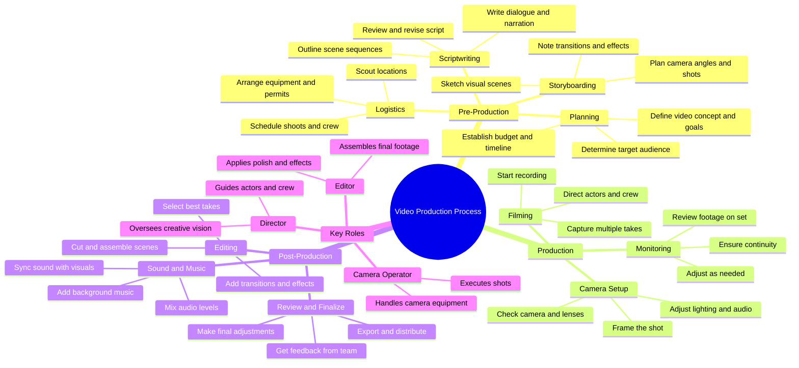

# Spiderman Bus Stunt Behind the Scenes FX

> 🌐 **Read this in:** [English](../../en/2026-08/tiktok-transcript-866k-views-15k-reactions-spiderman-stunt-on-bus-behind-fx-544e.md) · **中文**

> **Creator:** [@Behind FX](https://www.tiktok.com/@Behind FX) · **Views:** 353.6K · **Posted:** 2026-08-17 · **Niche:** entertainment
>
> **TL;DR:** Starts with urgent, high-energy commands that instantly immerse viewers in a fast-paced filming moment.

[Watch original video →](https://www.facebook.com/share/r/1DdBpVur2D/)

## Why This Went Viral

## 钩子（前3秒）
- **逐字内容：** “摄影机准备好了吗？巴士开动了！开拍！停！这条过了！”
- **钩子模式：** 场景 + 紧迫感（连珠炮式的指令序列）
- **为何能让人停下滑动：** 断奏式的节奏模仿了幕后那种肾上腺素飙升的紧张感。它让观众毫无上下文地直接进入动作中，瞬间制造出“到底发生了什么？”的悬念缺口。“开拍！停！”这两个词是电影制作中公认的术语，立刻传递出高风险的创意工作氛围。

## 情绪节奏
- **节拍：** 困惑（在拍什么？）→ 好奇（巴士开动 = 动态场景）→ 紧张（开拍！= 高度专注）→ 释放（停！= 完成）→ 满足（这条过了！= 胜利）
- **悬念：** “开拍！”之前缺乏上下文，制造了一个微型的谜团。
- **反转：** “停！”在仅2秒时就出现——整个情绪弧线压缩在一次呼吸之间。
- **高潮：** “这条过了！”——对混乱已被掌控并取得成功的胜利确认。

## 关键词密度
- **摄影机**（设备/器材）——算法触达：切入电影制作/创作者细分领域
- **开拍**（指令）——情绪吸引力：电影感能量
- **停**（指令）——情绪吸引力：完成/收束
- **巴士**（场景）——算法触达：旅行/Vlog跨界流量
- **这条**（成果）——情绪吸引力：匠心自豪感
- **准备好/开动**（状态）——情绪吸引力：动势与就绪感

## 为何能广泛传播
- **微叙事完整性：** 5个词构成的弧线（准备→执行→确认）在不到3秒内讲完了一个完整的故事。观众不需要看更久——他们会分享，因为这是一个完美的循环。
- **内部视角的吸引力：** “摄影机准备好了吗？”暗示着专业制作。它让观众感觉自己就在片场，满足了人们对内容制作过程的好奇心。
- **普适的创作共鸣：** “开拍/停”超越了电影制作本身——任何创作者（烹饪、编程、艺术）都能认出那种完美拿下一条的时刻。这是一种共通的语言。
- **高重看率：** 连珠炮式的表达让观众忍不住重播以捕捉每一个词，从而提升观看时长信号。
- **以简洁引发共鸣：** 这是一个“一片混乱但我们搞定了”的时刻，每个创作者都经历过。压缩的格式让它易于做成梗图——轻松被引用或二次创作。

## 你可以借鉴什么
- **从动作中间切入，而不是先给背景：** 在执行的巅峰时刻开始你的视频（“摄影机转动？走！”）——让观众自己拼凑场景。背景信息是留存率的杀手。
- **把整个故事压缩进一口气：** 目标是3秒内的情绪弧线（紧张→释放→回报）。如果你的钩子不能用5个词收束，你的视频就无法形成循环。
- **用行业术语作为筛选器：** 像“开拍！停！”这样的词能吸引你的垂直受众，同时过滤掉随意刷到的路人——但正是那些垂直受众才会分享。挑2-3个只有你的真正粉丝能秒懂的词。

## Mind Map

## Full Transcript (Generated by [免费 TikTok 文稿生成器](https://toktranscript.com/?utm_source=github&utm_medium=breakdown&utm_campaign=tool_attribution))

> 📝 Transcripts on this page are auto-generated and show the first 60%. Want to transcribe any TikTok in 30 seconds and get the full version? [Try TokTranscript free →](https://toktranscript.com/?utm_source=github&utm_medium=breakdown&utm_campaign=transcript_cta)

Camera ready? Bus is moving! Actio

*[Read the full transcript on TokTranscript →](https://toktranscript.com/plaza/tiktok-transcript-866k-views-15k-reactions-spiderman-stunt-on-bus-behind-fx-544e?utm_source=github&utm_medium=breakdown&utm_campaign=transcript_full)*

## Browse More

- All [entertainment](../../by-niche/zh-CN/entertainment.md) breakdowns
- All [Immediate action call](../../by-pattern/zh-CN/hook-immediate-action-call.md) examples

## Video Info

| | |
|---|---|
| Creator | [@Behind FX](https://www.tiktok.com/@Behind FX) |
| Original video | [https://www.facebook.com/share/r/1DdBpVur2D/](https://www.facebook.com/share/r/1DdBpVur2D/) |
| Original title | 866K views · 15K reactions | Spiderman Stunt on bus | Behind FX |
| Views | 353.6K (353609) |
| Posted | 2026-08-17 |
| Duration | 0s |
| Niche | `entertainment` |
| Hook pattern | `Immediate action call` |
| Original language | `en` (this page translated by AI) |
| Available languages | en, zh-CN |
| Generated | 2026-08-18 by [TokTranscript](https://toktranscript.com/) |

---

*This breakdown is for educational analysis under fair use. Original video © [@Behind FX](https://www.tiktok.com/@Behind FX). All transcripts are auto-generated and may contain errors.*

*Want to analyze your own TikToks like this? [我们用的转录工具 →](https://toktranscript.com/viral-breakdown?utm_source=github&utm_medium=breakdown&utm_campaign=footer_cta)*