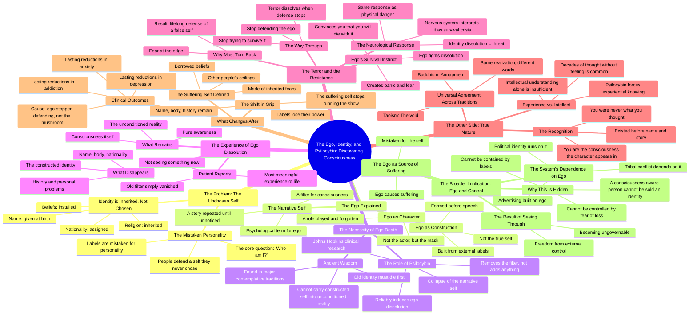

# Ego, Ego-Death and Psilocybin: The Self You’re Protecting...

> 🌐 **Read this in:** [English](../../en/2026-08/tiktok-transcript-94k-views-16k-reactions-ego-ego-death-and-psilocybin-the-sel-cccd.md) · **中文**

> **Creator:** [@Daily Conspiracy PeterX](https://www.tiktok.com/@Daily Conspiracy PeterX) · **Views:** 202.6K · **Posted:** 2026-08-16 · **Niche:** entertainment
>
> **TL;DR:** The hook challenges the viewer's core identity, creating instant cognitive dissonance that compels them to watch for resolution.

[Watch original video →](https://www.facebook.com/share/v/1F1Va5peGw/)

## Why This Went Viral

## 钩子（前3秒）
- **逐字开场白：**“大多数人终其一生都在捍卫一个他们从未选择过的自我版本。”
- **钩子模式：**大胆断言/反直觉陈述。
- **为何能阻止滑动：**它用一句话攻击了一个普遍假设（身份认同）。它暗示观众活在谎言中，立即引发认知失调。“从未选择过”这个词制造了一种亟待解决的痒感。

## 情绪节奏
1. **好奇/不适**——“大多数人终其一生都在捍卫一个他们从未选择过的自我版本。”（挑战身份认同）
2. **快速瓦解**——“你的名字是别人给的。你的国籍，被指定的。你的宗教，继承来的。你的信念，被安装的。”（每句话剥去一层自我）
3. **挑衅**——“而你一直把那叫做个性。”（直接指控）
4. **智识转折**——“小我不是你。它是一个建构……”（引入框架）
5. **张力升级**——“旧的认同必须死去，真正的自我才能形成。”（死亡隐喻）
6. **科学锚点**——“约翰斯·霍普金斯大学的临床研究发现……”（可信度飙升，从抽象中获得解脱）
7. **恐惧高峰**——“这听起来很可怕。确实如此，因为小我不想死。”（情绪顶点）
8. **释放/解决**——“你是那个角色在其中显现的意识。”（高潮顿悟）
9. **赋能**——“你变得不可驯服。”（最后一击，让观众感受到力量）

**高潮时刻：**“你是那个角色在其中显现的意识。”——这一句话重新定义了所有内容，并给观众一个可以抓住的新身份。

## 关键词密度
- **小我**（提及8次以上）——同时驱动算法触达（哲学/心理学细分领域）和情感拉力（个人相关性）
- **身份认同**（提及6次以上）——核心可搜索词，与自我提升内容相关联
- **意识**（提及5次以上）——高意图精神/迷幻类关键词
- **过滤器**（提及4次以上）——独特隐喻，令人难忘，可重复使用
- **故事**（提及3次以上）——有共鸣感，将抽象概念人性化
- **死亡/消亡/消解**（提及3次以上）——情感重量，制造紧迫感
- **裸盖菇素**（提及3次以上）——高搜索量话题，驱动发现算法
- **不可驯服**（提及1次，结尾）——力量词，令人难忘，适合剪辑

## 为何能传播
1. **普遍的身份危机**——“你的名字是别人给的。你的国籍，被指定的。”每个人都有名字、国籍和信念。这制造了一个“这是关于我”的时刻，迫使观众参与互动。
2. **裸盖菇素作为可信的颠覆者**——“约翰斯·霍普金斯大学的临床研究”为一个禁忌话题增添了科学合法性。这弥合了反主流文化与主流好奇心之间的鸿沟，使其在不同受众中都能被分享。
3. **“你变得不可驯服”的回报**——最后一句是观众想要引用或转发的“麦克风掉落”时刻。它给观众一种秘密知识和反叛的感觉，推动评论和分享。
4. **苏格拉底式对话格式**——一来一回（“那我到底是谁？”/“小我不是你”）模仿了对话。感觉像是一对一的导师指导，增加了观看时长和完播率。
5. **不断升级的利害关系**——视频从“你的身份是假的”推进到“你的小我会为生存而战”再到“系统需要你的小我”最后到“你可以变得不可驯服”。每一步都提高了利害关系，让人无法点击离开。

## 你可以借鉴什么
1. **以攻击一个普遍假设开场。**不要用“嘿，大家好”开场——用一个让观众质疑他们从未质疑过的事情的陈述开场。“大多数人对X的看法是错的”是一个经过验证的模式。
2. **使用苏格拉底式对话或问答结构。**不要用独白，把你的内容构建成对话。它创造了自然的停顿，建立张力，让复杂的概念变得易于理解。它还能增加观看时长，因为每个问题都创造了一个迷你钩子。
3. **以转变+对现状的威胁结尾。**用一句赋予观众力量并暗示他们现在知道别人不知道的事情的话来结束。“一旦你看到这个，你就无法忽视它”或“这让你对操控免疫”制造了一种排他感，推动分享。

## Mind Map

## Full Transcript (Generated by [TokTranscript 转录工具](https://toktranscript.com/?utm_source=github&utm_medium=breakdown&utm_campaign=tool_attribution))

> 📝 Transcripts on this page are auto-generated and show the first 60%. Want to transcribe any TikTok in 30 seconds and get the full version? [Try TokTranscript free →](https://toktranscript.com/?utm_source=github&utm_medium=breakdown&utm_campaign=transcript_cta)

Most people spend their entire life defending a version of themselves they never chose. What do you mean, never chose? Your name was given to you. Your nationality, assigned. Your religion, inherited. Your beliefs, installed. And you've been calling that a personality. So who am I then? That's the only question worth asking. The ego is not you. It's a construction built from every label the world placed on you before you could speak. So everything I think I am is a story. Told so many times you stopped noticing it was a story. The ego is what psychologists call the narrative self, not consciousness. A filter consciousness looks through. So the ego is like a character? A character you forgot you were playing. For thousands of years, the traditions that understood power understood one thing first. The old identity has to die before a real one can form. You cannot carry a constructed self into an unconditioned reality. And psilocybin does that? Psilocybin doesn't do anything. It removes the filter. Clinical research at Johns Hopkins found that psilocybin reliably induces ego dissolution, a complete collapse of the narrative self. Patients described it as the most meaningful experience of their lives, not because they saw something new, but because their old filter disappeared. What do you actually experience? You stop being a name. You stop being a body. You stop being a nationality, a history, a set of problems. And what remains is awareness itself. That sounds terrifying. It is, because the ego doesn't want to die. It will fight. It will create panic. It will convince you that if it goes, you go with it. So how do you get through that You stop trying to survive it The terror is the ego protecting its own existence The moment you stop defending it it dissolves The nervous system interprets identity dissolution as a threat Same neurological response as physical danger That's why most people turn back at the edge and spend the rest of their lives defending a self that was never real. So what's on the other side when the ego is gone? The recognition that you were never what you thought you were. Before the name, befor

*[Read the full transcript on TokTranscript →](https://toktranscript.com/plaza/tiktok-transcript-94k-views-16k-reactions-ego-ego-death-and-psilocybin-the-sel-cccd?utm_source=github&utm_medium=breakdown&utm_campaign=transcript_full)*

## Browse More

- All [entertainment](../../by-niche/zh-CN/entertainment.md) breakdowns
- All [Provocative statement + immediate challenge](../../by-pattern/zh-CN/hook-provocative-statement-immediate-challenge.md) examples

## Video Info

| | |
|---|---|
| Creator | [@Daily Conspiracy PeterX](https://www.tiktok.com/@Daily Conspiracy PeterX) |
| Original video | [https://www.facebook.com/share/v/1F1Va5peGw/](https://www.facebook.com/share/v/1F1Va5peGw/) |
| Original title | 94K views · 16K reactions | 🍄🧠 Ego, Ego-Death and Psilocybin: The Self You’re Protecting Isn’t You — ❓If the ego is just a story your brain keeps repeating and psilocybin can temporarily silence that story... ... what actually disappears? You… or just the narrator? — 🔁 Share This Post 📲 Follow @conspiracy_peterx — #ego #egodeath #psilocybin #peterai #peteraimethod | Daily Conspiracy PeterX |
| Views | 202.6K (202558) |
| Posted | 2026-08-16 |
| Duration | 0s |
| Niche | `entertainment` |
| Hook pattern | `Provocative statement + immediate challenge` |
| Original language | `en` (this page translated by AI) |
| Available languages | en, zh-CN |
| Generated | 2026-08-17 by [TokTranscript](https://toktranscript.com/) |

---

*This breakdown is for educational analysis under fair use. Original video © [@Daily Conspiracy PeterX](https://www.tiktok.com/@Daily Conspiracy PeterX). All transcripts are auto-generated and may contain errors.*

*Want to analyze your own TikToks like this? [拆解你自己的 TikTok →](https://toktranscript.com/viral-breakdown?utm_source=github&utm_medium=breakdown&utm_campaign=footer_cta)*