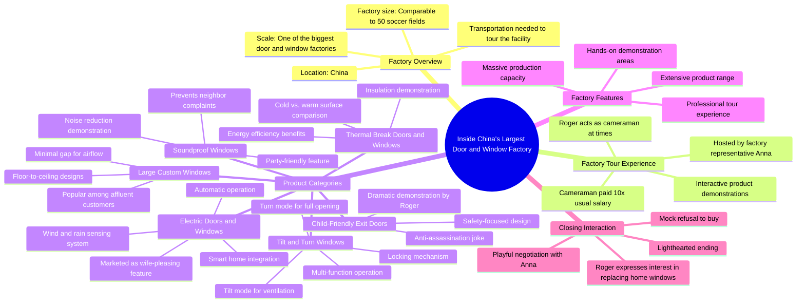

# Rare Window & Door Designs From China’s Biggest Factory

> 🌐 **Read this in:** [English](../../en/2026-08/tiktok-transcript-99-of-people-have-never-seen-these-window-door-designs-take-e7df.md) · **中文**

> **Creator:** [@rogerwu_georgedeco](https://www.tiktok.com/@rogerwu_georgedeco) · **Views:** 2.5M · **Posted:** 2026-08-05 · **Niche:** other
>
> **TL;DR:** Opens with an extreme scale claim that immediately sets up a grand tour and curiosity.

[Watch original video →](https://www.tiktok.com/@rogerwu_georgedeco/video/7604874884023405846)

## Why This Went Viral

## 钩子（前3秒）
- **逐字开场白：**“这是中国最大的门窗工厂之一。在这里你真的需要某种交通工具，否则你一天都走不完整个工厂。”
- **钩子模式：**大胆声明 + 规模化的场景设定（数字/规模模式）。
- **为何能阻止滑动：**这个说法是夸张的（“中国最大”），并立即在脑海中营造出荒谬规模的画面（“需要交通工具才能走完”）。它让观众期待一场盛大参观，承诺某种视觉上庞大而罕见的东西——一个经典的“你不会相信这存在”的开场。

## 情绪节奏
- **好奇（0–5秒）：**规模声明让你好奇，“一个工厂到底能有多大？”
- **紧张/悬念（5–15秒）：**提到付给摄影师10倍工资并亲自上阵增加了利害关系——“这一定很重要或很危险。”
- **轻松缓解（15–30秒）：**“这不是AI”的桥段打破了第四面墙，制造了一个喜剧停顿，让创作者更有人情味，也消除了观众的怀疑。
- **层层递进的惊叹（30–60秒）：**“50个足球场”的对比、隔热断桥演示和隔音窗演示构建了“先展示，再解释”的节奏——每个演示都是一次小型揭秘。
- **喜剧转折（60–75秒）：**“聪明的男人选择这种电动门窗，因为这让他们的妻子非常开心。我没有妻子。”——一个自嘲的笑话，恰到好处地成为笑点。
- **高潮（75–95秒）：**“暗杀我”的时刻——创作者把手放在电动门上，门朝他移动，他惊慌失措。这是巅峰：真实的情感、虚假的危险，以及之前“电动”演示的回报。
- **收尾（95秒–结束）：**虚假的购买承诺（“我想换掉我所有的窗户”）随后揭晓（“开个玩笑”），以最后一笑闭环，让观众心满意足。

## 关键词密度
- **“工厂”**——重复约5次；推动搜索/算法对工业/B2B内容的触达。
- **“门窗”**——重复约6次；核心产品关键词，提升产品相关搜索的可发现性。
- **“展示”**——重复约4次；行动导向，保持叙事推进。
- **“AI”**——重复约3次；引发互动（关于AI生成内容的评论），一个病毒式传播的热词。
- **“玩笑”**——重复约2次；表明喜剧意图，增加可分享性。
- **“妻子”**——重复约2次；情感吸引力， relatable的幽默。
- **“大/最大”**——重复约3次；强化规模钩子，驱动好奇心。
- **“电动”**——重复约3次；突出产品的新颖性，一个差异化卖点。

**算法触达驱动因素：**“工厂”、“门窗”、“电动”——这些是可搜索的细分术语，排名表现好。
**情感拉动驱动因素：**“AI”、“玩笑”、“妻子”——这些能引发评论、分享和收藏，因为它们 relatable 或有争议性。

## 为何能传播
- **“这是AI吗？”的张力：**创作者反复提及AI（“这不是AI”、“你想再展示一下这不是AI吗？”）。这直接切入了当前对AI生成内容的文化焦虑/迷恋——观众仔细观看以验证、评论和争论，从而提升互动率。
- **“暗杀”惊吓时刻：**电动门向他关闭（即使是编排的）也是一个直观的、值得分享的片段。这是一个3秒可循环的瞬间，人们会发给朋友并附上“快看这个”。
- **自嘲式幽默：**“我没有妻子”和“开个玩笑，你知道的”让创作者讨喜且 relatable。人们分享让他们感觉良好的内容，而这种幽默就是情感粘合剂。
- **B2B+娱乐的混合体：**这是一个工厂参观（细分、教育性），包裹在喜剧小品中（广泛、可分享）。这种双重吸引力让它能在工业受众和普通观众之间交叉传播。
- **规模吹嘘的兑现：**“50个足球场”和“中国最大”的说法在整个视频中通过视觉验证（广角镜头、行走、演示），因此视频兑现了它的钩子——观众信任它，并将其作为某种非凡事物的“证据”分享。

## 你可以借鉴什么
- **用“最大/规模”钩子开场：**以一个大胆、可验证的关于大小、规模或独特性的声明开始。它立即将你的视频框定为“必看”，并给观众一个留下的理由。
- **打破第四面墙建立信任：**提及你自己的制作过程（“我付了摄影师10倍工资”、“这不是AI”）。这让你更有人情味，消除怀疑，并引发评论——一个低成本的互动技巧。
- **以虚假承诺收尾：**预告一个重大承诺（“我要买下所有东西”），然后揭晓这是个玩笑。这创造了一个令人满意的叙事弧线，奖励看到最后的观众，提高完播率和观看时长——这是最强的病毒式传播信号。

## Mind Map

## Full Transcript (Generated by [TokTranscript](https://toktranscript.com/?utm_source=github&utm_medium=breakdown&utm_campaign=tool_attribution))

> 📝 Transcripts on this page are auto-generated and show the first 60%. Want to transcribe any TikTok in 30 seconds and get the full version? [Try TokTranscript free →](https://toktranscript.com/?utm_source=github&utm_medium=breakdown&utm_campaign=transcript_cta)

This is one of the biggest doors and window factory in China. You really need some kind of transportation here or you won't be able to walk through entire factory in a day. For this video, I paid my cameraman 10 times his usual salary. Sometimes I even have to be the cameraman myself. Hi EDA. Hi Roger. Nice to meet you. Welcome to our factory. Okay, show me your factory. Okay, haha, what are you doing? Just want to show everyone. This is not the air. We air will never do this. Okay, okay. Okay, Roger. Our factory covers an area about the size of 50 soccer fields. Have you ever seen a door and window factory bigger than ours? No. This is the Thermal break doors and windows and you can feel the sense here. This is the cold one actually. It's like you're playing with it now. Yes, I like ice. Yes. And this is the soundproof window. Let's close. Close it. Okay, so you can feel it. So when you're throwing the party at home, you don't have to worry your neighbors gonna complain you. Yes, yes. Rich people always lie their windows to be as big as possible, only leaving a gap for air flowing as you can see here. And this is the tilt and turn window. Let me show you. This is the t

*[Read the full transcript on TokTranscript →](https://toktranscript.com/plaza/tiktok-transcript-99-of-people-have-never-seen-these-window-door-designs-take-e7df?utm_source=github&utm_medium=breakdown&utm_campaign=transcript_full)*

## Browse More

- All [other](../../by-niche/zh-CN/other.md) breakdowns
- All [Scale shock](../../by-pattern/zh-CN/hook-scale-shock.md) examples

## Video Info

| | |
|---|---|
| Creator | [@rogerwu_georgedeco](https://www.tiktok.com/@rogerwu_georgedeco) |
| Original video | [https://www.tiktok.com/@rogerwu_georgedeco/video/7604874884023405846](https://www.tiktok.com/@rogerwu_georgedeco/video/7604874884023405846) |
| Original title | 99% of People Have Never Seen These Window & Door Designs! Take a Loo... |
| Views | 2.5M (2500000) |
| Posted | 2026-08-05 |
| Duration | 0s |
| Niche | `other` |
| Hook pattern | `Scale shock` |
| Original language | `en` (this page translated by AI) |
| Available languages | en, zh-CN |
| Generated | 2026-08-06 by [TokTranscript](https://toktranscript.com/) |

---

*This breakdown is for educational analysis under fair use. Original video © [@rogerwu_georgedeco](https://www.tiktok.com/@rogerwu_georgedeco). All transcripts are auto-generated and may contain errors.*

*Want to analyze your own TikToks like this? [TokTranscript 转录工具 →](https://toktranscript.com/viral-breakdown?utm_source=github&utm_medium=breakdown&utm_campaign=footer_cta)*