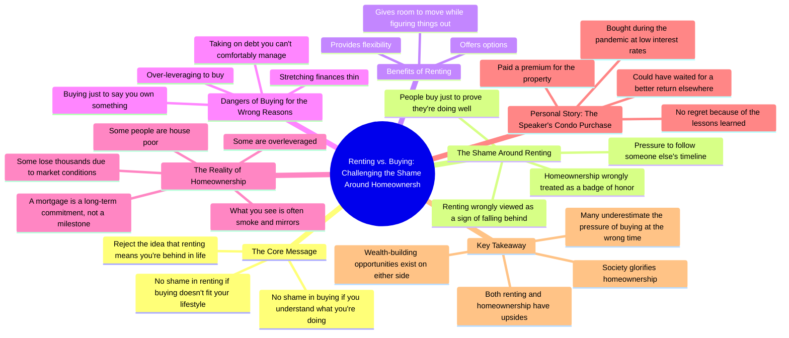

# Renting Isn't a Failure: Why Buying a House Isn't for Eve...

> 🌐 **Read this in:** [English](../../en/2026-08/tiktok-transcript-a-mortgage-is-not-a-milestone-for-most-people-it-s-a-financi-0ecf.md) · **中文**

> **Creator:** [@taraocansey](https://www.tiktok.com/@taraocansey) · **Views:** 429.0K · **Posted:** 2026-08-01 · **Niche:** finance
>
> **TL;DR:** Directly challenges a common societal pressure, immediately grabbing attention.

[Watch original video →](https://vt.tiktok.com/ZS4hcf62r/)

## Why This Went Viral

## 钩子（前3秒）
- **逐字开场白：** “别为了说‘我有房’就急着买房。”
- **钩子模式：** 大胆主张 + 直接命令（“别……”）——一种反主流立场，挑战根深蒂固的社会规范。
- **为何能让人停下滑动：** 它直击一个神圣不可侵犯的观念（买房是终极目标），并将观众可能的行为框定为愚蠢之举。它立刻制造认知失调——观众要么强烈认同（获得认同感），要么强烈反对（感到愤怒）。两种反应都会促使观众看完视频。

## 情绪节奏
1. **挑战/挑衅**（0–3秒）：“别急着买房”——直接质疑观众可能的人生选择。
2. **认同/释然**（3–8秒）：“租房没什么不对”——为那些承受社会压力的租房者卸下重担。
3. **共情/连接**（8–15秒）：“对租房的羞耻感……与事实相去甚远”——点出共同的痛点，建立信任。
4. **警示/紧张**（15–25秒）：“过度杠杆、捉襟见肘、背负无法承受的债务”——描绘另一条路的惨淡图景，制造恐惧。
5. **脆弱/共鸣**（25–35秒）：疫情期间买房的个人故事——“我不骗你，我付了溢价”——营造真实感和亲切感。
6. **反转/重构**（35–40秒）：“我不后悔我的决定”——颠覆预期；说话者并非反对买房，只是反对被压力裹挟。
7. **收束/赋能**（40–50秒）：“不要落入别人的时间表……两者都很有力量”——让观众掌握主动权，获得积极的启示。

**高潮时刻：** 个人坦白——“我为我的房产付了溢价”——因为这是创作者第一次承认失误，从说教者转变为同路人。

## 关键词密度
1. **“租房”** ——重复5次以上；情感锚点和反主流立场。
2. **“买房/拥有房产”** ——重复5次以上；制造张力的对立力量。
3. **“没什么不对”** ——重复2次；简单易记、推动核心信息的口头禅。
4. **“压力/羞耻”** ——重复3次；触及驱动互动的情感痛点。
5. **“选择/灵活性”** ——重复2次；给租房者“感觉良好”的正面重构。
6. **“时间表”** ——重复2次；推动最终行动号召（“别人的时间表”）的关键短语。

**算法触达驱动词：** “租房”和“买房”是个人理财领域的高搜索量词汇——它们触发话题匹配算法。“羞耻”和“压力”是情绪化词汇，能提升观看时长和分享率。

**情感拉动驱动词：** “没什么不对”和“时间表”是观众截图、引用和在评论中重复的短语——它们成为视频可传播的金句。

## 为何能广泛传播
- **它选边站但不疏远另一方。** 创作者明确认可租房者和买房者（“两者都有好处”），所以两个阵营都可以分享而不觉得被攻击——潜在分享受众翻倍。
- **它将个人脆弱感武器化。** 疫情期买公寓的坦白（“我付了溢价”）在这个充满炫耀的领域里是罕见的诚实时刻。这建立了信任，让整个论点更可信、更值得分享。
- **它给租房者一张“许可单”。** “不要落入别人的时间表”这句话是可引用、可截图的箴言，租房者会发给朋友或发到自己的动态里——这是一种社交货币。
- **它将“失败”重构为教训。** 通过说“我不后悔我的决定，因为我学到了很多”，创作者示范了一种健康的心态，让视频感觉像免费的生涯指导——高感知价值推动收藏和分享。
- **结构是一个完整的论证。** 它提出一个有争议的主张→认同双方→分享个人证据→给出普适的结论。它不留悬念，观众感到满足并被吸引去评论自己的立场。

## 你可以借鉴什么
1. **以挑战常规的命令开场。** 用“别为了[达成Y]就[做X]”开头——它足够有对抗性，能让人停下滑动，又足够宽泛，适用于你的领域（健身、职业、人际关系）。
2. **在视频中段插入一个个人失误。** 不要只说教——承认一个具体的、略显尴尬的财务或人生错误。这种脆弱感的爆发是把观众转化为粉丝和评论者的关键。
3. **以“双方都合理”的重构收尾。** 不要硬推销，而是以“两者都有好处”收尾——这让你的内容显得公平、不强势，从而增加信任度，也更容易被分享给犹豫不决的人。

## Mind Map

## Full Transcript (Generated by [拆解你自己的 TikTok](https://toktranscript.com/?utm_source=github&utm_medium=breakdown&utm_campaign=tool_attribution))

> 📝 Transcripts on this page are auto-generated and show the first 60%. Want to transcribe any TikTok in 30 seconds and get the full version? [Try TokTranscript free →](https://toktranscript.com/?utm_source=github&utm_medium=breakdown&utm_campaign=transcript_cta)

Stop rushing to buy a house just to say you own something. Guys, there's nothing wrong with renting if the opportunity to buy does not fit your lifestyle right now. And there's nothing wrong with buying if you actually understand what you're doing. What I don't agree with is the shame around renting. Like if you're renting, you're all of a sudden behind in life. That is so far from the truth. Renting gives you flexibility. It gives you options. It gives you room to move while you're still trying to figure things out. People treat homeownership like it's a badge of honour, like it's something that you're just supposed to collect to prove that all of a sudden you're doing well in life. So they over leverage, they stretch themselves thin, they take on debt they can't comfortably manage just to say they own something. Guys, a mortgage isn't a milestone. It's a long term commitment. A lot of what you see is smoke and mirrors. Some people are house poor, some are over leveraged, and some people have lost thousands of dollars because of market conditions. I'm gonna tell you guys a story. I bought my condo during the pandemic when interest rates were really, really low. And 

*[Read the full transcript on TokTranscript →](https://toktranscript.com/plaza/tiktok-transcript-a-mortgage-is-not-a-milestone-for-most-people-it-s-a-financi-0ecf?utm_source=github&utm_medium=breakdown&utm_campaign=transcript_full)*

## Browse More

- All [finance](../../by-niche/zh-CN/finance.md) breakdowns
- All [Contrarian command](../../by-pattern/zh-CN/hook-contrarian-command.md) examples

## Video Info

| | |
|---|---|
| Creator | [@taraocansey](https://www.tiktok.com/@taraocansey) |
| Original video | [https://vt.tiktok.com/ZS4hcf62r/](https://vt.tiktok.com/ZS4hcf62r/) |
| Original title | A mortgage is not a milestone. For most people, it’s a financial burd... |
| Views | 429.0K (429000) |
| Posted | 2026-08-01 |
| Duration | 0s |
| Niche | `finance` |
| Hook pattern | `Contrarian command` |
| Original language | `en` (this page translated by AI) |
| Available languages | en, zh-CN |
| Generated | 2026-08-02 by [TokTranscript](https://toktranscript.com/) |

---

*This breakdown is for educational analysis under fair use. Original video © [@taraocansey](https://www.tiktok.com/@taraocansey). All transcripts are auto-generated and may contain errors.*

*Want to analyze your own TikToks like this? [TokTranscript →](https://toktranscript.com/viral-breakdown?utm_source=github&utm_medium=breakdown&utm_campaign=footer_cta)*