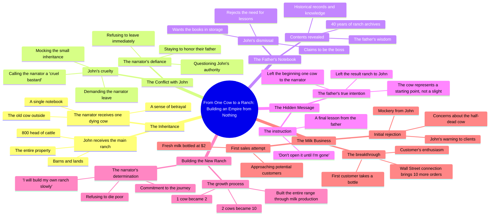

# John's Ranch Inheritance: 800 Cattle and One Old Cow

> 🌐 **Read this in:** [English](../../en/2026-08/tiktok-transcript-aistory-fruits-fruitstory-france-storytime-8d93.md) · **中文**

> **Creator:** [@unehistoiredefruits](https://www.tiktok.com/@unehistoiredefruits) · **Views:** 1.2M · **Posted:** 2026-08-01 · **Niche:** other
>
> **TL;DR:** The dying father's shocking unequal inheritance immediately creates conflict and curiosity.

[Watch original video →](https://vt.tiktok.com/ZS4kYsrDy/)

## Why This Went Viral

## 钩子（前3秒）
- **逐字开场白：**“听好了，我只有力气说一遍。约翰，房子、卡车、谷仓，还有那800头牛，全都归你。托尼，我留给你的只有外面那头老母牛。”
- **钩子模式：****对比 + 遗产戏剧**（800头牛 vs. 1头垂死的老牛）
- **为何能让人停下滑动：**父亲临终遗言制造了即刻的不公——一个儿子得到巨额财富，另一个只得到一头一文不值的老牛。观众的大脑立刻问出“为什么？”，必须看下去才能解开这个不公。

## 情绪节奏
1. **悲痛 + 紧张**（0–5秒）：父亲临终告白——沉重、肃穆、赌注已定。
2. **不公 / 愤怒**（5–15秒）：约翰继承一切；托尼只得到一头垂死的老牛。兄弟间的残忍（“你一直都是个残忍的混蛋”）点燃怒火。
3. **悬念**（15–25秒）：那本笔记本——“等我走了再打开”——制造了一个锁住的盒子般的好奇心。
4. **羞辱**（25–40秒）：约翰嘲笑托尼的牛、他的牛奶、他的贫穷。情绪最低点——观众感受到托尼的屈辱。
5. **反抗 / 希望**（40–50秒）：“那我就慢慢建起我自己的牧场”——转折点。弱者能量被点燃。
6. **证明**（50–60秒）：第一位顾客买下了牛奶。反转落地——“垂死的老牛”其实是财富的种子。
7. **高潮：**“打电话给华尔街，明天再进10头”——财富轨迹骤然上升。不公翻转成胜利。

## 关键词密度
- **“牛”**（9次）——驱动核心隐喻；对乡村/牧场受众具有算法相关性。
- **“牧场”**（6次）——锚定场景与赌注；可搜索的细分领域术语。
- **“牛奶”**（4次）——产品转折点；连接商业与日常生活的共鸣。
- **“父亲/爸”**（5次）——情绪触发词；家庭戏剧具有普世共鸣。
- **“1”/“一头”**（6次）——强化稀缺与丰盛的对比；简单、好记。
- **“建”**（3次）——励志关键词；与自我提升内容赛道契合。
- **“800”**（2次）——具体数字量化不公；驱动分享欲（“你敢信？”）。

**算法驱动词：**“牛”、“牧场”、“牛奶”——细分领域、高意图搜索词。
**情绪牵引词：**“父亲”、“建”、“一头”——触发传承、野心和弱者叙事。

## 为何能传播
- **60秒内完成不公→证明的弧线：**父亲“残忍”的遗嘱被揭示为一场天才测试。开头感到愤怒的观众在结尾得到回报——一个完整的情绪闭环，让人忍不住分享（“你一定要看看这个”）。
- **“起点与结果”的反转：**父亲的纸条（“我把结果留给了约翰，我把起点留给了你”）重新定义了整个故事。这一句话就是可分享的洞见——它是一堂人生课，而不仅仅是一个故事。
- **可共鸣的兄弟竞争：**“你一直都是个残忍的混蛋”触及了普世的家庭摩擦。观众将自己的兄弟关系投射到叙事中。
- **具体数字制造赌注：**“800头牛”对比“1头牛”一目了然。没有模糊地带——不公是可量化的，分享时容易解释。
- **弱者创业角度：**托尼的“我会慢慢建起我自己的牧场”与创作者/零工经济受众产生共鸣。这是一个伪装成家庭剧的白手起家故事。

## 你可以偷师什么
1. **用最大的不公开场，而不是铺垫。**在最大不公平的时刻开始你的视频——观众会留下来看正义是否得到伸张。（偷师：“800头牛 vs. 1头垂死的老牛”的框架。）
2. **尽早埋下一个密封的神秘物件。**那本“等我走了再打开”的笔记本制造了一个滴答作响的好奇心炸弹。引入一封未拆的信、一扇锁着的门、一个隐藏的文件——然后直到最后三分之一再揭晓。
3. **以数字递增的升级收尾。**“1头牛→2头牛→10头牛→华尔街”是一个复合式的回报，感觉既必然又满足。用可见的、可计数的步骤来呈现你故事的成长——这让胜利变得具体可感、值得分享。

## Mind Map

## Full Transcript (Generated by [TokTranscript](https://toktranscript.com/?utm_source=github&utm_medium=breakdown&utm_campaign=tool_attribution))

> 📝 Transcripts on this page are auto-generated and show the first 60%. Want to transcribe any TikTok in 30 seconds and get the full version? [Try TokTranscript free →](https://toktranscript.com/?utm_source=github&utm_medium=breakdown&utm_campaign=transcript_cta)

listen carefully I have enough strength to say it only once Johns the house of the truck lands barns and the entire herd of 800 head of cattle Tony all I leave you is the old cow that is outside this thing could die before dad shut up John I have 1 ranch you have dinner you've always been a cruel bastard take this don't open it until I'm gone it's supposed to make me think that giving me only one cow it's just him every page before judging me I hope there is 1 damn good reason what did daddy give you it's none of your business 1 notebook and 1 dying cow will not make you my equal keeps the ranch but don't destroy what dad spent his life building your caravan is behind the old shelter your father is hardly cold the property is mine now go away I'm staying with dad these books contain 40 years of the ranch's archive these 40 years of boring books can go to storage you should learn before you want to change things I'm the boss here I 

*[Read the full transcript on TokTranscript →](https://toktranscript.com/plaza/tiktok-transcript-aistory-fruits-fruitstory-france-storytime-8d93?utm_source=github&utm_medium=breakdown&utm_campaign=transcript_full)*

## Browse More

- All [other](../../by-niche/zh-CN/other.md) breakdowns
- All [Mysterious Inheritance](../../by-pattern/zh-CN/hook-mysterious-inheritance.md) examples

## Video Info

| | |
|---|---|
| Creator | [@unehistoiredefruits](https://www.tiktok.com/@unehistoiredefruits) |
| Original video | [https://vt.tiktok.com/ZS4kYsrDy/](https://vt.tiktok.com/ZS4kYsrDy/) |
| Original title | #aistory #fruits #fruitstory #france #storytime |
| Views | 1.2M (1200000) |
| Posted | 2026-08-01 |
| Duration | 0s |
| Niche | `other` |
| Hook pattern | `Mysterious Inheritance` |
| Original language | `en` (this page translated by AI) |
| Available languages | en, zh-CN |
| Generated | 2026-08-02 by [TokTranscript](https://toktranscript.com/) |

---

*This breakdown is for educational analysis under fair use. Original video © [@unehistoiredefruits](https://www.tiktok.com/@unehistoiredefruits). All transcripts are auto-generated and may contain errors.*

*Want to analyze your own TikToks like this? [TokTranscript 转录工具 →](https://toktranscript.com/viral-breakdown?utm_source=github&utm_medium=breakdown&utm_campaign=footer_cta)*