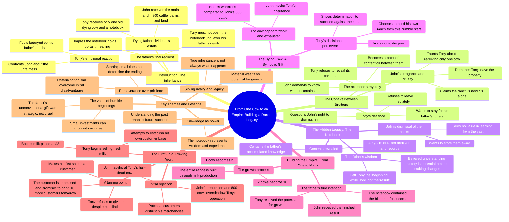

# Old Cow Inheritance: A Father's Final Words

> 🌐 **Read this in:** [English](../../en/2026-08/tiktok-transcript-aistory-fruits-fruitstory-france-storytime-da2f.md) · **中文**

> **Creator:** [@unehistoiredefruits](https://www.tiktok.com/@unehistoiredefruits) · **Views:** 1.2M · **Posted:** 2026-08-01 · **Niche:** other
>
> **TL;DR:** The father's dying words immediately create a stark contrast between a massive inheritance and a single dying cow, hooking viewers with the unfairness and mystery.

[Watch original video →](https://vt.tiktok.com/ZS4kNy83y/)

## Why This Went Viral

## 钩子（前3秒）
- **逐字开场白：** “仔细听好，我只有力气说一遍。约翰，房子、卡车、土地、谷仓，还有整整800头牛，全归你。托尼，我只留给你外面那头老母牛。”
- **钩子模式：** 对比 / 遗产反转
- **为何能让人停下滑动：** 垂死父亲的遗言给出了一个残酷而不公的分配——800头牛对一头垂死的老牛。这种不对称瞬间抓住人心；观众天生对不公敏感，而利害关系（一座牧场、一份家业、一个受宠的儿子对一个被冷落的儿子）在5秒内就建立起来。“仔细听好……只说一遍”的框架增添了终结感和戏剧张力。

## 情绪节奏
- **节拍1——震惊/不公（0–5秒）：** 不公的遗产分配落地。观众立刻对托尼产生同情。
- **节拍2——紧张/对峙（5–15秒）：** 约翰嘲讽托尼（“1本笔记本和1头垂死的老牛不会让你成为我的对手”）。兄弟之争升级；反派一目了然。
- **节拍3——悲伤/决心（15–25秒）：** 托尼拒绝离开，守在父亲遗体旁，随后发现笔记本——从受害者的身份转向沉默的坚定。
- **节拍4——好奇/发现（25–35秒）：** 揭示：“这些书里记载了牧场40年的档案。”托尼意识到那头牛不是轻视，而是一颗种子。
- **节拍5——希望/蜕变（35–50秒）：** “1头牛变成了2头，2头牛变成了10头……我留给你的是开始。”情感回报：父亲的真实用意揭晓。观众感到被印证。
- **节拍6——骄傲/反抗（50秒至结尾）：** 托尼拒绝卖给约翰的买家，坚持走自己的路（“我不会拿你的货去连累我的客户”）。最终反转：“这瓶不可思议的牛奶打给了华尔街，明天再带来10个。”逆袭者赢了。
- **高潮：** 父亲的画外音——“我把结果留给了约翰，我把开始留给了你”——是情感巅峰。它重新定义了整个冲突，带来宣泄。

## 关键词密度
- **“牛”**（提及8次以上）——核心象征。既驱动搜索相关性（牧场/牛群领域），也驱动情感吸引力（逆袭资产）。
- **“牧场”**（提及6次以上）——细分受众的核心关键词；锚定背景和利害关系。
- **“父亲/爸爸”**（提及5次以上）——情感触发器；驱动共鸣和家庭戏剧的感染力。
- **“约翰”**（提及4次以上）——反派；制造清晰的冲突和反派认同。
- **“牛奶”**（提及3次以上）——产品转折点；暗示商业/创业副线。
- **“开始”**（提及2次）——主题关键词；概括道德内核并驱动分享欲。
- **“800”**（提及2次）——具体数字，让对比更加直观、令人难忘。

## 为何能传播
- **不公→平反的弧线：** 不公的分配（800对1）钩住观众；揭示“无用”的礼物其实是成功的关键，触发令人满足的正义回报。观众分享它，是为了说：“逆袭者赢了。”
- **父亲的智慧反转：** “我把开始留给了你”是一句值得引用的、充满哲理的台词。这是那种人们会截图、引用、转发的句子——一个天然的梗。
- **可共鸣的兄弟之争：** 约翰对托尼的张力是普世的。任何有兄弟姐妹、有家族生意、或有过被低估感受的人，都会在托尼身上看到自己。
- **具体、可视化的蜕变：** “1头牛变成了2头，2头牛变成了10头”是一个简单、可视化的进程。容易理解、容易复述、容易想象——这让它在文字形式下极具分享性。
- **“华尔街”的爆点：** 最终反转——一瓶牛奶吸引来大投资人——既励志又出人意料。它把整个故事从“悲伤的农场剧”翻转成“创业胜利”，给观众一个评论和@朋友的理由。

## 你可以借鉴什么
- **以不公的不对称开场：** 用一个鲜明、可量化的对比（800对1、100万美元对10美元）开场，瞬间制造情感利害关系。观众不需要背景就能感受到不公。
- **用延迟揭示来重构冲突：** 早早埋下一个神秘物件（笔记本），然后让它在高潮时重构整个故事。这创造了“二刷”的动机，加深情感回报。
- **以一个具体、出人意料的结果收尾：** 不要只展示逆袭者赢了——要展示一个具体、意外的结果（一通华尔街电话、一次爆款销售、一份新合同）。具体性让结局显得实至名归、值得分享，也给观众一个清晰的“钩子”去告诉别人。

## Mind Map

## Full Transcript (Generated by [TokTranscript 转录工具](https://toktranscript.com/?utm_source=github&utm_medium=breakdown&utm_campaign=tool_attribution))

> 📝 Transcripts on this page are auto-generated and show the first 60%. Want to transcribe any TikTok in 30 seconds and get the full version? [Try TokTranscript free →](https://toktranscript.com/?utm_source=github&utm_medium=breakdown&utm_campaign=transcript_cta)

listen carefully I have enough strength to say it only once Johns the house of the truck lands barns and the entire herd of 800 head of cattle Tony all I leave you is the old cow that is outside this thing could die before dad shut up John I have 1 ranch you have dinner you've always been a cruel bastard take this don't open it until I'm gone it's supposed to make me think that giving me only one cow it's just him every page before judging me I hope there is 1 damn good reason what did daddy give you it's none of your business 1 notebook and 1 dying cow will not make you my equal keeps the ranch but don't destroy what dad spent his life building your caravan is behind the old shelter your father is hardly cold the property is mine now go away I'm staying with dad these books contain 40 years of the ranch's archive these 40 years of boring books can go to storage you should learn before you want to change things I'm the boss here I 

*[Read the full transcript on TokTranscript →](https://toktranscript.com/plaza/tiktok-transcript-aistory-fruits-fruitstory-france-storytime-da2f?utm_source=github&utm_medium=breakdown&utm_campaign=transcript_full)*

## Browse More

- All [other](../../by-niche/zh-CN/other.md) breakdowns
- All [The Inheritance Twist](../../by-pattern/zh-CN/hook-the-inheritance-twist.md) examples

## Video Info

| | |
|---|---|
| Creator | [@unehistoiredefruits](https://www.tiktok.com/@unehistoiredefruits) |
| Original video | [https://vt.tiktok.com/ZS4kNy83y/](https://vt.tiktok.com/ZS4kNy83y/) |
| Original title | #aistory #fruits #fruitstory #france #storytime |
| Views | 1.2M (1200000) |
| Posted | 2026-08-01 |
| Duration | 0s |
| Niche | `other` |
| Hook pattern | `The Inheritance Twist` |
| Original language | `en` (this page translated by AI) |
| Available languages | en, zh-CN |
| Generated | 2026-08-02 by [TokTranscript](https://toktranscript.com/) |

---

*This breakdown is for educational analysis under fair use. Original video © [@unehistoiredefruits](https://www.tiktok.com/@unehistoiredefruits). All transcripts are auto-generated and may contain errors.*

*Want to analyze your own TikToks like this? [我们用的转录工具 →](https://toktranscript.com/viral-breakdown?utm_source=github&utm_medium=breakdown&utm_campaign=footer_cta)*