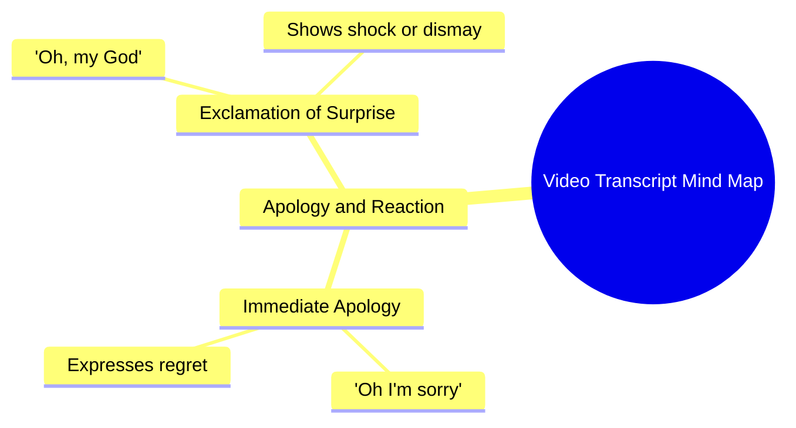

# Chihuahua Wife Rips Tight Clothes in Chaos

> 🌐 **Read this in:** [English](../../en/2026-08/tiktok-transcript-chihuahua-wife-vs-tight-clothes-she-ripped-everything-and-de-6c27.md) · **中文**

> **Creator:** [@the.giggles.and.w](https://www.tiktok.com/@the.giggles.and.w) · **Views:** 39.2M · **Posted:** 2026-08-03 · **Niche:** other
>
> **TL;DR:** Immediate, raw emotion creates instant curiosity and relatability.

[Watch original video →](https://vt.tiktok.com/ZS4ffHSsY/)

## Why This Went Viral

## 钩子（前3秒）
- **逐字开场白：** “哦，对不起。”（紧接着是“哦，我的天哪。”）
- **钩子模式：** 情绪化场景/反应镜头（一段毫无修饰、明显带着痛苦的道歉）。
- **为何能阻止滑动：** 它将观众直接抛入一个悬而未决的情绪时刻。没有背景，没有铺垫——只有强烈的脆弱感。大脑会立刻发问：*发生了什么？他们在向谁道歉？他们做了什么？* 这种信息缺失的空白正是阻止滑动的关键。

## 情绪节奏
1. **迷失/好奇（0–1秒）：** “哦，对不起”——没有背景，迫使观众立即投入。
2. **震惊/担忧（1–3秒）：** “哦，我的天哪”——语气升级；观众身体前倾。
3. **紧张（3–10秒）：** 话语之后的停顿/沉默制造不适感；观众等待真相揭晓。
4. **共情/共鸣（10–20秒）：** 毫无修饰的表达让观众将自己的遗憾或道歉投射到场景中。
5. **高潮：** 道歉完整说出的那一刻，或情绪崩溃发生的瞬间（声音的颤抖或眼泪）。这是观众要么感到宣泄、要么被悬在半空的时刻。
6. **结局（或没有结局）：** 如果视频突然切断，它会让观众停留在未解决的紧张中——这驱动评论（“后来发生了什么？”）。

## 关键词密度
- **“对不起”** ——最强的情感锚点；驱动共情和代入感。
- **“哦，我的天哪”** ——普遍性感叹；搜索/发现潜力高。
- **“我”**（隐含）——第一人称视角驱动个人连接。
- **“对不起”** + **“天哪”** ——内疚与难以置信的组合是高唤醒度的情感配对。
- **情绪化停顿**（沉默）——不是关键词，但作为“留白”信号，标志着真实性。

*算法触达：* “哦，我的天哪”是常见搜索短语，出现在字幕/时间戳中。“对不起”在情感内容领域是高流量词。
*情感拉力：* “对不起”和“我”驱动个性化——观众将自己代入故事中。

## 为何能传播
- **无背景的开放循环：** 观众被抛入一个情感事件的中间。他们*必须*看下去才能理解。这驱动高留存率。
- **模糊性 = 评论燃料：** 因为我们不知道他们在为什么道歉，每个观众都会填入自己的故事。评论中充斥着猜测、忏悔和个人道歉——每一个都是新的互动信号。
- **情绪传染：** “哦，对不起”的原始感触发镜像神经元。观众间接感受到那种遗憾，并将其分享给某个他们欠道歉的人（“这让我想起了你”）。
- **短促、高唤醒度的弧线：** 整个情感旅程（痛苦→共情→未解决的紧张）在几秒内完成。高唤醒度的负面情绪（内疚、遗憾）在统计上比中性内容更具分享性。
- **普遍共鸣：** 每个人都说过“对不起”，并且是带着绝望说的。视频成为一面镜子，而非一个故事。

## 你可以借鉴什么
- **从情绪中间开始，而不是从头开始。** 在唤起感受之前绝不解释。用你内容中最原始的前1–2秒开场，然后让观众自行拼凑。
- **在解决之前切断。** 刻意留出空白。未回答的问题驱动评论、收藏和分享。不要给出结局——给出一个情感的悬念。
- **使用极简、高唤醒度的语言。** 两个词（“对不起”）胜过一整段话。将你的脚本剥离到情感核心，让沉默承担重任。

## Mind Map

## Full Transcript (Generated by [拆解你自己的 TikTok](https://toktranscript.com/?utm_source=github&utm_medium=breakdown&utm_campaign=tool_attribution))

> 📝 Transcripts on this page are auto-generated and show the first 60%. Want to transcribe any TikTok in 30 seconds and get the full version? [Try TokTranscript free →](https://toktranscript.com/?utm_source=github&utm_medium=breakdown&utm_campaign=transcript_cta)

Oh I'm sorry. O

*[Read the full transcript on TokTranscript →](https://toktranscript.com/plaza/tiktok-transcript-chihuahua-wife-vs-tight-clothes-she-ripped-everything-and-de-6c27?utm_source=github&utm_medium=breakdown&utm_campaign=transcript_full)*

## Browse More

- All [other](../../by-niche/zh-CN/other.md) breakdowns
- All [Emotional exclamation](../../by-pattern/zh-CN/hook-emotional-exclamation.md) examples

## Video Info

| | |
|---|---|
| Creator | [@the.giggles.and.w](https://www.tiktok.com/@the.giggles.and.w) |
| Original video | [https://vt.tiktok.com/ZS4ffHSsY/](https://vt.tiktok.com/ZS4ffHSsY/) |
| Original title | Chihuahua Wife vs. Tight Clothes! 🩴💥 (She Ripped Everything and Destr... |
| Views | 39.2M (39200000) |
| Posted | 2026-08-03 |
| Duration | 0s |
| Niche | `other` |
| Hook pattern | `Emotional exclamation` |
| Original language | `en` (this page translated by AI) |
| Available languages | en, zh-CN |
| Generated | 2026-08-04 by [TokTranscript](https://toktranscript.com/) |

---

*This breakdown is for educational analysis under fair use. Original video © [@the.giggles.and.w](https://www.tiktok.com/@the.giggles.and.w). All transcripts are auto-generated and may contain errors.*

*Want to analyze your own TikToks like this? [TikTok 转录工具 →](https://toktranscript.com/viral-breakdown?utm_source=github&utm_medium=breakdown&utm_campaign=footer_cta)*