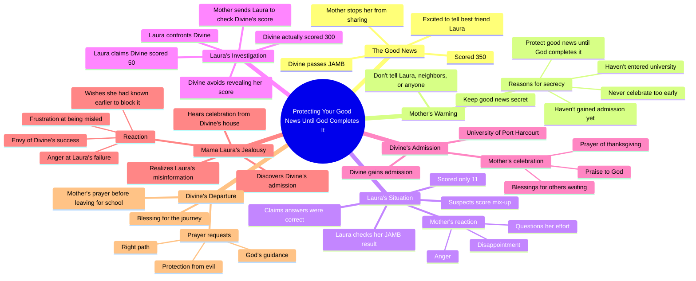

# True Life Story: I Passed My JAMB Exam

> 🌐 **Read this in:** [English](../../en/2026-08/tiktok-transcript-full-story-based-on-true-life-experience-aigenerated-fyp-vir-4d18.md) · **中文**

> **Creator:** [@omoai7](https://www.tiktok.com/@omoai7) · **Views:** 1.8M · **Posted:** 2026-08-09 · **Niche:** entertainment
>
> **TL;DR:** The immediate shushing creates suspense and curiosity about the hidden good news.

[Watch original video →](https://vm.tiktok.com/ZN8Rfowqq/)

## Why This Went Viral

## 钩子（前3秒）
- **逐字开场：**“妈妈！妈妈，我有好消息。嘘！小声点。我们进去说。”
- **钩子模式：**场景 + 反差（兴奋 vs. 隐秘）
- **为何能让人停下滑动：**女儿爆棚的兴奋立刻被母亲压低声音的急切所压制。“好消息”与“保持安静”之间的张力制造了一个即时的谜团——观众需要知道为什么母亲害怕庆祝。

## 情绪节奏
- **好奇**——“妈妈，我有好消息”→“嘘！小声点”
- **紧张**——母亲拒绝让女儿与任何人分享这个消息
- **智慧/共鸣**——“永远不要过早庆祝。在上帝成就它之前，保护好你的好消息。”（这是主题核心）
- **反差/同情**——劳拉11分的羞辱；母亲冷酷的“总是一个失望接一个失望”
- **悬念**——劳拉调查黛薇恩的分数；故意谎称“50”
- **反转**——劳拉妈妈的独白揭示了她真正的嫉妒：“这个院子里不该有任何庆祝，除非是来自我家”
- **高潮**——“要是我早知道就好了。现在太晚了。一切都毁了。”
- **结局/释然**——黛薇恩妈妈为女儿离家求学祷告；精神上的圆满

## 关键词密度
- **“好消息”**——重复5次以上；推动核心冲突和情感牵引
- **“庆祝”**——重复4次以上；标志着嫉妒驱动的反派的执念
- **“录取”**——重复5次以上；锚定情节的具体目标
- **“JAMB”**——重复4次以上；具有文化特定性，提升尼日利亚观众中的细分算法触达
- **“妈妈”**——重复15次以上；情感锚点，家庭共鸣
- **“保护”**——重复2次；智慧主题，推动分享传播
- **“只有我家”**——重复2次；反派的口头禅，情感冲击力强

**算法驱动词：**JAMB、录取、哈科特港大学（可搜索、带地点标签）
**情感牵引词：**好消息、保护、庆祝、妈妈（ relatable、可分享）

## 为何能广泛传播
- **以故事形式呈现的普遍性嫉妒恐惧。**母亲的警告——“在上帝成就它之前，保护好你的好消息”——是一种广泛持有的文化信念（尤其在非洲社区）。观众将其作为教训分享，而不仅仅是娱乐。
- **反派的独白真实得令人不适。**劳拉妈妈的“这个院子里不该有任何庆祝，除非是来自我家”是一段赤裸裸、不加修饰的嫉妒告白。它引发强烈反应——愤怒、认同或自我反思——从而驱动评论。
- **“11分对300分”的分数对比制造即时的幸灾乐祸。**那个撒谎算计的女儿被羞辱；谦逊的人成功了。这种道德回报令人深感满足，值得反复观看。
- **祷告式结尾提供精神共鸣。**最后的祷告（“愿每一位等待好消息的父母都能收到自己的见证”）直接面向观众，让他们感到被纳入祝福之中。这是对信仰型受众经过验证的互动钩子。
- **“要是我早知道就好了”的反转。**反派的垮台源于她自身的信息缺失——一种诗意的正义时刻，观众会截图并在评论中引用。

## 你可以借鉴的
- **以被压抑的情绪开场。**在兴奋与克制相遇的时刻开始你的视频（“嘘！小声点”）。这无需任何背景故事就能制造即时张力。
- **给反派一段独白。**让反派大声揭示他们的真实动机。赤裸、失控的自言自语极具剪辑传播性，也容易引发评论。
- **以直接面向观众的祝福结尾。**以包含观众的祷告或祝愿收尾（“愿每一位等待好消息的父母都能收到自己的见证”）。这将被动观众转化为参与者，并提升分享率。

## Mind Map

## Full Transcript (Generated by [TokTranscript](https://toktranscript.com/?utm_source=github&utm_medium=breakdown&utm_campaign=tool_attribution))

> 📝 Transcripts on this page are auto-generated and show the first 60%. Want to transcribe any TikTok in 30 seconds and get the full version? [Try TokTranscript free →](https://toktranscript.com/?utm_source=github&utm_medium=breakdown&utm_campaign=transcript_cta)

Mama! Mama, I have good news. Shh! Lower your voice. Let's go inside. Mama, what's wrong? Is everything okay? Everything is fine. Just follow me. Mama, why did you stop me? I was so excited. I couldn't wait to tell you the good news. I know. So what's the good news? Mama, I passed my JAMB. I scored 3:50. Oh, my daughter, I'm so proud of you. You've made me very happy. Mama, I can't wait to tell Laura. She'll be so happy for me. Listen to me carefully. I don't want you telling this to anyone. Not Laura, not the neighbors, nobody. Do you understand? Mama, Laura is my best friend. Why should I hide something so good from her? Because some things are best kept secret. And this is only the beginning. You passed JMB. You haven't gained admission, and you haven't entered the university. Never celebrate too early. Protect your good news until God completes it. Oh, okay, Mom. Laura, let me see your result. Mama, give it to me. 11. You scored 11, Laura. Mama, I don't understand. I answered the questions. I think they mixed up my score. Enough! Always one disappointment after another. How does someone score 11? What were you doing in that exam hall? I'm sorry, Mama. I'll do better next time. What about divine? Has she checked his? I don't know. I haven't asked. Go find out today. I want to know exactly what she scored. Okay, Mama. Divine. Divine! Hi, Laura, how are you? I'm fine. Have you checked your JMB results yet? Um. Um. Not yet. What about you? Have you checked yours? Yes. Oh really? How is it? Fine. I scored 300. Wow, 300! That's big. Thank you. When are you checking yours? Soon. Okay. Mama! Mama! What is it? My daughter? Mama, I've gained admission. I've been admitted to the university of Port Harcourt. Oh, my father, king of kings, receive all the honour. You have remembered the labour of this child. Thank you. May every parent waiting for good news receive their own testimony. May every child trusting you for open doors be remembered by your mercy. The same god who has done this for us will do it for them. Amen. What is this sound of joy and happiness I'm hearing from Mama Divine's house? What are they celebrating? Laura told me divine scored 50 in JAMB. There's no way she would gain admission with such low score. So what could they possibly be celebrating? No, something isn't right. I must find out. This my neighbour is somet

*[Read the full transcript on TokTranscript →](https://toktranscript.com/plaza/tiktok-transcript-full-story-based-on-true-life-experience-aigenerated-fyp-vir-4d18?utm_source=github&utm_medium=breakdown&utm_campaign=transcript_full)*

## Browse More

- All [entertainment](../../by-niche/zh-CN/entertainment.md) breakdowns
- All [Mystery/Secret Hook](../../by-pattern/zh-CN/hook-mystery-secret-hook.md) examples

## Video Info

| | |
|---|---|
| Creator | [@omoai7](https://www.tiktok.com/@omoai7) |
| Original video | [https://vm.tiktok.com/ZN8Rfowqq/](https://vm.tiktok.com/ZN8Rfowqq/) |
| Original title | Full story based on true life experience.#aigenerated #fyp #viralvideos  |
| Views | 1.8M (1800000) |
| Posted | 2026-08-09 |
| Duration | 0s |
| Niche | `entertainment` |
| Hook pattern | `Mystery/Secret Hook` |
| Original language | `en` (this page translated by AI) |
| Available languages | en, zh-CN |
| Generated | 2026-08-11 by [TokTranscript](https://toktranscript.com/) |

---

*This breakdown is for educational analysis under fair use. Original video © [@omoai7](https://www.tiktok.com/@omoai7). All transcripts are auto-generated and may contain errors.*

*Want to analyze your own TikToks like this? [免费 TikTok 文稿生成器 →](https://toktranscript.com/viral-breakdown?utm_source=github&utm_medium=breakdown&utm_campaign=footer_cta)*