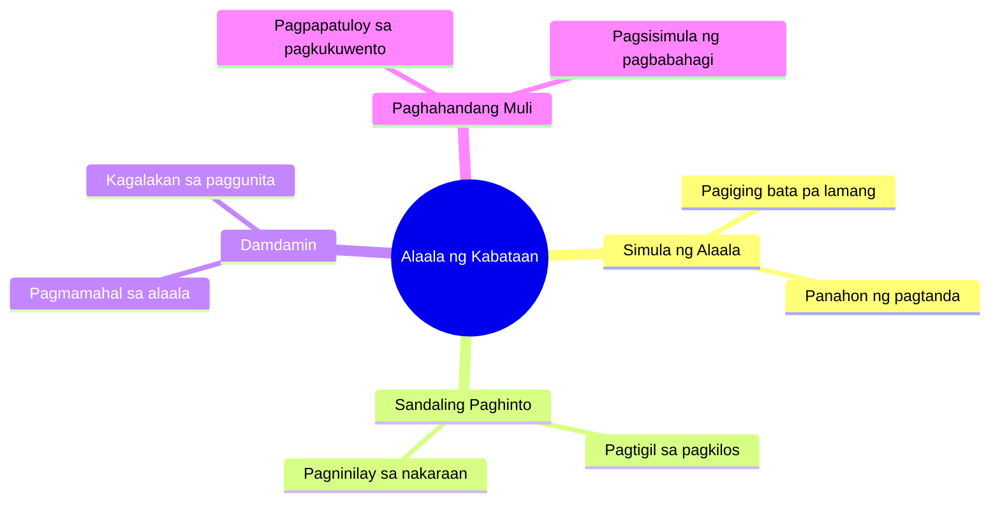

# Thank You Lord For Answered Prayers

> 🌐 **Read this in:** [English](../../en/2026-08/tiktok-transcript-fyp-fyp-fypviral-jesus-thankyou-lord-amen-e-043f.md) · **中文**

> **Creator:** [@johnliv94](https://www.tiktok.com/@johnliv94) · **Views:** 329.8K · **Posted:** 2026-08-01 · **Niche:** other
>
> **TL;DR:** The hook instantly triggers a shared memory of childhood, making viewers feel a personal connection.

[Watch original video →](https://vt.tiktok.com/ZS4ksxgr4/)

## Why This Went Viral

## Hook（前3秒）
- **逐字内容：** “哟，我爱，我记得那时候，哟，来吧 记得我年轻的时候，所以我站着不动”
- **模式：** 场景 + 怀旧 + 错位的期待（“年轻”和“站着不动”之间的对比，仿佛后面有个笑点要爆出来）
- **为什么能抓住人：** 台词快速断裂（“哟，我爱……我记得……来吧”）——好像要讲一个很大的故事。“当我年轻的时候”是普遍的触发点；每个人都有记忆。但“站着不动”是出乎意料的——所以观众会留下来看看接下来会发生什么。

## 情绪节奏
- **节拍1（0–3秒）：** 好奇 + 怀旧——“我记得我年轻的时候”——立刻变得个人化且容易产生共鸣。
- **节拍2（3–6秒）：** 张力——“站着不动”留下了一个悬而未决的问题：*为什么？发生了什么？*
- **节拍3（6–10秒）：** 期待——“记得”的重复像是在搭建一个场景；大脑在等待一个答案。
- **节拍4（高潮）：** 反转/揭示——“站着不动”变成了笑点或转折点；情绪释放在这里爆发（笑、心动，或者“原来如此”）。
- **节拍5（结尾）：** 余韵——“记得”的重复留下了一种共同体验的回味。

## 关键词密度
- **“记得”**（3次）——算法触达：怀旧驱动的内容具有高分享性；这也是YouTube/TikTok搜索的触发器。
- **“年轻”**——情感拉力：普遍话题；打开了评论的闸门（“我懂这个”）。
- **“我爱”**——情感拉力：展现真实性；增强与观众的连接。
- **“站着不动”**——算法 + 情感：这个短语是“钩子中的钩子”——变得可搜索、可引用；成为梗模板。
- **“来吧”**——情感拉力：像是一种邀请；让观众感觉自己参与了故事。

## 为什么它会传播
- **怀旧是分享触发器。** “当我年轻的时候”不仅仅是个人化的——它是集体性的。观众会评论他们自己的“记得那时候”的故事，所以互动量增长，算法也会更多推送这个视频。
- **“站着不动”的反转制造了循环。** 这个出乎意料的短语变成了“洗脑旋律”——反复观看以理解上下文。重看率高，这是对算法的强信号。
- **短小、碎片化的台词 = 高留存率。** “哟，我爱，我记得那时候，哟”像说唱节奏——快速的节奏防止了滑动跳过。每一个停顿都有情感重量。
- **它是一个模板，而不仅仅是一个视频。** “记得[年轻]的时候 + [出乎意料的动作]”的结构很容易被其他人重新创作。一旦有人翻拍，传播就变成连锁反应。
- **真实性胜过制作。** 没有剧本化的开场，没有铺垫——像是真实的聊天。这种粗糙感增强了信任和分享。

## 你可以借鉴什么
- **以碎片化、快节奏的台词开场。** 不要精心设计开场白。使用“哟，我记得，来吧”的风格——它在观众还没想好要不要滑动之前就展现了能量并抢夺了注意力。
- **使用普遍触发点 + 一个反转。** 选择一个容易引起共鸣的话题（年龄、地点、食物、前任），并以一个出乎意料的动作收尾。这种对比会让你的视频被人记住。
- **以开放式结尾收场。** 不要解释一切。把“站着不动”留得像一个谜语——观众会评论他们的解读，传播就从那里开始。

## Mind Map

## Full Transcript (Generated by [拆解你自己的 TikTok](https://toktranscript.com/?utm_source=github&utm_medium=breakdown&utm_campaign=tool_attribution))

> 📝 Transcripts on this page are auto-generated and show the first 60%. Want to transcribe any TikTok in 30 seconds and get the full version? [Try TokTranscript free →](https://toktranscript.com/?utm_source=github&utm_medium=breakdown&utm_campaign=transcript_cta)

Yo, I love, I remember when, yo, let's do it Remember w

*[Read the full transcript on TokTranscript →](https://toktranscript.com/plaza/tiktok-transcript-fyp-fyp-fypviral-jesus-thankyou-lord-amen-e-043f?utm_source=github&utm_medium=breakdown&utm_campaign=transcript_full)*

## Browse More

- All [other](../../by-niche/zh-CN/other.md) breakdowns
- All [Nostalgic callback](../../by-pattern/zh-CN/hook-nostalgic-callback.md) examples

## Video Info

| | |
|---|---|
| Creator | [@johnliv94](https://www.tiktok.com/@johnliv94) |
| Original video | [https://vt.tiktok.com/ZS4ksxgr4/](https://vt.tiktok.com/ZS4ksxgr4/) |
| Original title | ᴛʜᴀɴᴋ ʏᴏᴜ ʟᴏʀᴅ🙏😇 #fyp #fypシ #fypviral#jesus  #thankyou #lord #amen #e... |
| Views | 329.8K (329800) |
| Posted | 2026-08-01 |
| Duration | 0s |
| Niche | `other` |
| Hook pattern | `Nostalgic callback` |
| Original language | `tl` (this page translated by AI) |
| Available languages | en, zh-CN |
| Generated | 2026-08-03 by [TokTranscript](https://toktranscript.com/) |

---

*This breakdown is for educational analysis under fair use. Original video © [@johnliv94](https://www.tiktok.com/@johnliv94). All transcripts are auto-generated and may contain errors.*

*Want to analyze your own TikToks like this? [我们用的转录工具 →](https://toktranscript.com/viral-breakdown?utm_source=github&utm_medium=breakdown&utm_campaign=footer_cta)*