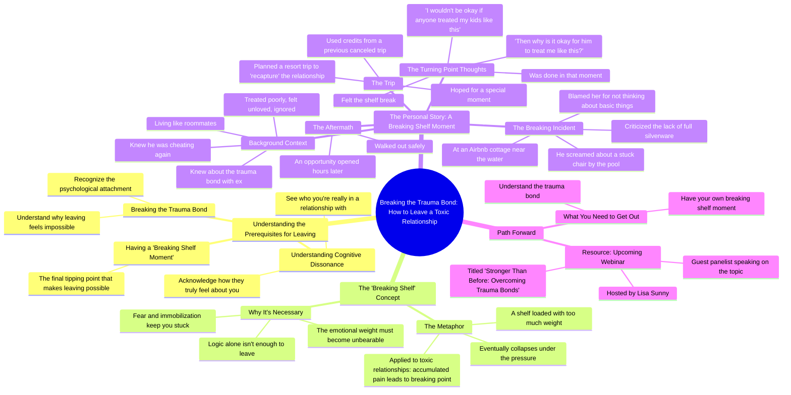

# Why You Can't Leave a Toxic Partner: Break the Trauma Bond

> 🌐 **Read this in:** [English](../../en/2026-08/tiktok-transcript-here-s-why-you-re-struggling-to-leave-a-toxic-partner-you-ha-459b.md) · **中文**

> **Creator:** [@kerrymcavoyphd](https://www.tiktok.com/@kerrymcavoyphd) · **Views:** 913.9K · **Posted:** 2026-08-02 · **Niche:** entertainment
>
> **TL;DR:** Immediately speaks to the viewer's pain and offers a clear path, creating urgency and relevance.

[Watch original video →](https://www.tiktok.com/@kerrymcavoyphd/video/7322565320030424362?is_from_webapp=1&sender_device=pc)

## Why This Went Viral

## 钩子（前3秒）
- **逐字开场白：**“你不会离开那段有毒的关系，除非几件事发生……”
- **钩子模式：**大胆断言 + 直接称呼（“你不会离开”）。
- **为何能让人停下滑动：**它向观众当下的现实发出挑战，暗示他们被困住了，而说话者掌握着他们缺失的答案。它立刻制造认知失调——观众要么产生共鸣（“我被困住了”），要么被这种笃定所吸引。

## 情绪节奏
- **节拍1——好奇/紧张：**大胆断言设定了一个问题（无法离开）并承诺一个解决方案（几件事必须发生）。
- **节拍2——认同/验证：**说话者点名内心的混乱（“混杂的信号”“恐惧”“动弹不得”）——这是对目标受众的一面镜子。
- **节拍3——隐喻/清晰：**“架子断裂”的类比为一种抽象的情绪状态提供了可视化的、可触摸的解释，制造了一个“顿悟”时刻。
- **节拍4——故事/共鸣（紧张感上升）：**度假之旅的叙述构建了琐碎却痛苦的细节（室友、被忽视、生病），让处境显得真实而令人窒息。
- **节拍5——反转/高潮：**荒谬的触发点（卡住的椅子、缺失的银器）成为压垮骆驼的最后一根稻草。关键台词：*“如果任何人这样对待我的孩子，我绝不会接受……那为什么他这样对待我就可以？”*——这是情绪的最高点，也是自我觉醒的时刻。
- **节拍6——解决/释然：**“我感觉架子断了。我彻底结束了。”随后是一个安全的出口和温和的行动号召（网络研讨会）。

## 关键词密度
- **有毒的关系**（算法型：高搜索量、高共情话题）
- **创伤联结**（算法型+情绪型：小众心理学术语，彰显专业性）
- **架子断裂时刻**（情绪型：自创短语，令人难忘，创造新的心智模型）
- **离开**（情绪型：观众的核心渴望）
- **对待我**（情绪型：聚焦于不公和自我价值）
- **困惑/令人困惑**（情绪型：验证观众的心理迷雾）
- **架子**（情绪型：锚定隐喻，反复出现以强化记忆）

## 为何能传播
1. **“命名即驯服”效应：**说话者为一种广泛存在但难以言说的体验赋予了新词汇（“架子断裂时刻”）。人们会分享能帮他们表达自身痛苦的内容。
2. **“我没疯”的验证：**像“我甚至说不清自己为什么离不开”和“把我搞得困惑至极”这样的台词，验证了观众的羞耻感和困惑，让他们感到被看见，并促使他们分享给“需要听到这个”的朋友。
3. **具体而荒诞的轶事：**卡住的椅子+缺失银器的故事如此平凡却又令人愤怒，以至于极具分享性。它比任何抽象建议都更有力地证明了观点——人们会把它分享出去，并说“这就是情感虐待的样子”。
4. **父母视角的重构：**“如果任何人这样对待我的孩子，我绝不会接受”这句话是一个普世的、发自本能的标准，瞬间重新定义了自我价值。这是观众会引用和转发的“顿悟”时刻。
5. **清晰、可操作的结构：**视频不只是抱怨；它是一个三步公式（创伤联结→理解→架子断裂）。这让它感觉像一堂微课，提升了感知价值，促进了保存和转发行为。

## 你可以借鉴什么
1. **发明一个粘性隐喻：**为一个常见问题创造一个“品牌化”概念（比如“架子断裂时刻”）。它让你的建议令人难忘，并给观众一个可以使用和分享的短语。
2. **运用“自我标准”转折：**在你的故事中，加入一个时刻——你把自己自然会给予所爱之人（孩子、朋友、父母）的标准应用到自己身上。这是一个强大的修辞手法，能触发观众的自我反思。
3. **以微课形式构建：**以大胆断言开场（“你不会X，直到Y发生”），列出步骤，然后用一个生动、具体的故事加以说明。这种“公式+证明”的结构能建立权威感并保持高留存率。

## Mind Map

## Full Transcript (Generated by [免费 TikTok 文稿生成器](https://toktranscript.com/?utm_source=github&utm_medium=breakdown&utm_campaign=tool_attribution))

> 📝 Transcripts on this page are auto-generated and show the first 60%. Want to transcribe any TikTok in 30 seconds and get the full version? [Try TokTranscript free →](https://toktranscript.com/?utm_source=github&utm_medium=breakdown&utm_campaign=transcript_cta)

you're not gonna leave that toxic relationship until a few things happen one you have to break the trauma bond two you have to understand what actually has happened who you're really in a relationship with and how they truly feel about you in other words understand the cognitive dissonance but you also need to have what's called breaking shelf moment here's my breaking shelf moment I knew I had a trauma bond with my ex I knew that he was giving me mixed messages that were confusing the hell out of me but I still couldn't leave and I couldn't even tell you why I couldn't leave I just knew that leaving felt not possible I was terrified I felt immobilized you know how you have a shelf in your house and you keep loading it up and you put more and more on the shelf and finally you put too much and that moment you put too much whatever it is the shelf comes down that's what has to happen in order for us to leave these toxic relationships we need to have a moment when too much gets loaded on that shelf it breaks and when we're ready to leave here's my moment I knew he was back to cheating he's treating me awful I was feeling really confused about everything I wasn't feeling loved he was ignoring me basically where we're practically living like roommates so we take a trip a resort to use up some credit that we had from another trip that we didn't take and I wanted to be like this extra special moment like a recapture moment for us why I thought that would work I I don't know we're on this trip and he's treating me horribly worse than ever and we are ending the trip with a couple days stay at an Airbnb in order to coordinate the end of our resort trip and the getting a flight cause we're on an island that doesn't have flights every day I know complicated so we're at this really cool cottage near the water and we're at

*[Read the full transcript on TokTranscript →](https://toktranscript.com/plaza/tiktok-transcript-here-s-why-you-re-struggling-to-leave-a-toxic-partner-you-ha-459b?utm_source=github&utm_medium=breakdown&utm_campaign=transcript_full)*

## Browse More

- All [entertainment](../../by-niche/zh-CN/entertainment.md) breakdowns
- All [Direct address with a promise of a solution](../../by-pattern/zh-CN/hook-direct-address-with-a-promise-of-a-solution.md) examples

## Video Info

| | |
|---|---|
| Creator | [@kerrymcavoyphd](https://www.tiktok.com/@kerrymcavoyphd) |
| Original video | [https://www.tiktok.com/@kerrymcavoyphd/video/7322565320030424362?is_from_webapp=1&sender_device=pc](https://www.tiktok.com/@kerrymcavoyphd/video/7322565320030424362?is_from_webapp=1&sender_device=pc) |
| Original title | Here’s why you’re struggling to leave a toxic partner. You haven’t ha... |
| Views | 913.9K (913900) |
| Posted | 2026-08-02 |
| Duration | 0s |
| Niche | `entertainment` |
| Hook pattern | `Direct address with a promise of a solution` |
| Original language | `en` (this page translated by AI) |
| Available languages | en, zh-CN |
| Generated | 2026-08-03 by [TokTranscript](https://toktranscript.com/) |

---

*This breakdown is for educational analysis under fair use. Original video © [@kerrymcavoyphd](https://www.tiktok.com/@kerrymcavoyphd). All transcripts are auto-generated and may contain errors.*

*Want to analyze your own TikToks like this? [TokTranscript 转录工具 →](https://toktranscript.com/viral-breakdown?utm_source=github&utm_medium=breakdown&utm_campaign=footer_cta)*