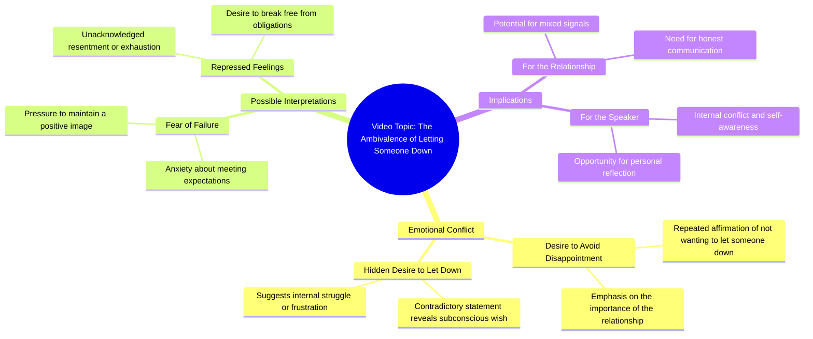

# Honda Civic Sport Drive-By

> 🌐 **Read this in:** [English](../../en/2026-08/tiktok-transcript-hondacivic-sport-fyp-trending-a72a.md) · **中文**

> **Creator:** [@mondragonbriiii](https://www.tiktok.com/@mondragonbriiii) · **Views:** 728.8K · **Posted:** 2026-08-08 · **Niche:** entertainment
>
> **TL;DR:** The repeated phrase creates a rhythmic emotional plea that instantly grabs attention.

[Watch original video →](https://www.tiktok.com/t/ZTA7CHjXm/)

## Why This Went Viral

## Hook（前3秒）
- **逐字开场白：**“我不想让你失望，我不想让你失望，我想让你失望。”
- **钩子模式：** **对比 / 反转** ——重复的“不想”营造出一种安慰的预期，最后一句“我想”却将其翻转成挑衅或黑色幽默。
- **为何能阻止滑动：**大脑会自动补全熟悉的歌词模式，但意外的词语替换（“想”而非“不想”）制造了一个微小的惊喜，迫使读者重新阅读。这是一种需要解决的认知痒点。

## 情绪节奏
- **节拍1——熟悉感（0–1秒）：**重复的“不想”触发已知的流行歌曲韵律，带来舒适感。
- **节拍2——张力（1–2秒）：**第二次重复积累期待——观众预期第三句会完成这一模式。
- **节拍3——反转/释放（2–3秒）：**“我想让你失望”打破了模式，落点可以是玩笑、告白，或一个可被做成梗的荒诞。
- **高潮：**最后一个词“失望”——真正的翻转——是点睛之笔。之前的一切都是铺垫。
- **余韵：**观众的大脑重新处理这句话，产生一种“等等，什么？”的瞬间，推动评论和分享。

## 关键词密度
- **“让你失望”** ——出现3次，核心短语；驱动算法对歌曲《Never Gonna Give You Up》（Rick Astley）及相关梗内容的关键词匹配。
- **“不想”** ——出现2次，建立模式；因暗示脆弱而具有高情绪吸引力。
- **“想”** ——出现1次，反转词；重复率低但情绪权重最高——它是破坏者。
- **“我”** ——出现3次，使陈述个人化，驱动共鸣感和第一人称参与。
- **“失望”** ——出现3次，锚定押韵和情绪的下坠；通过音频匹配实现算法触达。

## 为何能传播
- **模式中断：**这段文本是预期与违背的完美循环。观众分享它，因为这个反转*刚好*出乎意料到让人觉得聪明，但又不令人困惑——这是一个瞬间就能理解的“抓到了”。
- **适合做梗的模糊性：**这句话既可以当作分手告白、自嘲笑话，也可以当作钓鱼挑衅。这种模糊性 invites 混剪、合拍和字幕创作，成倍扩大其触达范围。
- **视听同步潜力：**词语的节奏天然具有音乐性——创作者可以将其同步到鼓点坠落、露脸瞬间或戏剧性停顿，使其成为其他视频的模板。
- **低参与门槛：**这段文本只有3秒长，任何人都可以用自己的脸或情境重新演绎。这是一种“填空”格式，激发用户生成内容。
- **情绪过山车：**从“不想”（在乎）到“想”（自私）的转变创造了一个关于背叛的微叙事——一种普遍感受，促使观众@朋友或评论“这就是我”。

## 你可以偷师什么
1. **使用“近似重复”钩子：**从一个熟悉的模式开始（一句歌词、一个常见短语、一个陈词滥调），然后翻转最后一个词或短语。大脑的预测误差就是钩子。
2. **铺垫控制在3秒以内：**整个反转必须在观众拇指滑动之前落地。去掉任何开场白——第一个词就应该已经处于模式之中。
3. **为可混剪而设计：**让核心句子足够短、足够有节奏感，使其他创作者能轻松将其叠加到自己的画面上。如果你的文本可以被唱出来、说出来或做成字幕配在任何内容上，它就具有可分享性。

## Mind Map

## Full Transcript (Generated by [TokTranscript](https://toktranscript.com/?utm_source=github&utm_medium=breakdown&utm_campaign=tool_attribution))

> 📝 Transcripts on this page are auto-generated and show the first 60%. Want to transcribe any TikTok in 30 seconds and get the full version? [Try TokTranscript free →](https://toktranscript.com/?utm_source=github&utm_medium=breakdown&utm_campaign=transcript_cta)

I don't wanna let you down, I don't wanna let

*[Read the full transcript on TokTranscript →](https://toktranscript.com/plaza/tiktok-transcript-hondacivic-sport-fyp-trending-a72a?utm_source=github&utm_medium=breakdown&utm_campaign=transcript_full)*

## Browse More

- All [entertainment](../../by-niche/zh-CN/entertainment.md) breakdowns
- All [Repetition with emotional tension](../../by-pattern/zh-CN/hook-repetition-with-emotional-tension.md) examples

## Video Info

| | |
|---|---|
| Creator | [@mondragonbriiii](https://www.tiktok.com/@mondragonbriiii) |
| Original video | [https://www.tiktok.com/t/ZTA7CHjXm/](https://www.tiktok.com/t/ZTA7CHjXm/) |
| Original title | #hondacivic #sport #fyp #trending  |
| Views | 728.8K (728800) |
| Posted | 2026-08-08 |
| Duration | 0s |
| Niche | `entertainment` |
| Hook pattern | `Repetition with emotional tension` |
| Original language | `en` (this page translated by AI) |
| Available languages | en, zh-CN |
| Generated | 2026-08-09 by [TokTranscript](https://toktranscript.com/) |

---

*This breakdown is for educational analysis under fair use. Original video © [@mondragonbriiii](https://www.tiktok.com/@mondragonbriiii). All transcripts are auto-generated and may contain errors.*

*Want to analyze your own TikToks like this? [免费 TikTok 文稿生成器 →](https://toktranscript.com/viral-breakdown?utm_source=github&utm_medium=breakdown&utm_campaign=footer_cta)*