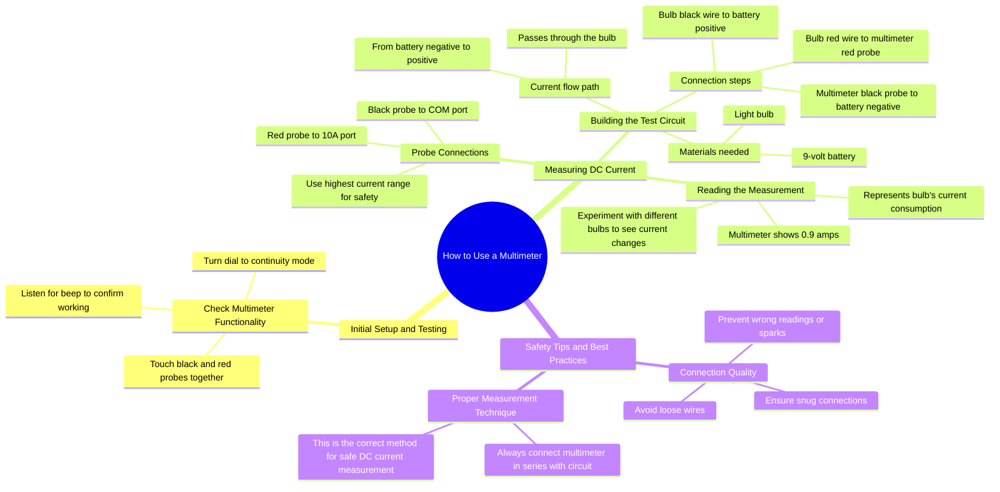

# How to Use a Multimeter: Check Continuity and Measure DC...

> 🌐 **Read this in:** [English](../../en/2026-08/tiktok-transcript-how-to-use-a-multimeter-tik-knowledge-science-multimeter-aab0.md) · **中文**

> **Creator:** [@knowledgesnap0](https://www.tiktok.com/@knowledgesnap0) · **Views:** 1.2M · **Posted:** 2026-08-07 · **Niche:** tech
>
> **TL;DR:** The hook immediately engages the viewer with a common question and promises a learning experience.

[Watch original video →](https://vt.tiktok.com/ZS4X9EaX2/)

## Why This Went Viral

## 钩子（前3秒）
- **逐字开场白：** “你知道怎么用万用表吗？咱们来学学。”
- **钩子模式：** 提问 + 直接邀请（一个“好奇缺口”，同时承诺能学会）。
- **为何能让人停下刷屏：** 它精准击中一个巨大的潜在痛点——大多数人都有或见过万用表，但心里发怵。这个问题触发“不知道，但我应该会”的自我认同，而“咱们来学学”消除了羞耻感，让人觉得这是一场低门槛、友好的教学。

## 情绪节奏
- **好奇（0–3秒）：** 问题打开一个缺口——“我真的会这个吗？”
- **安心（3–10秒）：** 通断测试简单又满足（蜂鸣声=即时奖励）。观众觉得“我能行”。
- **紧张（10–20秒）：** “为了安全，始终用最高电流档”引入一丝危险感（电、损坏）——抬高赌注。
- **清晰（20–35秒）：** 分步接线有条不紊；万用表上0.9安培读数的画面带来一个实实在在的“啊哈”时刻。
- **反转/小贴士（35–42秒）：** “线松了会导致读数不准甚至打火花”——一小波谨慎感，像内行才知道的知识。
- **高潮（42–48秒）：** 最后一条规则——“始终串联连接”——作为核心要点落地，干脆利落地收尾，带来一种掌握感。
- **收束：** 观众觉得不到一分钟就学会了一项真本事。

## 关键词密度
1. **万用表** —— 重复5次；核心搜索词，驱动算法发现。
2. **表笔** —— 重复4次；技术但具体，有助于视觉搜索。
3. **电流** —— 重复4次；物理关键词，体现教育价值。
4. **测量** —— 隐含并多次出现；动作动词，提升“怎么做”类SEO。
5. **电池** —— 重复3次；熟悉物件，降低畏惧感。
6. **灯泡** —— 重复3次；视觉锚点，让概念变得可感知。
7. **安全** —— 重复2次；触发情绪拉力（减少恐惧）。
8. **串联** —— 只出现1次，但它是“秘密”关键词；制造记忆钩子。

- **算法触达：** “万用表”“电流”“测量”——高流量搜索词，将视频归类为教育内容。
- **情绪拉力：** “安全”“火花”“读数不准”——建立信任和紧迫感。

## 为何能传播
1. **普适的技能缺口：** 开场问题是个特洛伊木马——对初学者（学习）和爱好者（验证知识）都适用。文案中的“你知道……吗？”对任何见过万用表的人来说都是零门槛的入口。
2. **微奖励循环：** 第5秒的通断蜂鸣声是即时的多巴胺刺激。文案搭建了“测试→成功”的模式，为后续教学预热大脑。
3. **安全作为钩子：** “为了安全，始终用最高电流档”和“火花”增添了一丝危险气息。这提高了情绪赌注，又不至于吓人——观众把它当作“保命小贴士”分享，而不只是DIY技巧。
4. **具体的视觉证明：** 万用表上0.9安培的读数是看得见的结果。这种“看着它工作”的时刻让观众觉得自己完成了什么，促使他们评论“真简单”或@需要这个的朋友。
5. **好记的最终规则：** “始终串联连接”是一个简单、可复述的要点。这种话观众会在评论里引用或收藏备用，推动互动信号。

## 你可以偷师的
1. **用一个不让人丢脸、却能暴露无知的问题开场：** “你知道怎么……吗？”之所以有效，是因为它暗示大多数人不会，但紧接着的“咱们来学学”把它变成共同旅程，而不是说教。
2. **在前10秒内设置一个微奖励：** 在正式教学前给观众一个快速成就感（蜂鸣测试）。这营造出“我正在成功”的感觉，让他们继续看下去。
3. **用一条简单、可复述的规则收尾：** 把整个教程浓缩成一句话（“始终串联连接”）。这给了观众一个可以复述、评论或收藏的要点——从而推动算法互动。

## Mind Map

## Full Transcript (Generated by [TokTranscript](https://toktranscript.com/?utm_source=github&utm_medium=breakdown&utm_campaign=tool_attribution))

> 📝 Transcripts on this page are auto-generated and show the first 60%. Want to transcribe any TikTok in 30 seconds and get the full version? [Try TokTranscript free →](https://toktranscript.com/?utm_source=github&utm_medium=breakdown&utm_campaign=transcript_cta)

Do you know how to use a multimeter? Let's learn. First, check if your multimeter works. Turn the dial to continuity mode. Touch the black and red probes together. If it beeps, it's working perfectly. Now let's measure d C current. Connect the black probe to the C O m port and the red probe to the 10 a port. Always use the highest current range to be safe and avoid damaging the meter. Take a 9 volt battery and a light bulb. Connect the bulbs black wire to the batteries positive. The multimeter's black probe to the batteries negative. And the bulbs red wire to the multimeter's red probe. Current flows from the batteri

*[Read the full transcript on TokTranscript →](https://toktranscript.com/plaza/tiktok-transcript-how-to-use-a-multimeter-tik-knowledge-science-multimeter-aab0?utm_source=github&utm_medium=breakdown&utm_campaign=transcript_full)*

## Browse More

- All [tech](../../by-niche/zh-CN/tech.md) breakdowns
- All [Direct question + invitation](../../by-pattern/zh-CN/hook-direct-question-invitation.md) examples

## Video Info

| | |
|---|---|
| Creator | [@knowledgesnap0](https://www.tiktok.com/@knowledgesnap0) |
| Original video | [https://vt.tiktok.com/ZS4X9EaX2/](https://vt.tiktok.com/ZS4X9EaX2/) |
| Original title | How to use a multimeter!#tik #knowledge #science #multimeter  |
| Views | 1.2M (1200000) |
| Posted | 2026-08-07 |
| Duration | 0s |
| Niche | `tech` |
| Hook pattern | `Direct question + invitation` |
| Original language | `en` (this page translated by AI) |
| Available languages | en, zh-CN |
| Generated | 2026-08-08 by [TokTranscript](https://toktranscript.com/) |

---

*This breakdown is for educational analysis under fair use. Original video © [@knowledgesnap0](https://www.tiktok.com/@knowledgesnap0). All transcripts are auto-generated and may contain errors.*

*Want to analyze your own TikToks like this? [免费 TikTok 文稿生成器 →](https://toktranscript.com/viral-breakdown?utm_source=github&utm_medium=breakdown&utm_campaign=footer_cta)*