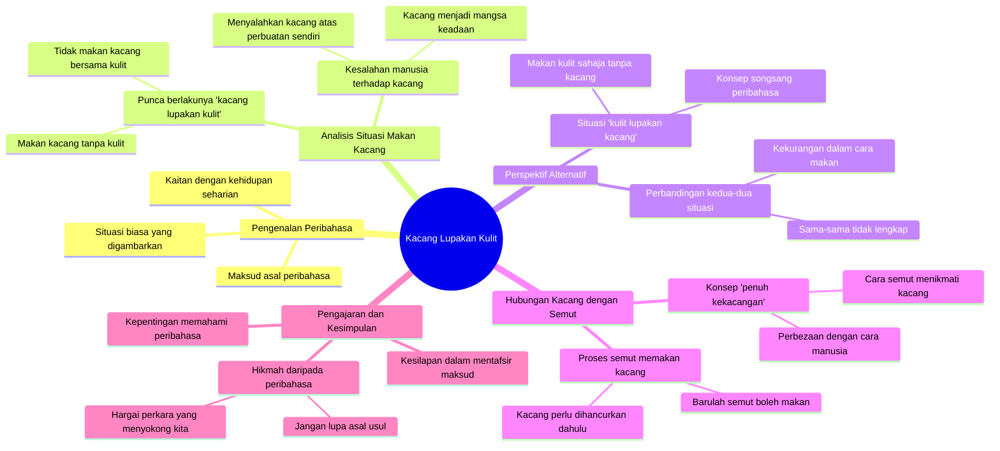

# Forget the Peanut Shells Blame Game

> 🌐 **Read this in:** [English](../../en/2026-08/tiktok-transcript-kacang-lupakan-kulit-panglipurlara-hezrie-blissful-kacang-750f.md) · **中文**

> **Creator:** [@tiktokhezrie](https://www.tiktok.com/@tiktokhezrie) · **Views:** 364.1K · **Posted:** 2026-08-10 · **Niche:** other
>
> **TL;DR:** Takes a well-known Malay idiom and immediately challenges it with a literal twist, creating curiosity.

[Watch original video →](https://vt.tiktok.com/ZS4na5sVu/)

## Why This Went Viral

## Hook（前3秒）
- 开场白逐字引用：*“忘本的坚果是因为只吃坚果本身。”*
- Hook模式类型：**对比/颠覆谚语** —— 一个广为人知的短语（“忘本的坚果”）被逻辑性地反转。
- 为什么它能让观众停止滑动：这句马来谚语通常意味着“忘记本源”，但演讲者却一本正经地攻击其字面含义。观众感到惊讶并好奇——“他到底什么意思？”——于是继续观看。

## 情绪节奏
- **困惑/好奇** → *“试试连壳一起吃。就不会有忘本的坚果了。”* —— 观众开始感觉到逻辑游戏的存在。
- **喜剧张力** → *“是吃的人忘了连壳一起吃。然后还怪到坚果头上。”* —— 反转：错的是人，不是坚果。
- **荒诞升级** → *“或者试试只吃壳，不吃坚果。那就更没有理由了。于是就会变成壳忘了坚果。”* —— 逻辑被扭曲到荒谬的地步。
- **点睛/高潮** → *“蚂蚁吃坚果……蚂蚁才能真正以坚果之道吃坚果。”* —— 高潮落在“坚果之道”这个文字游戏上，以幽默收尾闭环。
- **共鸣** → 理解原谚语的观众觉得“被击中”——这个视频在玩文化梗，但并无冒犯之意。

## 关键词密度
- **“坚果”**（约10次）—— 核心关键词；将算法引向食物/谚语主题，同时成为反复出现的笑点。
- **“壳”**（约6次）—— 与“坚果”形成对比搭档；创造出容易记住的二元对立。
- **“忘”**（约5次）—— 情感词汇；触及背叛/忘记本源的主题，具有心理吸引力。
- **“吃”**（约5次）—— 字面动作；让抽象概念变得具象而好笑。
- **“蚂蚁”**（约3次）—— 惊喜元素；在结尾引入新角色制造反转。
- **“坚果之道”** —— 自创词；起到“洗脑神句”的作用——观众会反复念叨。

## 为何能爆火
- **颠覆谚语** —— *“忘本的坚果”* 是人尽皆知的谚语。这个视频攻击其字面含义，产生强烈的“模式中断”效果。
- **紧凑的喜剧闭环** —— 每一句话都构建出更荒谬的新逻辑，从人怪坚果 → 壳忘了坚果 → 蚂蚁吃坚果。观众会一直看到底“他能走多远”。
- **可分享的文字游戏** —— *“以坚果之道”* 这个短语很容易作为短视频片段或标题传播。它“值得引用”。
- **严肃的表达方式配上荒诞的内容** —— 严肃语气与荒谬内容之间的反差创造出冷面幽默，非常适合TikTok/Reels等平台。
- **时长紧凑且无停顿** —— 文字稿没有开场白，没有“大家好”——直接进入hook，节奏快到结尾。这最大化地提升了完播率。

## 你可以借鉴什么
- **选择知名谚语/表达并攻击其字面含义** —— 找一个人人都知道的短语，然后做逻辑上的“如果”推演。例如：“宁死孩子，莫死规矩”——如果孩子和规矩互换位置会怎样？
- **使用“荒诞升级”结构** —— 从合理的逻辑开始，然后每一句都转得更远。观众会留下来看疯狂的高潮。
- **用一个与关键词押韵的自创词收尾** —— *“坚果之道”* 作为一个独特且易记的笑点。创造一个能用一个短语概括整个视频的新词。

## Mind Map

## Full Transcript (Generated by [TikTok 转录工具](https://toktranscript.com/?utm_source=github&utm_medium=breakdown&utm_campaign=tool_attribution))

> 📝 Transcripts on this page are auto-generated and show the first 60%. Want to transcribe any TikTok in 30 seconds and get the full version? [Try TokTranscript free →](https://toktranscript.com/?utm_source=github&utm_medium=breakdown&utm_campaign=transcript_cta)

Kacang lupakan kulit berlaku sebab makan kacang saja. Cuba makan sekali dengan kulit. Tak jadi kacang lupa kulit. Orang yang makan tu yang lupa nak makan sekali dengan kulit. Lepas tu pergi salah ke kacang. Kacang-kacang je pergi salah ke kacang. Ataupun cuba makan kulit, kacang jangan makan. Tak ada sebab lagi tu. Maka akan jadi kulit lupakan 

*[Read the full transcript on TokTranscript →](https://toktranscript.com/plaza/tiktok-transcript-kacang-lupakan-kulit-panglipurlara-hezrie-blissful-kacang-750f?utm_source=github&utm_medium=breakdown&utm_campaign=transcript_full)*

## Browse More

- All [other](../../by-niche/zh-CN/other.md) breakdowns
- All [Reframe the familiar proverb](../../by-pattern/zh-CN/hook-reframe-the-familiar-proverb.md) examples

## Video Info

| | |
|---|---|
| Creator | [@tiktokhezrie](https://www.tiktok.com/@tiktokhezrie) |
| Original video | [https://vt.tiktok.com/ZS4na5sVu/](https://vt.tiktok.com/ZS4na5sVu/) |
| Original title | Kacang lupakan kulit #panglipurlara #hezrie #blissful #kacang |
| Views | 364.1K (364100) |
| Posted | 2026-08-10 |
| Duration | 0s |
| Niche | `other` |
| Hook pattern | `Reframe the familiar proverb` |
| Original language | `ms` (this page translated by AI) |
| Available languages | en, zh-CN |
| Generated | 2026-08-12 by [TokTranscript](https://toktranscript.com/) |

---

*This breakdown is for educational analysis under fair use. Original video © [@tiktokhezrie](https://www.tiktok.com/@tiktokhezrie). All transcripts are auto-generated and may contain errors.*

*Want to analyze your own TikToks like this? [我们用的转录工具 →](https://toktranscript.com/viral-breakdown?utm_source=github&utm_medium=breakdown&utm_campaign=footer_cta)*