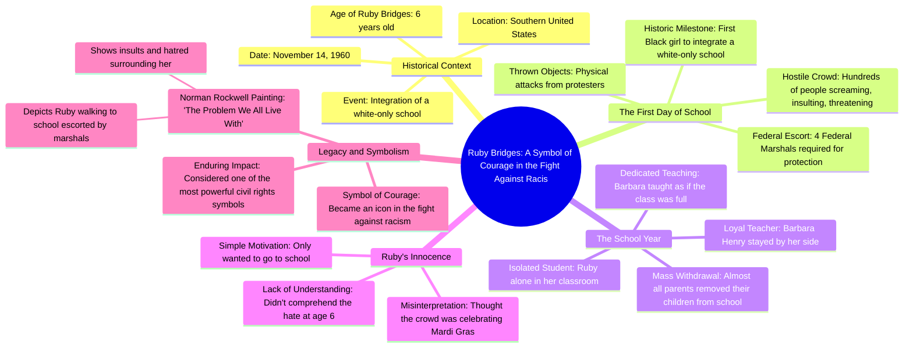

# 6-Year-Old Defies Segregation at School

> 🌐 **Read this in:** [English](../../en/2026-08/tiktok-transcript-le-jour-o-une-enfant-de-6-ans-a-d-fi-la-s-gr-gation-amazing-3955.md) · **中文**

> **Creator:** [@darkearth](https://www.tiktok.com/@darkearth) · **Views:** 1.6M · **Posted:** 2026-08-10 · **Niche:** entertainment
>
> **TL;DR:** Introduces a young protagonist and a historic milestone, immediately creating empathy and curiosity.

[Watch original video →](https://www.tiktok.com/@darkearth/video/7665408093441821984?is_from_webapp=1&sender_device=pc&web_id=7625772072178075154)

## Why This Went Viral

## 钩子（前3秒）
- **逐字开场：** “Ruby bridge年仅6岁时，在11月14日这一天，她成为美国南部第一位进入白人专属学校的黑人小女孩。”
- **钩子模式：** 大胆陈述 + 历史冲击（一个具体、极端的事实快速抛出）。
- **为何能阻止滑动：** 开场将纯真（“年仅6岁”）与沉重的历史禁忌（“白人专属学校”）并置，瞬间制造认知失调。观众大脑会标记：*这是一个我必须看完的故事。*

## 情感节奏
- **节拍1 — 纯真（0–3秒）：** “年仅6岁”——观众心软，保护本能被触发。
- **节拍2 — 紧张（3–10秒）：** “数百人尖叫、辱骂、威胁、投掷物品”——愤怒与焦虑累积；风险升级。
- **节拍3 — 孤立（10–15秒）：** “Ruby发现自己独自一人在教室里”——心碎达到顶峰；一个孩子独处空房间的画面直击人心。
- **节拍4 — 守护（15–20秒）：** “一位老师同意留在她身边，Barbara Henry”——宽慰、希望、情感救援。
- **节拍5 — 反转（20–25秒）：** “她以为人群是来参加像狂欢节那样的派对”——重击。场景的残酷通过孩子天真的无知被重新框定。这是高潮。
- **节拍6 — 遗产（25–30秒）：** “Norman Rockwell将她的故事永载史册”——升华、宣泄、意义建构。

## 关键词密度
- **“年仅6岁”**（两次）——情感牵引；唤起脆弱与不公。
- **“独自”**（两次）——情感牵引；孤立是核心创伤。
- **“第一”**（一次）——算法触达；“第一”是高点击、高分享关键词。
- **“象征”/“传奇”**（两次）——算法+情感；触动文化记忆与可分享性。
- **“仇恨”**（两次）——情感牵引；明确指认反派。
- **“勇气”**（一次）——情感牵引；给观众一个道德收获。

## 为何会传播
1. **纯真与邪恶的对比：** “年仅6岁”对比“数百人尖叫”——这种鲜明的二元对立使故事即刻具备可分享性；观众通过分享来表达道德愤怒。
2. **狂欢节反转：** “她以为人群是来参加派对的”——这句话是病毒传播的核心。它将愤怒转化为心碎，让观众*感受*而非仅仅*知晓*。人们分享那些让他们深深触动时刻。
3. **普世情感弧线：** 故事从紧张 → 孤立 → 救援 → 遗产推进。这是一个30秒内完整的叙事，易于观看、易于记忆、易于转发。
4. **具体的历史锚点：** “Norman Rockwell”和“我们共同面对的问题”赋予视频文化分量。观众分享以显得见多识广、具有社会意识。
5. **引发反思：** 最后一句（“民权斗争中最有力的象征之一”）邀请观众参与致敬历史——一种低成本、高认同感的分享。

## 你可以借鉴的
1. **以最极端的事实开头，而非铺垫。** 从“年仅6岁”+“白人专属学校”开始——而不是“1960年，一个历史性事件发生了。”钩子是冲击，不是背景。
2. **用孩子的误解作为情感转折点。** 狂欢节那句是将历史课变成心碎时刻的关键。在你的故事中找到主角*不理解*事情严重性的细节——那就是你的反转。
3. **以遗产锚点结尾。** 不要停在悲伤时刻。停在画作、象征、“传奇”的结局上。这给观众一个满足的情感回报和一个分享的理由（“这是重要的历史”）。

## Mind Map

## Full Transcript (Generated by [TokTranscript](https://toktranscript.com/?utm_source=github&utm_medium=breakdown&utm_campaign=tool_attribution))

> 📝 Transcripts on this page are auto-generated and show the first 60%. Want to transcribe any TikTok in 30 seconds and get the full version? [Try TokTranscript free →](https://toktranscript.com/?utm_source=github&utm_medium=breakdown&utm_campaign=transcript_cta)

Ruby bridge was only 6 years old when on November 14, it has become the 1st little black girl in integrate a white-only school in the southern United States. But in front of the school, A crowd is waiting for him hundreds of people are screaming, insulting, threatening and throwing objects. So she can just walk into the classroom, 4 Federal Marshalls have to escort him every morning. The most shocking, almost all parents withdraw their children from school. Ruby finds herself alone in her classroom. Only one teacher agrees to stay by his side, Barbara Henry. Throughout the school year, Barbara Henry teaches alone, as if the class was full of students. The most overwhelming, is that Ruby didn't even understand what was happening at only 6 years old. She thought that this huge c

*[Read the full transcript on TokTranscript →](https://toktranscript.com/plaza/tiktok-transcript-le-jour-o-une-enfant-de-6-ans-a-d-fi-la-s-gr-gation-amazing-3955?utm_source=github&utm_medium=breakdown&utm_campaign=transcript_full)*

## Browse More

- All [entertainment](../../by-niche/zh-CN/entertainment.md) breakdowns
- All [Historical revelation with emotional contrast](../../by-pattern/zh-CN/hook-historical-revelation-with-emotional-contrast.md) examples

## Video Info

| | |
|---|---|
| Creator | [@darkearth](https://www.tiktok.com/@darkearth) |
| Original video | [https://www.tiktok.com/@darkearth/video/7665408093441821984?is_from_webapp=1&sender_device=pc&web_id=7625772072178075154](https://www.tiktok.com/@darkearth/video/7665408093441821984?is_from_webapp=1&sender_device=pc&web_id=7625772072178075154) |
| Original title | Le jour où une enfant de 6 ans a défié la ségrégation 😳  #amazing #in... |
| Views | 1.6M (1600000) |
| Posted | 2026-08-10 |
| Duration | 0s |
| Niche | `entertainment` |
| Hook pattern | `Historical revelation with emotional contrast` |
| Original language | `en` (this page translated by AI) |
| Available languages | en, zh-CN |
| Generated | 2026-08-11 by [TokTranscript](https://toktranscript.com/) |

---

*This breakdown is for educational analysis under fair use. Original video © [@darkearth](https://www.tiktok.com/@darkearth). All transcripts are auto-generated and may contain errors.*

*Want to analyze your own TikToks like this? [TokTranscript 转录工具 →](https://toktranscript.com/viral-breakdown?utm_source=github&utm_medium=breakdown&utm_campaign=footer_cta)*