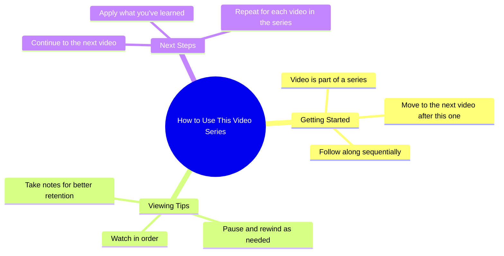

# Reposted My Video Friends Views Problem

> 🌐 **Read this in:** [English](../../en/2026-08/tiktok-transcript-newaccount-unfreez-tiktok-4ef3.md) · **中文**

> **Creator:** [@zahrafunny6](https://www.tiktok.com/@zahrafunny6) · **Views:** 10.6M · **Posted:** 2026-08-03 · **Niche:** other
>
> **TL;DR:** The abrupt, mundane statement creates an expectation of a transition, but the video ends immediately, subverting the viewer's anticipation.

[Watch original video →](https://vt.tiktok.com/ZS4fUgUNU/)

## Why This Went Viral

## 钩子（前3秒）
- **逐字开场白：**“我要去看下一个视频了。”
- **钩子模式：**场景/元评论（一个制造即时紧张感的行动承诺）。
- **为何能阻止滑动：**它打破了第四面墙，制造了一个悬念。观众不知道“下一个视频”是什么意思、为什么重要、结果会怎样。它暗示了一个过渡，迫使观众留下来看到结果。

## 情绪节奏
- **顺序节拍：**
  1. **好奇/ intrigue**——“我要去看下一个视频了”（接下来会发生什么？）。
  2. **期待**——停顿/过渡（等待揭示）。
  3. **紧张**——未知的结果（会是好的/坏的/搞笑的吗？）。
  4. **解决/释放**——“下一个视频”的实际内容落地（回报）。
  5. **潜在共鸣/代入感**——如果下一个视频是一个能引起共鸣的反应，观众会感到被看见。
- **高潮：**“下一个视频”真正播放、观众获得背景/笑点的时刻。

## 关键词密度
- **“下一个视频”**——重复出现（驱动核心循环并创造元叙事）。
- **“去看”**——主动动词（驱动动作和过渡）。
- **“我要”**——个人主体性（建立视角连接）。
- **“视频”**——平台原生术语（对内容发现的算法相关性）。
- **“你”**——隐含（如果下一个视频是一个反应，它邀请观众进入体验）。

*驱动算法触达的：*“视频”、“下一个”（可搜索、趋势相关）。
*驱动情感吸引的：*“我要”、“你”（个人化、对话式）。

## 为何能传播
- **元钩子创造循环：**“我要去看下一个视频了”这句话是一个自我意识的承诺，利用了观众自己的滑动行为——它镜像了观众*此刻*正在做的事（看视频），并让他们成为共谋。
- **悬念张力：**开场缺乏背景迫使观众看完整个短视频才能理解前提，提高了完播率——这是一个关键的算法信号。
- **通过过渡产生共鸣：**如果“下一个视频”是一个反应、一个梗或一个能引起共鸣的时刻，它就能触及共同体验，使其容易被@朋友或评论“这就是我”。
- **短格式节奏：**这句话快速说出，没有铺垫，符合平台对即时价值的需求。
- **开放式解读：**这句话足够模糊，可以被重新利用（例如，用“我要去看下一个视频了”来回应任何事情），允许混音文化放大它。

## 你可以借鉴什么
- **以元指令开场：**用一句引用观众自身行为（滑动、观看、决定）的话开场。它会立即产生镜像效应，为你赢得3秒的注意力。
- **用过渡作为钩子：**不要从内容开始——从*转向内容的动作*开始。这会建立自然的悬念和留下的理由。
- **让回报保持模糊：**不要在第一句话中揭示“下一个”意味着什么。让观众的好奇心填补空白；揭示就是奖励。

## Mind Map

## Full Transcript (Generated by [免费 TikTok 文稿生成器](https://toktranscript.com/?utm_source=github&utm_medium=breakdown&utm_campaign=tool_attribution))

> 📝 Transcripts on this page are auto-generated and show the first 60%. Want to transcribe any TikTok in 30 seconds and get the full version? [Try TokTranscript free →](https://toktranscript.com/?utm_source=github&utm_medium=breakdown&utm_campaign=transcript_cta)

I'm going to go to the

*[Read the full transcript on TokTranscript →](https://toktranscript.com/plaza/tiktok-transcript-newaccount-unfreez-tiktok-4ef3?utm_source=github&utm_medium=breakdown&utm_campaign=transcript_full)*

## Browse More

- All [other](../../by-niche/zh-CN/other.md) breakdowns
- All [False expectation](../../by-pattern/zh-CN/hook-false-expectation.md) examples

## Video Info

| | |
|---|---|
| Creator | [@zahrafunny6](https://www.tiktok.com/@zahrafunny6) |
| Original video | [https://vt.tiktok.com/ZS4fUgUNU/](https://vt.tiktok.com/ZS4fUgUNU/) |
| Original title | 𝗥𝗲𝗽𝗼𝘀𝘁𝗲𝗱 𝗠𝘆 𝘃𝗶𝗱𝗲𝗼 𝗳𝗿𝗶𝗲𝗻𝗱𝘀💞+𝘃𝗶𝗲𝘄𝘀 𝗽𝗿𝗼𝗯𝗹𝗲𝗺😕#newaccount #unfreez #tiktok... |
| Views | 10.6M (10600000) |
| Posted | 2026-08-03 |
| Duration | 0s |
| Niche | `other` |
| Hook pattern | `False expectation` |
| Original language | `en` (this page translated by AI) |
| Available languages | en, zh-CN |
| Generated | 2026-08-04 by [TokTranscript](https://toktranscript.com/) |

---

*This breakdown is for educational analysis under fair use. Original video © [@zahrafunny6](https://www.tiktok.com/@zahrafunny6). All transcripts are auto-generated and may contain errors.*

*Want to analyze your own TikToks like this? [TikTok 转录工具 →](https://toktranscript.com/viral-breakdown?utm_source=github&utm_medium=breakdown&utm_campaign=footer_cta)*