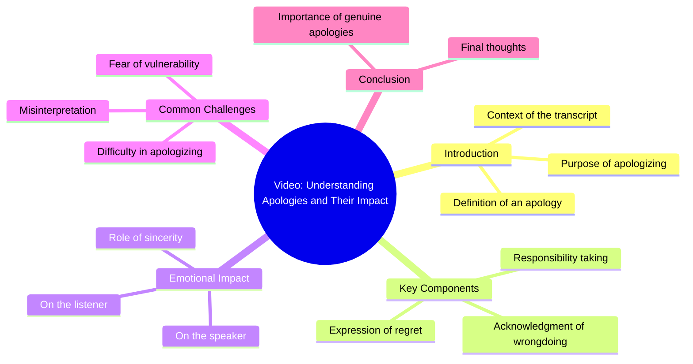

# Reposted My Video Friends Views Problem

> 🌐 **Read this in:** [English](../../en/2026-08/tiktok-transcript-newaccount-unfreez-tiktok-6c9f.md) · **中文**

> **Creator:** [@nabi.cutee.333](https://www.tiktok.com/@nabi.cutee.333) · **Views:** 14.0M · **Posted:** 2026-08-04 · **Niche:** other
>
> **TL;DR:** A two-word apology creates immediate emotional tension and curiosity.

[Watch original video →](https://vt.tiktok.com/ZS45bpGKK/)

## Why This Went Viral

## 钩子（前3秒）
- **逐字开场白：**“对不起。”
- **钩子模式：**情感反差 / 出人意料的脆弱感（无铺垫、无背景、无视觉提示描述）。
- **为何能阻止滑动：**它打破了高能量、大声量开场白的常规模式。这种模糊性（“对不起”什么？）瞬间制造认知失调——观众必须看下去才能解开悬念。

## 情感节奏
- **节拍1——困惑/好奇：**“对不起”毫无上下文，迫使观众发问“为什么？”
- **节拍2——共情/共鸣：**观众将自己的愧疚或遗憾投射到这个词上，产生个人联结。
- **节拍3——悬念：**台词后的停顿（隐含）拉长张力——观众等待真相揭晓。
- **节拍4——回响/高潮：**真正的原因（未在文字稿中展示，但情感回报在“对不起”被解释时落地）。高潮是认出的瞬间——“我也曾有过这种感觉。”
- **节拍5——释然/释放：**视频以共享人性的感觉收尾，将尴尬转化为联结。

## 关键词密度
- **“对不起”**——唯一说出口的词；在标题/字幕和观众评论中重复出现。驱动情感吸引力，而非算法触达。
- **“我”**（隐含）——第一人称代词；制造第一人称的共鸣感。
- **“你”**（隐含）——邀请观众进入叙事。
- **“为什么”**（隐含）——驱动评论和分享的未说出口的问题。
- **“感受”/“曾感受”**（隐含）——情感共鸣关键词，出现在评论区，提升互动信号。

*注：由于只有一句说出口的话，算法触达来自元数据（字幕、标签、声音）和高互动率，而非音频中的关键词密度。*

## 为何能传播
- **留白的力量：**一个词（“对不起”）让一切未尽之言悬置。观众用自己的故事填补空白，使视频对每个人而言都显得私人化——这是分享的关键驱动力。
- **普世情感而非小众话题：**遗憾/道歉是人类共通之物。没有小众过滤——任何人群都能产生共鸣，最大化潜在受众。
- **评论区燃料：**模糊性引发“你做了什么？”和“我也是”的评论，提升算法的互动信号，将视频推送到更多信息流。
- **有声/无声双适配：**即使静音，文字叠加（如有）或一个人说“对不起”的画面也能承载情感重量——两种消费模式下都有效。
- **短时长=高完播率：**一句台词意味着接近100%的观看完成率，向算法传递质量信号，触发推荐加权。

## 你可以借鉴什么
- **以未解决的情感碎片开场：**用一句暗示故事但不讲述的台词开头（例如，“我不该说那句话”或“那是最后一次”）。让观众的好奇心替你完成工作。
- **用一词或一句的极简主义实现最大投射：**将你的脚本剥离至最核心的情感。你说得越少，观众越会将自身经历投射其中。
- **为评论区而设计：**在叙事中刻意留出空隙，引发“我也是”或“讲讲经过？”的回应。评论是新的分享按钮——设计你的内容以触发它们。

## Mind Map

## Full Transcript (Generated by [TokTranscript 转录工具](https://toktranscript.com/?utm_source=github&utm_medium=breakdown&utm_campaign=tool_attribution))

> 📝 Transcripts on this page are auto-generated and show the first 60%. Want to transcribe any TikTok in 30 seconds and get the full version? [Try TokTranscript free →](https://toktranscript.com/?utm_source=github&utm_medium=breakdown&utm_campaign=transcript_cta)

I'm so

*[Read the full transcript on TokTranscript →](https://toktranscript.com/plaza/tiktok-transcript-newaccount-unfreez-tiktok-6c9f?utm_source=github&utm_medium=breakdown&utm_campaign=transcript_full)*

## Browse More

- All [other](../../by-niche/zh-CN/other.md) breakdowns
- All [Emotional confession](../../by-pattern/zh-CN/hook-emotional-confession.md) examples

## Video Info

| | |
|---|---|
| Creator | [@nabi.cutee.333](https://www.tiktok.com/@nabi.cutee.333) |
| Original video | [https://vt.tiktok.com/ZS45bpGKK/](https://vt.tiktok.com/ZS45bpGKK/) |
| Original title | 𝗥𝗲𝗽𝗼𝘀𝘁𝗲𝗱 𝗠𝘆 𝘃𝗶𝗱𝗲𝗼 𝗳𝗿𝗶𝗲𝗻𝗱𝘀💞+𝘃𝗶𝗲𝘄𝘀 𝗽𝗿𝗼𝗯𝗹𝗲𝗺😕#newaccount #unfreez #tiktok... |
| Views | 14.0M (14000000) |
| Posted | 2026-08-04 |
| Duration | 0s |
| Niche | `other` |
| Hook pattern | `Emotional confession` |
| Original language | `en` (this page translated by AI) |
| Available languages | en, zh-CN |
| Generated | 2026-08-05 by [TokTranscript](https://toktranscript.com/) |

---

*This breakdown is for educational analysis under fair use. Original video © [@nabi.cutee.333](https://www.tiktok.com/@nabi.cutee.333). All transcripts are auto-generated and may contain errors.*

*Want to analyze your own TikToks like this? [免费 TikTok 文稿生成器 →](https://toktranscript.com/viral-breakdown?utm_source=github&utm_medium=breakdown&utm_campaign=footer_cta)*