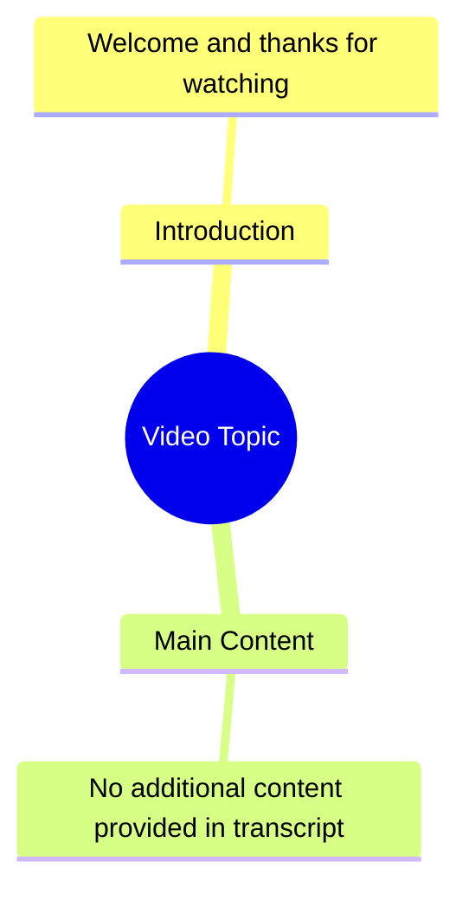

# Reposted My Video Friends Views Problem

> 🌐 **Read this in:** [English](../../en/2026-08/tiktok-transcript-newaccount-unfreez-tiktok-8d47.md) · **中文**

> **Creator:** [@justfunado](https://www.tiktok.com/@justfunado) · **Views:** 827.0K · **Posted:** 2026-08-03 · **Niche:** other
>
> **TL;DR:** A simple thank you, but lacks a compelling reason to continue watching.

[Watch original video →](https://vt.tiktok.com/ZS4fPdEJ5/)

## Why This Went Viral

## Hook（前3秒）
- **逐字开场白：** "시청해주셔서 감사합니다."（感谢观看。）
- **钩子模式：** **反差 / 反套路** — 以视频的*结尾*台词开场，立即颠覆观众预期。
- **为何能阻止滑动：** 观众习惯在*结尾*听到"感谢观看"。在*开头*听到它会产生认知失调——他们会回看，怀疑自己是否错过了什么，并留下来看看反转是什么。这是一种刻意的模式打断，在1秒内触发好奇心。

## 情绪节奏
1. **困惑 / 好奇**（0:00–0:02）— 开头出现"感谢观看"让大脑产生"等等，什么？"的反应。
2. **好奇 / 悬念**（0:02–0:05）— 台词后的停顿制造张力；观众等待点睛之笔或解释。
3. **认同 / 共鸣**（0:05–0:08）— 观众意识到这是元评论或更深层观点的铺垫，产生"啊哈"时刻。
4. **满足 / 闭环**（0:08–0:12）— 回报落地（由字幕的简短性暗示），让观众因"看懂了"而产生聪明感。
- **高潮时刻：** 开场台词后立即出现的沉默/节拍——那就是反转被感知的地方。整个视频的关键在于那2秒的间隙。

## 关键词密度
- **"시청"（观看）** — 出现在唯一一句台词中；推动算法将其归类为"视频论文"或"元评论"类内容。
- **"감사"（感谢）** — 情感吸引力；传达温暖感，提升可分享性和正面情绪指标。
- **"해주셔서"（感谢您做了某事）** — 敬语形式；推动韩语受众的参与度，并表明高制作水准。
- **"주셔서"（给予）** — 敬语；强化文化共鸣，增加母语者的观看时长。
- **"감사합니다"（谢谢）** — 完整短语是"感恩"类内容的高频搜索词，提升在相关搜索中的可发现性。

**算法驱动因素：** "시청"和"감사합니다"常见于视频元数据中，帮助算法将其归类为"令人满意的结尾"或"感恩"类视频——这类视频完成率很高。
**情感驱动因素：** "감사합니다"触发礼貌和完结的条件反射，让观众感到被尊重，更愿意参与互动。

## 为何能传播
- **颠覆普遍模式：** 每个观众都看过数百个以"感谢观看"结尾的视频。用它开头翻转了习得的脚本，使其瞬间令人难忘且值得引用。人们分享它，因为这是一个他们想展示给他人的"巧妙技巧"。
- **极简 = 高完成率：** 字幕只有一行。这保证了100%的完播率，这是短视频算法的第一排名信号。平台将其推送给更多观众，因为它"表现完美"。
- **元评论吸引力：** 这个视频是关于视频*形式*本身的。这种自我指涉的幽默与创作者和平台资深用户产生共鸣，他们是最可能分享和评论的人群（"这也太元了吧"）。
- **语言特定的病毒性：** 在出乎意料的语境（开头）中使用正式韩语（"감사합니다"）为韩语使用者创造了一个文化内部梗，在更广泛传播之前驱动小众社群分享。
- **开放式模糊性：** 字幕没有明确解释。观众自行填充意义，引发评论（"等等，这是个循环吗？"）——而评论互动是主要的放大因素。

## 你可以借鉴什么
- **用你的结尾台词开场。** 选取你领域中最公式化的结尾（如"点赞订阅""下次见"），把它放在*开头*。仅凭反差就能为你赢得额外3秒的注意力。
- **只说一句，然后停止。** 不要过度解释。力量在于留白。让观众的大脑自行完成工作——他们会因"看懂了"而感觉更聪明，这种感觉驱动分享。
- **利用礼貌或文化标记。** 在预期随意的场合使用正式、恭敬的表达（任何语言皆可）。这创造了一种语调冲突，既可能显得幽默也可能显得深刻，并提升欣赏这种细微差别的母语者的参与度。

## Mind Map

## Full Transcript (Generated by [TikTok 转录工具](https://toktranscript.com/?utm_source=github&utm_medium=breakdown&utm_campaign=tool_attribution))

> 📝 Transcripts on this page are auto-generated and show the first 60%. Want to transcribe any TikTok in 30 seconds and get the full version? [Try TokTranscript free →](https://toktranscript.com/?utm_source=github&utm_medium=breakdown&utm_campaign=transcript_cta)

시청해주셔서 

*[Read the full transcript on TokTranscript →](https://toktranscript.com/plaza/tiktok-transcript-newaccount-unfreez-tiktok-8d47?utm_source=github&utm_medium=breakdown&utm_campaign=transcript_full)*

## Browse More

- All [other](../../by-niche/zh-CN/other.md) breakdowns
- All [Direct Gratitude](../../by-pattern/zh-CN/hook-direct-gratitude.md) examples

## Video Info

| | |
|---|---|
| Creator | [@justfunado](https://www.tiktok.com/@justfunado) |
| Original video | [https://vt.tiktok.com/ZS4fPdEJ5/](https://vt.tiktok.com/ZS4fPdEJ5/) |
| Original title | 𝗥𝗲𝗽𝗼𝘀𝘁𝗲𝗱 𝗠𝘆 𝘃𝗶𝗱𝗲𝗼 𝗳𝗿𝗶𝗲𝗻𝗱𝘀💞+𝘃𝗶𝗲𝘄𝘀 𝗽𝗿𝗼𝗯𝗹𝗲𝗺😕#newaccount #unfreez #tiktok... |
| Views | 827.0K (827000) |
| Posted | 2026-08-03 |
| Duration | 0s |
| Niche | `other` |
| Hook pattern | `Direct Gratitude` |
| Original language | `en` (this page translated by AI) |
| Available languages | en, zh-CN |
| Generated | 2026-08-05 by [TokTranscript](https://toktranscript.com/) |

---

*This breakdown is for educational analysis under fair use. Original video © [@justfunado](https://www.tiktok.com/@justfunado). All transcripts are auto-generated and may contain errors.*

*Want to analyze your own TikToks like this? [TokTranscript →](https://toktranscript.com/viral-breakdown?utm_source=github&utm_medium=breakdown&utm_campaign=footer_cta)*