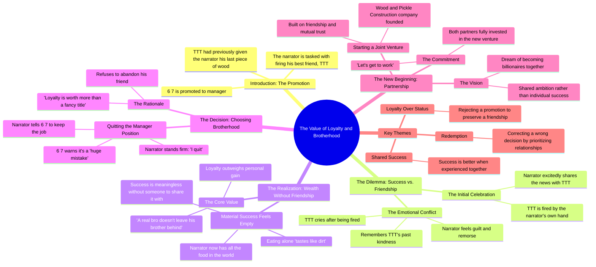

# True Friendship Story Part 2: He Took His Job

> 🌐 **Read this in:** [English](../../en/2026-08/tiktok-transcript-part-2-of-the-true-friendship-story-tungtungtungsahur-tungtu-bdb0.md) · **中文**

> **Creator:** [@brainglitchprime](https://www.tiktok.com/@brainglitchprime) · **Views:** 2.7M · **Posted:** 2026-08-03 · **Niche:** entertainment
>
> **TL;DR:** The hook immediately creates tension and surprise by revealing a betrayal, making viewers want to see the fallout.

[Watch original video →](https://vt.tiktok.com/ZS4yGVNR7/)

## Why This Went Viral

## 钩子（前3秒）
- **逐字开场：**“我能赶紧去TTT那儿告诉他这个好消息吗？能。告诉他，他被炒了。”
- **钩子模式：** **反差 / 道德困境** ——“好消息”瞬间被揭示为一场背叛（炒掉朋友），立刻制造认知失调。
- **为何能让人停下滑动：**观众期待的是庆祝，却迎来一记重击。“好消息”+“他被炒了”迫使大脑在3秒内调和两种对立情绪，制造出无法抗拒的“等等，什么？”的停顿。

## 情绪节奏
1. **好奇**（“我能赶紧去TTT那儿告诉他这个好消息吗？”）——铺垫一个积极的预期。
2. **紧张 / 震惊**（“告诉他，他被炒了。”）——突然反转。观众感受到背叛。
3. **愧疚 / 同情**（“我该怎么跟他说？他把他最后一块……都给了我。”）——让背叛者更有人性，增添道德分量。
4. **共鸣 / 代入感**（“别哭。我说过，谁先富起来就拉兄弟一把。”）——触动友情忠诚的价值观。
5. **冲突 / 内心挣扎**（“但一个人吃饭，味同嚼蜡……真兄弟不会丢下兄弟。”）——情绪高潮，主角选择人品而非前程。
6. **宣泄 / 救赎**（“我辞职。咱们自己开建筑公司。”）——释然与胜利。
7. **喜悦 / 憧憬**（“咱们要成亿万富翁了，兄弟。”）——以高昂、展望未来的基调收尾。

**高潮时刻：**“我知道我该怎么做了。保住你的工作，6 7。我辞职。”——这是情绪顶点，观众的投入在此得到回报。

## 关键词密度
| 词/短语 | 频率 | 驱动因素 |
|---|---|---|
| “兄弟” | 4次 | **情绪拉动** ——象征兄弟情、忠诚、男性友谊原型 |
| “辞职” | 2次 | **情绪拉动** ——反抗与道德勇气的行为 |
| “炒了” | 2次 | **算法触达** ——职场剧情高搜索关键词 |
| “工作” | 2次 | **算法触达** ——职业内容被全球搜索 |
| “亿万富翁” | 1次 | **情绪拉动** ——梦想愿景，推动分享 |
| “忠诚” | 1次 | **情绪拉动** ——核心道德关键词，驱动评论 |
| “建筑公司” | 1次 | **算法触达** ——小众但令人难忘的品牌时刻 |
| “错误” | 1次 | **情绪拉动** ——制造紧张与讨论 |

**算法驱动词：**“炒了”“工作”“经理”——这些触发职场相关的推荐图谱。
**情绪驱动词：**“兄弟”“忠诚”“亿万富翁”——这些推动评论、收藏和分享。

## 为何能病毒式传播
- **道德困境引发评论区大战：**“好消息=炒人”的反转让观众分裂。有人说“他应该保住工作”，有人力挺忠诚。评论区争论爆发，推高互动数据。
- **“最后一块木头”的回响是一个微型故事：**“他把他最后一块……都给了我”是一个微小细节，暗示了丰富的背景故事。观众自行脑补，让情感张力在30秒内显得水到渠成。这触发了“我得把这条发给朋友”的分享冲动。
- **救赎弧线节奏完美：**背叛 → 愧疚 → 牺牲 → 合伙。这是一个完整的英雄之旅，压缩进45秒。观众获得完整的情感回报，提升观看时长和完播率。
- **“泡菜兄弟”是令人难忘的品牌时刻：**这个荒诞的绰号（“泡菜兄弟”）足够古怪，能成为梗。独特的角色名驱动口头传播（“你看过那个泡菜兄弟的视频吗？”）——这是关键的病毒机制。
- **结尾是新的开始：**“咱们自己开建筑公司”为潜在系列埋下伏笔。观众评论“第二部？”——这向算法发出信号：内容值得追看。

## 你可以借鉴什么
1. **用道德困境开场，而不是陈述句。**用一句迫使观众选边站的话开场（先说是“好消息”，再说“他被炒了”）。这立刻制造出值得评论的张力。
2. **把完整的英雄之旅压缩进45秒。**将脚本规划为：铺垫 → 背叛 → 内心冲突 → 牺牲 → 新起点。你越快走完这些节拍，完播率就越高。
3. **给角色起一个荒诞、令人难忘的名字。**“泡菜兄弟”够怪，所以能被反复提及。创造一个观众能逐字引用的绰号或口头禅——它将成为你视频可传播的基因。

## Mind Map

## Full Transcript (Generated by [TikTok 转录工具](https://toktranscript.com/?utm_source=github&utm_medium=breakdown&utm_campaign=tool_attribution))

> 📝 Transcripts on this page are auto-generated and show the first 60%. Want to transcribe any TikTok in 30 seconds and get the full version? [Try TokTranscript free →](https://toktranscript.com/?utm_source=github&utm_medium=breakdown&utm_campaign=transcript_cta)

Can I quickly go to TTT and tell him the good news? Yes. Tell him he is fired. How am I supposed to tell him? He gave me his last piece of. Now I took his job. 6 7 made me the manager. But he fired you. Hey, don't cry. I told you, whoever gets rich first pulls the other one up. The best piece of wood I ever knew. I have all the food in the world now. But eating alone tastes like dirt. No, this isn't right. A real bro doesn't leave his brother behind. I know what I have to do. 

*[Read the full transcript on TokTranscript →](https://toktranscript.com/plaza/tiktok-transcript-part-2-of-the-true-friendship-story-tungtungtungsahur-tungtu-bdb0?utm_source=github&utm_medium=breakdown&utm_campaign=transcript_full)*

## Browse More

- All [entertainment](../../by-niche/zh-CN/entertainment.md) breakdowns
- All [Unexpected twist](../../by-pattern/zh-CN/hook-unexpected-twist.md) examples

## Video Info

| | |
|---|---|
| Creator | [@brainglitchprime](https://www.tiktok.com/@brainglitchprime) |
| Original video | [https://vt.tiktok.com/ZS4yGVNR7/](https://vt.tiktok.com/ZS4yGVNR7/) |
| Original title | Part 2 of the true friendship Story?! #tungtungtungsahur #tungtung #p... |
| Views | 2.7M (2700000) |
| Posted | 2026-08-03 |
| Duration | 0s |
| Niche | `entertainment` |
| Hook pattern | `Unexpected twist` |
| Original language | `en` (this page translated by AI) |
| Available languages | en, zh-CN |
| Generated | 2026-08-04 by [TokTranscript](https://toktranscript.com/) |

---

*This breakdown is for educational analysis under fair use. Original video © [@brainglitchprime](https://www.tiktok.com/@brainglitchprime). All transcripts are auto-generated and may contain errors.*

*Want to analyze your own TikToks like this? [TokTranscript →](https://toktranscript.com/viral-breakdown?utm_source=github&utm_medium=breakdown&utm_campaign=footer_cta)*