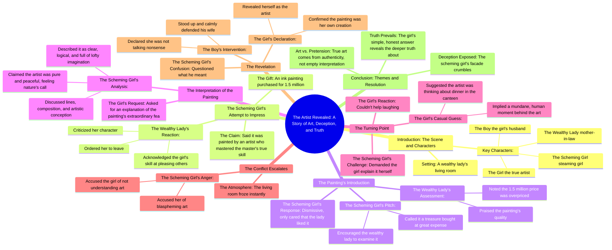

# Married to a Comatose Tycoon: My Daily Routine of Annoyin...

> 🌐 **Read this in:** [English](../../en/2026-08/tiktok-transcript-part23-married-to-a-comatose-tycoon-my-daily-routine-annoy-h-b421.md) · **中文**

> **Creator:** [@vfmiylaabrie11](https://www.tiktok.com/@vfmiylaabrie11) · **Views:** 164.8K · **Posted:** 2026-08-01 · **Niche:** entertainment
>
> **TL;DR:** Immediately introduces a high-stakes social conflict with a clear antagonist and a mysterious painting.

[Watch original video →](https://vm.tiktok.com/ZS4rcjMoJ/ This post is shared via TikTok Lite. Download TikTok Lite to enjoy more posts: https://www.tiktok.com/tiktoklite)

## Why This Went Viral

## 钩子（前3秒）
- **逐字开场：**“一个心机女拿着她花150万买来的水墨画，当着众人的面讨好富婆，说是出自一位深得大师真传的画家之手。”
- **钩子模式：**场景设定采用**数字+地位反差**（150万的价格标签对比“讨好”的动机）。
- **为何能让人停下滑动：**它瞬间构建了一个高风险的社交权力博弈——金钱、奉承、阶层等级，一句话全齐了。观众立刻嗅到一场羞辱大戏的味道，迫不及待想看谁笑到最后。

## 情绪节奏
- **节拍1——好奇/悬念：**昂贵的画作和“讨好”的动机，铺垫了一个算计。
- **节拍2——紧张（社交摩擦）：**富婆当众点破心机女的为人——一场公开斥责。
- **节拍3——虚假的平静/喘息：**心机女话锋一转，开始夸赞画作，看似挽回局面。
- **节拍4——悬念升级：**女主（主角）引心机女深入分析画作的艺术性——心机女滔滔不绝，故作高深。
- **节拍5——喜剧释放：**女主面无表情地猜测：“也许画家当时只是在想晚上食堂吃什么。”这就是**反转**——幽默瞬间戳破所有装腔作势。
- **节拍6——高潮/揭晓：**心机女暴怒发作；丈夫站起身来；女主抛出重磅炸弹：“因为，我就是那位画家。”
- **节拍7——宣泄：**心机女当场愣住；观众为女主感到大快人心。

## 关键词密度
- **“画家”**（5次以上）——驱动核心身份揭晓；通过“艺术”垂直领域触达算法推荐。
- **“画作”**（4次以上）——推动剧情的核心物件；视觉化、可搜索的词汇。
- **“心机女”**（5次以上）——反派标签；情绪牵引力（塑造清晰的对立面）。
- **“富婆”**（3次）——阶层标识；驱动身份地位带来的情绪张力。
- **“150万”**（2次）——具体数字；增强可信度和好奇心。
- **“大师”/“真传”**（2次）——权威框架；在艺术/手艺类目下触达算法推荐。
- **“食堂”**（1次）——喜剧转折的关键词；出现频率低但情绪冲击力极强。

## 为何能病毒式传播
- **“羞辱反转”的叙事弧是普世的。**心机女的过度自信被低调的女主彻底击碎。那句“因为，我就是那位画家”正是观众截图分享的瞬间——一记响亮的麦克风掉落，满足了人们对正义的深层渴望。
- **冷面幽默极具金句潜质。**“也许画家当时只是在想晚上食堂吃什么”本身就是一条可以独立传播的梗。它将故作高深的艺术话语与平凡现实形成反差，让内容超越故事本身被广泛分享。
- **清晰的反派vs.弱者结构。**“心机女”被反复点名，冲突一目了然。观众站在她的对立面，而揭晓时刻让他们觉得自己“早就看穿了”——催生“我就知道！”这样的评论。
- **反转有铺垫但依然炸裂。**女主淡定的神态和丈夫的支持早已埋下伏笔，但揭晓的时机（在心机女长篇大论、故作高深之后）将冲击力拉满。这制造了“二刷”效应——观众会重看一遍寻找线索。
- **触发“分享以证明我聪明”的冲动。**视频让观众觉得自己看穿了铺垫，于是会转发给朋友，配上一句“看到最后”。

## 你可以偷师的点
- **使用“静默揭晓”结构。**先让一个装腔作势的角色长篇大论地过度解读某样东西，然后让主角用一句简单、平凡的观察将其击碎。这种反差制造喜剧效果和令人难忘的收尾。
- **明确命名你的反派。**把角色叫做“心机女”（而不是“她”），能让冲突瞬间清晰且情绪饱满。在自己的故事讲述中也这样做——给角色贴上标签，让戏剧冲突更锋利。
- **用一个具体、高风险的数字锚定故事。**“150万”让开场变得具体，并抬高了赌注。即使在非金钱类故事中，开头一个精确、有冲击力的细节也比模糊的说法更能抓住观众。

## Mind Map

## Full Transcript (Generated by [TokTranscript 转录工具](https://toktranscript.com/?utm_source=github&utm_medium=breakdown&utm_campaign=tool_attribution))

> 📝 Transcripts on this page are auto-generated and show the first 60%. Want to transcribe any TikTok in 30 seconds and get the full version? [Try TokTranscript free →](https://toktranscript.com/?utm_source=github&utm_medium=breakdown&utm_campaign=transcript_cta)

Steaming girl took the ink painting she bought for 1 5 million to curry favor with the wealthy lady in front of her, said it was painted by an artist who had mastered the master's true skills. The wealthy lady said she was really good at pleasing others, but her character was not good, then told her to leave. At this time, the girl said to her mother in law, this is a treasure the steaming girl spent a lot of money on, why don't we take a look? Then the wealthy lady looked at the painting, praised that the painting was really good, but the transaction price of 1 5 million was really overpriced. But the scheming girl didn't care at all and praised as long as you like it. At this time, the girl praised the scheming girl for her good taste, then asked to interpret the extraordinary features of the painting in the name of asking for advice. So the scheming girl began to analyze the lines of the picture composition and artistic conception. Her interpretation was clear and logical, full of lofty imagination of art, asserted that the artist was pure and peaceful in his heart when creatin

*[Read the full transcript on TokTranscript →](https://toktranscript.com/plaza/tiktok-transcript-part23-married-to-a-comatose-tycoon-my-daily-routine-annoy-h-b421?utm_source=github&utm_medium=breakdown&utm_campaign=transcript_full)*

## Browse More

- All [entertainment](../../by-niche/zh-CN/entertainment.md) breakdowns
- All [Conflict setup with high stakes](../../by-pattern/zh-CN/hook-conflict-setup-with-high-stakes.md) examples

## Video Info

| | |
|---|---|
| Creator | [@vfmiylaabrie11](https://www.tiktok.com/@vfmiylaabrie11) |
| Original video | [https://vm.tiktok.com/ZS4rcjMoJ/ This post is shared via TikTok Lite. Download TikTok Lite to enjoy more posts: https://www.tiktok.com/tiktoklite](https://vm.tiktok.com/ZS4rcjMoJ/ This post is shared via TikTok Lite. Download TikTok Lite to enjoy more posts: https://www.tiktok.com/tiktoklite) |
| Original title | Part23|Married to a comatose tycoon. My daily routine: annoy him = cu... |
| Views | 164.8K (164800) |
| Posted | 2026-08-01 |
| Duration | 0s |
| Niche | `entertainment` |
| Hook pattern | `Conflict setup with high stakes` |
| Original language | `en` (this page translated by AI) |
| Available languages | en, zh-CN |
| Generated | 2026-08-03 by [TokTranscript](https://toktranscript.com/) |

---

*This breakdown is for educational analysis under fair use. Original video © [@vfmiylaabrie11](https://www.tiktok.com/@vfmiylaabrie11). All transcripts are auto-generated and may contain errors.*

*Want to analyze your own TikToks like this? [拆解你自己的 TikTok →](https://toktranscript.com/viral-breakdown?utm_source=github&utm_medium=breakdown&utm_campaign=footer_cta)*