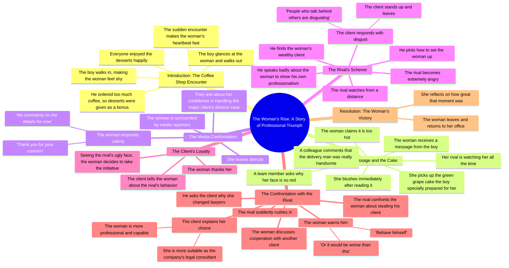

# Neighbor’s Guitar and Cake Spark a Sudden Heartbeat

> 🌐 **Read this in:** [English](../../en/2026-08/tiktok-transcript-part7-the-neighbor-s-guitar-and-cake-a-sudden-heartbeat-next-ed75.md) · **中文**

> **Creator:** [@vjbrisaidajayvonn](https://www.tiktok.com/@vjbrisaidajayvonn) · **Views:** 189.2K · **Posted:** 2026-08-01 · **Niche:** entertainment
>
> **TL;DR:** A sudden, unexplained character entrance instantly creates curiosity and romantic tension.

[Watch original video →](https://vm.tiktok.com/ZS4r37pog/)

## Why This Went Viral

## 钩子（前3秒）
- **逐字开场：** “男孩走了进来。这让女人更加害羞了。”
- **钩子模式：** 场景/开放式循环（动作进行中，无背景交代）
- **为何能阻止滑动：** 它把你直接扔进一个未解决的社交时刻，零铺垫。模糊性（“她为什么害羞？”）立即制造叙事张力。感觉像故事中间部分，大脑天生倾向于完成不完整的模式——你会继续看下去以闭合这个循环。

## 情绪节奏
- **节拍1——好奇/轻柔张力：** “男孩走了进来……让女人更加害羞了。”（他们是谁？什么关系动态？）
- **节拍2——温暖/舒适：** 咖啡、免费甜点、“大家都吃得很开心。”（安全、温馨的微场景）
- **节拍3——浪漫悸动：** “心跳加速”+同事说他很帅。（轻微升级，甜蜜）
- **节拍4——好奇/脸红：** 那条短信→她脸红了。（开放式循环：短信说了什么？）
- **节拍5——期待/威胁：** “她的对手一直在盯着她。”（张力飙升；利害关系引入）
- **节拍6——地位反转/高潮：** 媒体记者围住她——她是一位备受瞩目的律师。冷静、轻描淡写的回答。（权力动作；“低调炫技”的高潮）
- **节拍7——反派/复仇铺垫：** 对手试图用客户陷害她；客户反呛他（“在背后说人坏话的人真恶心”）。（令人满足的正义时刻）
- **节拍8——最终胜利/解决：** 她抢走了他的客户，让他“规矩点”，然后走了出去。（宣泄式胜利——情感回报）

**高潮时刻：** 媒体发布会上的那句话——“细节暂时无可奉告。”这是从浪漫到权力幻想的转折点，也是观众对这位女性的认知从害羞女孩翻转为主导型专业人士的瞬间。

## 关键词密度
1. **“女人”**（重复约10次）——驱动主角认同；算法锚定“女性赋权”内容。
2. **“对手”**（重复4次）——明确的反派标签；触发与冲突相关的观看时长。
3. **“客户”**（重复4次）——职业利害关系；标记“职场剧”细分领域。
4. **“男孩”**（重复3次）——浪漫副线关键词；扩大对言情受众的吸引力。
5. **“害羞/脸红/心跳”**——情感拉动词；让人物人性化，使其更具共鸣感。
6. **“背后说/坏话”**——反派标记；驱动道德义愤和站队心理。

**算法驱动词：** “女人”、“客户”、“对手”——这些是复仇/戏剧细分领域中的高搜索量词汇。**情感拉动：** “害羞”、“脸红”、“心跳”——它们营造亲密感和柔软感，与后来的权力幻想形成鲜明对比。

## 为何能广泛传播
- **“安静的力量”幻想：** 一个害羞的女人不提高声音就完成复仇，这是一种极具分享性的原型。那句“女人让他规矩点，否则会比这更糟”是一句冷酷、令人难忘的掷地有声之语——观众会截图并转发这类台词。
- **双线叙事钩子（言情+职场）：** 视频以浪漫邂逅开场，然后转向职业权力斗争。这种双线结构让两个不同的受众群体（言情粉、职场剧粉）都看到最后。
- **快速场景切换：** 每2-3句话就引入一个新角色或冲突（男孩→对手→媒体→客户→对手再次出现）。这模仿了短视频的快节奏剪辑，通过持续的新鲜感抓住注意力。
- **“反派受辱”的回报：** 对手的计划两次反噬（客户拒绝他，然后又丢了一个客户）。“在背后说人坏话的人真恶心”这句话是普世道德教训——观众将其作为“真理”语句分享。
- **处处是开放循环：** 短信内容从未揭晓；感情线从未解决。这让观众意犹未尽，促使评论如“第二部呢？”——从而推高互动指标。

## 你可以借鉴什么
1. **从场景中间开始，而不是从头开始。** 以一个紧张时刻开场（“男孩走了进来。她害羞了。”）——绝不要用“这是一个关于……的故事”。把观众直接扔进深水区，让背景信息逐步展开。
2. **使用“柔→刚”的角色反转。** 先呈现主角脆弱的一面（害羞、脸红），然后揭示她的力量（媒体压力下依然冷静）。这种对比创造了令人难忘的身份转变，观众愿意分享。
3. **以一句冷酷、可引用的台词收尾。** “规矩点，否则会比这更糟”就是那种观众会截图、配文、转发的台词。为你的视频高潮写一句决定性的权力台词，并将其放在最终对白的位置，在结局之前说出。

## Mind Map

## Full Transcript (Generated by [TokTranscript](https://toktranscript.com/?utm_source=github&utm_medium=breakdown&utm_campaign=tool_attribution))

> 📝 Transcripts on this page are auto-generated and show the first 60%. Want to transcribe any TikTok in 30 seconds and get the full version? [Try TokTranscript free →](https://toktranscript.com/?utm_source=github&utm_medium=breakdown&utm_campaign=transcript_cta)

The boy walked in. It made the woman even more shy. The boy said he ordered too much coffee, so desserts were given as a bonus. Everyone enjoyed them happily. Then he took a glance at the woman and walked out. The sudden encounter made the woman's heartbeat fast. A colleague said the delivery man was really handsome. Just then, the woman received a message from the boy. She blushed immediately after reading it. A team member asked why her face was so red. The woman said it was too hot. she picked up the green grape cake the boy specially prepared for her. But her rival was watching her all the time. Not long after, the woman was surrounded by media reporters. They asked if she was confident to handle the major client's divorce case. Facing all the questions, the woman calmly said, thank you for your concern. No comments on the details for now. Then she left directly. The rival watched this from a distance, thinking about how to set the woman up. Later, he found the woman's wealthy client said bad things about the woman to show his own professionalism. The client smil

*[Read the full transcript on TokTranscript →](https://toktranscript.com/plaza/tiktok-transcript-part7-the-neighbor-s-guitar-and-cake-a-sudden-heartbeat-next-ed75?utm_source=github&utm_medium=breakdown&utm_campaign=transcript_full)*

## Browse More

- All [entertainment](../../by-niche/zh-CN/entertainment.md) breakdowns
- All [Mysterious Intrusion](../../by-pattern/zh-CN/hook-mysterious-intrusion.md) examples

## Video Info

| | |
|---|---|
| Creator | [@vjbrisaidajayvonn](https://www.tiktok.com/@vjbrisaidajayvonn) |
| Original video | [https://vm.tiktok.com/ZS4r37pog/](https://vm.tiktok.com/ZS4r37pog/) |
| Original title | Part7|The Neighbor’s Guitar and Cake A Sudden Heartbeat Next Door#fyp... |
| Views | 189.2K (189200) |
| Posted | 2026-08-01 |
| Duration | 0s |
| Niche | `entertainment` |
| Hook pattern | `Mysterious Intrusion` |
| Original language | `en` (this page translated by AI) |
| Available languages | en, zh-CN |
| Generated | 2026-08-03 by [TokTranscript](https://toktranscript.com/) |

---

*This breakdown is for educational analysis under fair use. Original video © [@vjbrisaidajayvonn](https://www.tiktok.com/@vjbrisaidajayvonn). All transcripts are auto-generated and may contain errors.*

*Want to analyze your own TikToks like this? [拆解你自己的 TikTok →](https://toktranscript.com/viral-breakdown?utm_source=github&utm_medium=breakdown&utm_campaign=footer_cta)*