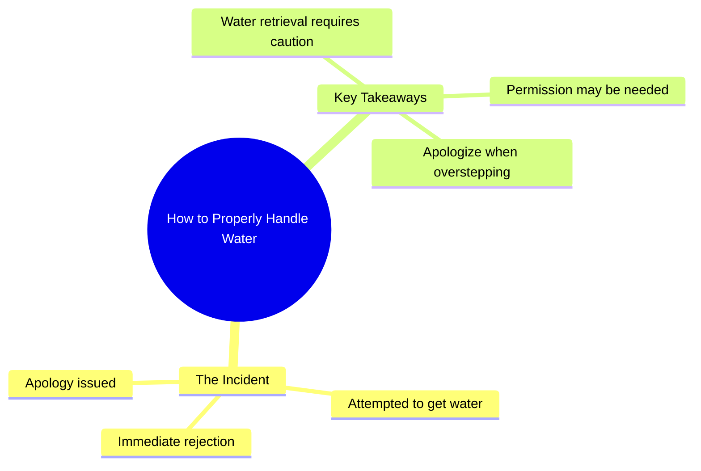

# Poor Chihuahua’s Marriage Life in a Nutshell

> 🌐 **Read this in:** [English](../../en/2026-08/tiktok-transcript-poor-chihuahua-s-marriage-life-summarized-in-this-video-just-6d77.md) · **中文**

> **Creator:** [@the.giggles.and.w](https://www.tiktok.com/@the.giggles.and.w) · **Views:** 43.6M · **Posted:** 2026-08-03 · **Niche:** other
>
> **TL;DR:** The mundane setup is instantly subverted by a frantic, comedic denial, creating a jarring and memorable hook.

[Watch original video →](https://vt.tiktok.com/ZS4fgAwBP/)

## Why This Went Viral

## 钩子（前3秒）
- **逐字开场白：**“我去弄点水。”
- **钩子模式：**带有隐含威胁的场景/动作——一句平静的陈述立刻引发恐惧。
- **为何能让人停下滑动：**日常动作（“弄水”）瞬间被疯狂的“不！不！不！”所打破——制造出认知失调。观众会停下来看看，从喝水这样无害的事情中，究竟会引发什么灾难性后果。

## 情绪节奏
- **节拍1——虚假的平静（0–1秒）：**“我去弄点水”听起来平淡无奇，甚至有些无聊。
- **节拍2——突如其来的恐慌（1–2秒）：**“不！不！不！”打破了平静——观众感到一阵惊愕。
- **节拍3——愧疚/道歉（2–3秒）：**“对不起”以喜剧性的削弱收尾，用荒诞感释放了紧张。
- **高潮：**“不！不！不！”是顶点——情绪急转直下就发生在这里。
- **收尾：**“对不起”带来点睛之笔，将潜在的危机变成了一个笑话。

## 关键词密度
- **“不”**（×3）——驱动情绪吸引力；制造恐慌和重复感，让片段令人难忘。
- **“水”**——驱动算法触达；一个通用、搜索量高的词，让视频在“水”相关的信息流中更容易被发现。
- **“对不起”**——情绪吸引力；传达脆弱感和喜剧性的自我意识。
- **“一点”**——情绪吸引力；轻描淡写放大了反应的荒诞性。
- **“我去”**——情绪吸引力；铺垫了虚假前提，让反转得以成立。

## 为何能传播
- **通过荒诞的过度反应引发共鸣：**每个人都曾对琐事反应过度——这个视频放大了那种普遍感受。“不！不！不！”是一种可以做成表情包的回应，观众会用它来@朋友。
- **短小、有力、可重复：**只有3秒，完美适合循环播放。“不！不！不！”成为人们在评论中引用和混音的声音片段。
- **反转即时发生：**无需铺垫。视频不渐进——它直接冲击。这使其非常适合自动播放和静音观看，视觉上的恐慌本身就承载了笑点。
- **情绪急转 = 分享冲动：**从平静到恐慌再到道歉的突然转变，制造出“刚才发生了什么？”的反应，促使观众把它发给别人，看看*对方*的反应。
- **开放式留白：**我们永远看不到“它”是什么——水、情境、背景。这种留白引发猜测和评论（“你干了什么？？”），提升互动信号。

## 你可以借鉴什么
- **以虚假前提开场：**用平淡或日常的事情开头，然后在2秒内将其打破。反差就是钩子。
- **用重复制造冲击力：**三重重复（“不！不！不！”）比单个词更令人难忘。它创造节奏感和可传播性。
- **以喜剧性削弱收尾：**在混乱之后道歉或加一句有自我意识的话。它释放紧张感，让视频显得有人情味，而非表演感——这能推动分享。

## Mind Map

## Full Transcript (Generated by [免费 TikTok 文稿生成器](https://toktranscript.com/?utm_source=github&utm_medium=breakdown&utm_campaign=tool_attribution))

> 📝 Transcripts on this page are auto-generated and show the first 60%. Want to transcribe any TikTok in 30 seconds and get the full version? [Try TokTranscript free →](https://toktranscript.com/?utm_source=github&utm_medium=breakdown&utm_campaign=transcript_cta)

I'm going to get a little bit of wate

*[Read the full transcript on TokTranscript →](https://toktranscript.com/plaza/tiktok-transcript-poor-chihuahua-s-marriage-life-summarized-in-this-video-just-6d77?utm_source=github&utm_medium=breakdown&utm_campaign=transcript_full)*

## Browse More

- All [other](../../by-niche/zh-CN/other.md) breakdowns
- All [Unexpected interruption](../../by-pattern/zh-CN/hook-unexpected-interruption.md) examples

## Video Info

| | |
|---|---|
| Creator | [@the.giggles.and.w](https://www.tiktok.com/@the.giggles.and.w) |
| Original video | [https://vt.tiktok.com/ZS4fgAwBP/](https://vt.tiktok.com/ZS4fgAwBP/) |
| Original title | Poor Chihuahua's marriage life summarized in this video 😭🤫😂 Just a no... |
| Views | 43.6M (43600000) |
| Posted | 2026-08-03 |
| Duration | 0s |
| Niche | `other` |
| Hook pattern | `Unexpected interruption` |
| Original language | `en` (this page translated by AI) |
| Available languages | en, zh-CN |
| Generated | 2026-08-04 by [TokTranscript](https://toktranscript.com/) |

---

*This breakdown is for educational analysis under fair use. Original video © [@the.giggles.and.w](https://www.tiktok.com/@the.giggles.and.w). All transcripts are auto-generated and may contain errors.*

*Want to analyze your own TikToks like this? [拆解你自己的 TikTok →](https://toktranscript.com/viral-breakdown?utm_source=github&utm_medium=breakdown&utm_campaign=footer_cta)*