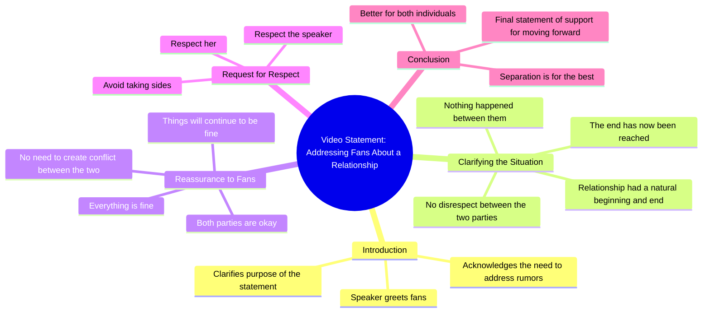

# My Statement About My Fans and Our Split

> 🌐 **Read this in:** [English](../../en/2026-08/tiktok-transcript-tiktok-video-7649580881773989141-8d73.md) · **中文**

> **Creator:** [@rigbylokao](https://www.tiktok.com/@rigbylokao) · **Views:** 24.8M · **Posted:** 2026-08-10 · **Niche:** entertainment
>
> **TL;DR:** The speaker immediately addresses fans with a sense of obligation, creating intrigue and emotional weight.

[Watch original video →](https://vt.tiktok.com/ZS4ngXoCV/)

## Why This Went Viral

## 钩子（前3秒）
- **逐字开场：**“哎，各位，所以既不是这样也不是那样，说说发生了什么，不幸的是我得在这里谈谈我的粉丝们……”
- **钩子模式：**场景 + 直接称呼（打破第四面墙）
- **为何能阻止滑动：**创作者立刻发出一个个人化、令人不适的声明——“不幸的是我得说”——制造出隐含的冲突。随意的“哎，各位”显得亲密，像朋友打断了你的信息流。模糊性（“既不是这样也不是那样，说说发生了什么”）迫使观众留下来解码发生了什么。

## 情绪节奏
1. **好奇（0–3秒）：**“发生了什么？”——模糊的紧张感，有什么不对劲。
2. **不安（3–8秒）：**“我得谈谈我的粉丝们”——暗示有丑闻或公开争执。
3. **防御性澄清（8–15秒）：**“我和她之间没有任何不尊重，什么都没发生”——试图平息谣言，但让“她”保持匿名，维持神秘感。
4. **忧郁的接受（15–20秒）：**“情侣就是这样，有开始就有结束……我们已经走到了尽头”——一种诗意的、近乎哲学式的认命，在情感上落地。
5. **安抚（20–28秒）：**“一切都好……尊重她，尊重我”——恳求文明对话，缓和冲击。
6. **高潮：**“不幸的是，就这样继续下去，对我们两个都更好”——分手的最终定论，带着不情愿的权威感。

## 关键词密度
- **“不幸的是”**（×3）——情感牵引，传达遗憾与分量。
- **“一切都好”**（×2）——安抚，但重复太多次反而显得像过度补偿，引发评论区猜测。
- **“尊重”**（×2）——道德框架，引导观众站队。
- **“粉丝”**（×2）——算法触达：直接面向观众，提升互动。
- **“什么都没发生”**——否认反而激发好奇和争论。
- **“结束”**（×2）——终结感，情感共鸣。

*算法驱动词：*“粉丝”“尊重”“什么都没发生”——这些触发评论、分享和争论。*情感牵引词：*“不幸的是”“结束”“一切都好”——这些维持共情和留存。

## 为何会传播
- **为互动而设计的模糊性：**“既不是这样也不是那样，说说发生了什么”以及未具名的“她”迫使观众评论追问背景，助推算法。
- **分手坦白形式具有普遍共鸣：**“情侣有开始就有结束”这句话是诗意的、可做成梗的片段，观众会剪辑并二次传播。
- **直接面向粉丝制造拟社会性紧迫感：**通过将视频框定为*给粉丝*的信息，观众感到个人参与感，提升观看时长和分享。
- **否认+安抚的悖论：**一边说“什么都没发生”一边宣布分手，引发猜测和阴谋论，推动重复观看和评论串。
- **低制作、原生态表达：**未经打磨的、意识流式的风格显得真实且无脚本，建立信任和可分享性。

## 你可以借鉴什么
1. **以“被迫声明”的框架开场。**用“我得谈谈……”开头制造即时紧张感，即使你的话题很平常。这传递出重要性和利害关系。
2. **用诗意的金句留下情感余韵。**打磨一句令人难忘的话（比如“情侣就是这样，有开始就有结束”），让观众可以引用、混剪或截图。
3. **留一个刻意的空白。**不要解释一切——保留一个模糊的细节（那个“她”、原因）。未解决的好奇心是评论、分享和重复观看的第一驱动力。

## Mind Map

## Full Transcript (Generated by [TikTok 转录工具](https://toktranscript.com/?utm_source=github&utm_medium=breakdown&utm_campaign=tool_attribution))

> 📝 Transcripts on this page are auto-generated and show the first 60%. Want to transcribe any TikTok in 30 seconds and get the full version? [Try TokTranscript free →](https://toktranscript.com/?utm_source=github&utm_medium=breakdown&utm_campaign=transcript_cta)

oi people so neither nor say what's going on and unfortunately i have to speak here about my fans and say that people playing and also say that there was no disrespect between me and her nothing happened couple is like that has a beginning and an end unfortunately we have reached the end I just want to reassure you that everything is fine. I d

*[Read the full transcript on TokTranscript →](https://toktranscript.com/plaza/tiktok-transcript-tiktok-video-7649580881773989141-8d73?utm_source=github&utm_medium=breakdown&utm_campaign=transcript_full)*

## Browse More

- All [entertainment](../../by-niche/zh-CN/entertainment.md) breakdowns
- All [Direct address + reluctant confession](../../by-pattern/zh-CN/hook-direct-address-reluctant-confession.md) examples

## Video Info

| | |
|---|---|
| Creator | [@rigbylokao](https://www.tiktok.com/@rigbylokao) |
| Original video | [https://vt.tiktok.com/ZS4ngXoCV/](https://vt.tiktok.com/ZS4ngXoCV/) |
| Original title | TikTok video #7649580881773989141 |
| Views | 24.8M (24800000) |
| Posted | 2026-08-10 |
| Duration | 0s |
| Niche | `entertainment` |
| Hook pattern | `Direct address + reluctant confession` |
| Original language | `en` (this page translated by AI) |
| Available languages | en, zh-CN |
| Generated | 2026-08-11 by [TokTranscript](https://toktranscript.com/) |

---

*This breakdown is for educational analysis under fair use. Original video © [@rigbylokao](https://www.tiktok.com/@rigbylokao). All transcripts are auto-generated and may contain errors.*

*Want to analyze your own TikToks like this? [TokTranscript 转录工具 →](https://toktranscript.com/viral-breakdown?utm_source=github&utm_medium=breakdown&utm_campaign=footer_cta)*