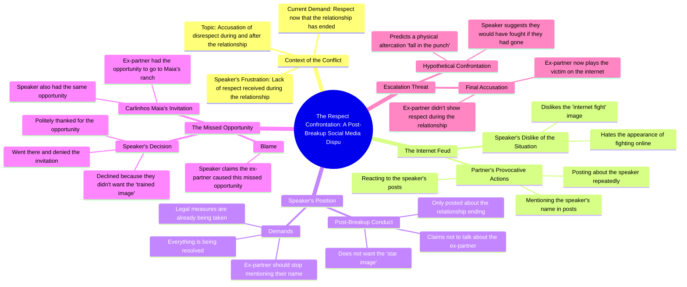

# Why Exes Demand Respect After Disrespecting You

> 🌐 **Read this in:** [English](../../en/2026-08/tiktok-transcript-tiktok-video-7671785610285174037-0aae.md) · **中文**

> **Creator:** [@rigbylokao](https://www.tiktok.com/@rigbylokao) · **Views:** 7.6M · **Posted:** 2026-08-09 · **Niche:** entertainment
>
> **TL;DR:** Starts with a pointed accusation that immediately creates tension and curiosity.

[Watch original video →](https://vm.tiktok.com/ZGdxAeRRu/)

## Why This Went Viral

## 钩子（前3秒）
- **逐字开场白：**“我不明白的是，在我恋爱期间你没有给我尊重……而现在我们都已经忘了，你却想要尊重，用这种东西来掩盖尊重。”
- **钩子模式：**对比+指责。这是一种直接、对抗性的表达，反转了局面——“你当时不尊重我，现在却要求尊重。”
- **为什么它能让人停下滑动：**这是对一位知名人物的公开斥责（这个“你”显然是指某个具体的人）。那种原始、不加掩饰的愤怒和“掩盖尊重”的说法立刻制造了悬念——观众马上就想知道背后的故事。

## 情绪节奏
- **节拍1——愤慨（0-5秒）：**指责者以正义的愤怒开场，明确指出了一个错误（“你没有给我尊重”）。
- **节拍2——厌恶（“我讨厌这样”）：**说话者打破第四面墙，表达了对这种情况发自内心的憎恶。这感觉真实且未经编排。
- **节拍3——防御/澄清：**“我不谈论你……我不想要明星光环。”说话者转而捍卫自己的名声，制造了一种“他说/她说”的紧张感。
- **节拍4——升级/威胁：**“把我的名字从你嘴里拿掉，因为措施已经在采取了。”这是**高潮**——一个法律威胁，把戏剧性推到了顶点。
- **节拍5——转移/挑战：**说话者提到了一个错过的机会（Carlinhos Maia的庄园），并以一个暴力的假设结尾：“我们本来要打起来的。”这让观众在未解决的冲突悬念中结束观看。

## 关键词密度
- **尊重**——核心主题；既驱动情感吸引力（尊严），也驱动算法传播（争议性）。
- **名字**——“把我的名字从你嘴里拿掉”——标志着名誉之战，这是一个高互动话题。
- **恋爱关系**——设定了个人背景，吸引了那些能共鸣分手戏剧的观众。
- **网络骂战**——说话者明确点出了这一类型，使视频具有自我意识且易于分享。
- **机会**——引入了一个具体的剧情点（庄园邀请），激发了猜测。
- **受害者**——“装受害者”——一个经典的指控，引发观众站队（选边站）。

## 为什么它会传播
- **实时戏剧性：**这段文字读起来像一场现场对峙，而不是一个精心编排的视频。结巴、重复和原始的愤怒（“天哪”）标志着真实性——这是短视频病毒式传播的第一货币。
- **点名提及：**提到“Carlinhos Maia”（一位巴西超级网红）借力了他现有的受众和搜索流量，为视频提供了内置的发现引擎。
- **升级钩子：**“措施已经在采取了”的威胁邀请观众猜测结果，推动评论和回访。
- **可共鸣的内核：**情感弧线——在恋爱中感到不被尊重，然后被要求尊重——是普遍能理解的，即使具体细节是小众的。
- **开放循环：**最后一句（“我们本来要打起来的”）暗示一场肢体冲突险些发生。它让故事悬而未决，迫使观众去寻找第二部分。

## 你可以借鉴什么
- **以直接的指责开场，而不是问候。**第一句话就点名了冒犯行为和冒犯者。你的钩子应该立即陈述冲突——不要“嘿大家好”的铺垫。
- **使用“螺旋式”表达。**说话者重复自己（“我不想要明星光环”）并插话（“我讨厌这样”）。这感觉不精致但真实。练习用自然的、情绪化的停顿来演绎你的脚本——不要过度剪辑。
- **以威胁或开放性问题结尾。**“措施已经在采取了”是一个悬念。永远给你的观众一个评论、猜测或要求后续的理由。

## Mind Map

## Full Transcript (Generated by [我们用的转录工具](https://toktranscript.com/?utm_source=github&utm_medium=breakdown&utm_campaign=tool_attribution))

> 📝 Transcripts on this page are auto-generated and show the first 60%. Want to transcribe any TikTok in 30 seconds and get the full version? [Try TokTranscript free →](https://toktranscript.com/?utm_source=github&utm_medium=breakdown&utm_campaign=transcript_cta)

what i don't understand is that you didn't give me respect during my relationship our relationship and now that we've forgotten you want you to cover respect covers something like this oh for the love of god I hate I came here to say this I hate it because it looks like he's fighting giving internet fight i hate it but unfortunately you've been posting this all the time my name every time it was me who did something every time i posted something and I don't talk about you I don't speak at any time the relationship ended the only thing I posted was myment and it's over I don't want the star image and say it again I don't want the star image and if i were you I took my name out of my mouth because the measures are already being taken everything is being resolv

*[Read the full transcript on TokTranscript →](https://toktranscript.com/plaza/tiktok-transcript-tiktok-video-7671785610285174037-0aae?utm_source=github&utm_medium=breakdown&utm_campaign=transcript_full)*

## Browse More

- All [entertainment](../../by-niche/zh-CN/entertainment.md) breakdowns
- All [Direct accusation](../../by-pattern/zh-CN/hook-direct-accusation.md) examples

## Video Info

| | |
|---|---|
| Creator | [@rigbylokao](https://www.tiktok.com/@rigbylokao) |
| Original video | [https://vm.tiktok.com/ZGdxAeRRu/](https://vm.tiktok.com/ZGdxAeRRu/) |
| Original title | TikTok video #7671785610285174037 |
| Views | 7.6M (7600000) |
| Posted | 2026-08-09 |
| Duration | 0s |
| Niche | `entertainment` |
| Hook pattern | `Direct accusation` |
| Original language | `en` (this page translated by AI) |
| Available languages | en, zh-CN |
| Generated | 2026-08-10 by [TokTranscript](https://toktranscript.com/) |

---

*This breakdown is for educational analysis under fair use. Original video © [@rigbylokao](https://www.tiktok.com/@rigbylokao). All transcripts are auto-generated and may contain errors.*

*Want to analyze your own TikToks like this? [TikTok 转录工具 →](https://toktranscript.com/viral-breakdown?utm_source=github&utm_medium=breakdown&utm_campaign=footer_cta)*