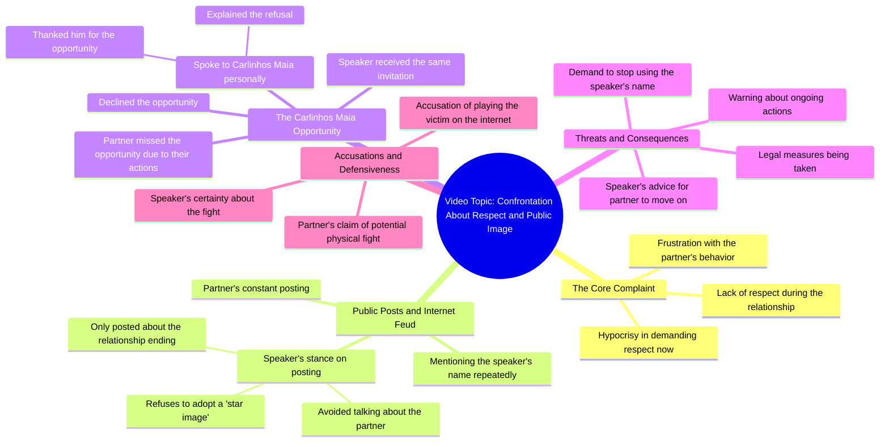

# Why Exes Demand Respect After Disrespecting You

> 🌐 **Read this in:** [English](../../en/2026-08/tiktok-transcript-tiktok-video-7671785610285174037-d198.md) · **中文**

> **Creator:** [@rigbylokao](https://www.tiktok.com/@rigbylokao) · **Views:** 7.9M · **Posted:** 2026-08-09 · **Niche:** entertainment
>
> **TL;DR:** Opens with a pointed accusation that immediately creates tension and curiosity.

[Watch original video →](https://vm.tiktok.com/ZGdxAL8ED/)

## Why This Went Viral

## 钩子（前3秒）
- **逐字开场白：**“我不明白的是，在我们恋爱期间你没有尊重我……现在事情都过去了，你却想要尊重，想要这种东西。”
- **钩子模式：** **对比 + 指责。** 它直接制造了一个道德矛盾（“当时不尊重”对比“现在要求尊重”），并立刻把对方定性为过错方。
- **为什么它能让人停下滑动：** 它把观众直接扔进一场正在进行的、未解决的冲突之中。指责性的语气和“我不明白”这句话制造了即时的认知张力——观众需要知道是谁在吵架、发生了什么。

## 情绪节奏
1. **困惑/好奇：**“我不明白”——观众被吸引进来，想弄清楚背后的故事。
2. **紧张/愤怒：** 关于不尊重的指控和“装受害者”的讽刺提高了事态的严重性。
3. **沮丧/厌恶：**“天哪，我讨厌这样”——说话者未经修饰的真实情绪显得自然、不做作。
4. **防御/澄清：**“我没有说你……我唯一发的是我的声明。”说话者试图澄清事实，给观众一个可以站队的立场。
5. **升级/威胁：**“把我的名字从你嘴里拿掉，因为措施已经在采取了。”这是紧张的顶峰——暗示着现实世界的后果。
6. **转移/挑衅：**“去上班吧……你错过了这个机会，全怪你自己。”转移责任，并加上一句实际又带点小心眼的讽刺。
7. **高潮（假设性暴力）：**“我们当时差点就要打起来了，我敢肯定。”提到肢体冲突是爆炸性的顶点——这是最容易被转发、最震撼的一句。
8. **收尾（道德高地）：**“为什么我们在一起的时候你不尊重我，现在你却来要求尊重？”——一个循环式的、最终的回击，把观众带回到最初的指控。

## 关键词密度
- **“尊重”**（驱动情绪吸引力——核心道德冲突）。
- **“形象”**（驱动情绪吸引力——与声誉和公众形象挂钩）。
- **“机会”**（驱动情绪吸引力——暗示对方浪费了一次机会）。
- **“恋爱/关系”**（驱动算法触达——高搜索量、高关注度的情感类话题）。
- **“网络/发帖”**（驱动算法触达——标志着社交媒体冲突，一个热门细分领域）。
- **“措施”**（驱动情绪吸引力——暗示法律或严肃行动，增加分量感）。
- **“受害者”**（驱动情绪吸引力——网络讨论中极具火药味的指控）。

## 为什么它会传播
- **实时冲突，而非事后复述：** 说话者说“我来这里就是为了说这个”和“你一直在发这些东西”。这感觉像是一个未经剪辑的实时反应视频，而不是一个精心打磨的故事。这种真实感触发了“我必须看到结局”的反应。
- **升级的威胁：**“措施已经在采取了”和“我们差点打起来”预示着后续内容。观众转发它来推动这场持续上演的戏码，并猜测接下来会发生什么。
- ** relatable 的情感纠葛：** 核心指控——“你当时不尊重我，现在却想要尊重”——是一种普遍的情感抱怨。这让视频适用于任何人的个人纠纷，而不仅仅是这场特定的恩怨。
- **清晰的 villain 框架：** 说话者将自己定位为受委屈的一方，声称“拒绝”了同样的机会、没有“谈论”前任。这给了观众一个明确的站队方向，从而推动评论和争论——两者都能提升算法推荐。
- **高情绪、高风险的表达：** 像“看在上帝的份上”、“我讨厌这样”和“差点打起来”这样的短语是发自肺腑的。它们不圆滑，而是赤裸裸的，这使得这段视频极具引用价值，也适合反应类频道剪辑。

## 你可以借鉴什么
- **以道德矛盾开场：** 在视频开头指出对方逻辑或行为中的漏洞（“你说了X，却做了Y”）。这能立即制造冲突和好奇心，无需任何铺垫。
- **使用逐步升级的利害关系：** 从个人挫败感过渡到具体后果（“措施已经在采取”）。这能让观众保持关注，因为他们知道事情不仅仅是一通抱怨。
- **以循环式回扣结尾：** 把观众带回你的开场白（“为什么你当时不尊重我……”）。这创造了一个令人满意的、完整的叙事弧线，感觉像是一个掷地有声的收尾，使这段视频作为一个独立单元更容易被转发。

## Mind Map

## Full Transcript (Generated by [TokTranscript 转录工具](https://toktranscript.com/?utm_source=github&utm_medium=breakdown&utm_campaign=tool_attribution))

> 📝 Transcripts on this page are auto-generated and show the first 60%. Want to transcribe any TikTok in 30 seconds and get the full version? [Try TokTranscript free →](https://toktranscript.com/?utm_source=github&utm_medium=breakdown&utm_campaign=transcript_cta)

what i don't understand is that you didn't give me respect during my relationship our relationship and now that we've forgotten you want you to cover respect covers something like this oh for the love of god I hate I came here to say this I hate it because it looks like he's fighting giving internet fight i hate it but unfortunately you've been posting this all the time my name every time it was me who did something every time i posted something and I don't talk about you I don't speak at any time the relationship ended the only thing I posted was myment and it's over I don't want the star image and say it again I don't want the star image and if i were you I took my name out of my mouth because the measures are already being taken everything is being resolv

*[Read the full transcript on TokTranscript →](https://toktranscript.com/plaza/tiktok-transcript-tiktok-video-7671785610285174037-d198?utm_source=github&utm_medium=breakdown&utm_campaign=transcript_full)*

## Browse More

- All [entertainment](../../by-niche/zh-CN/entertainment.md) breakdowns
- All [Direct accusation with emotional contrast](../../by-pattern/zh-CN/hook-direct-accusation-with-emotional-contrast.md) examples

## Video Info

| | |
|---|---|
| Creator | [@rigbylokao](https://www.tiktok.com/@rigbylokao) |
| Original video | [https://vm.tiktok.com/ZGdxAL8ED/](https://vm.tiktok.com/ZGdxAL8ED/) |
| Original title | TikTok video #7671785610285174037 |
| Views | 7.9M (7900000) |
| Posted | 2026-08-09 |
| Duration | 0s |
| Niche | `entertainment` |
| Hook pattern | `Direct accusation with emotional contrast` |
| Original language | `en` (this page translated by AI) |
| Available languages | en, zh-CN |
| Generated | 2026-08-10 by [TokTranscript](https://toktranscript.com/) |

---

*This breakdown is for educational analysis under fair use. Original video © [@rigbylokao](https://www.tiktok.com/@rigbylokao). All transcripts are auto-generated and may contain errors.*

*Want to analyze your own TikToks like this? [TokTranscript →](https://toktranscript.com/viral-breakdown?utm_source=github&utm_medium=breakdown&utm_campaign=footer_cta)*