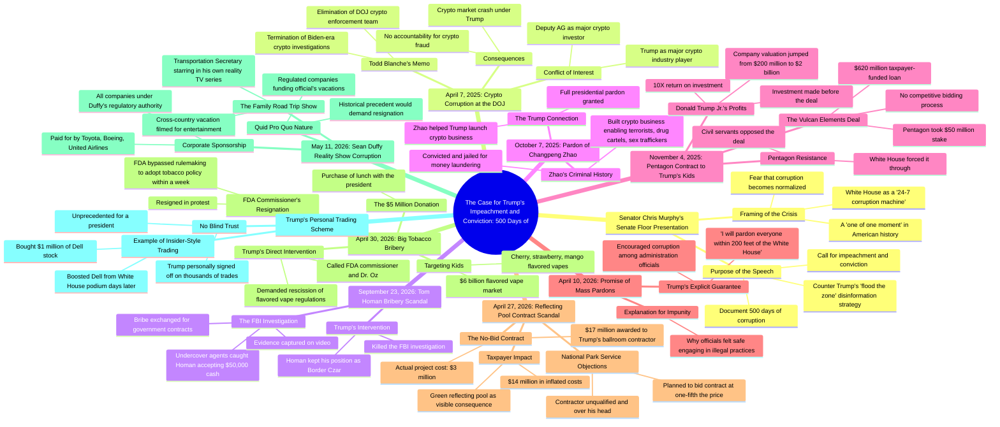

# Trump Panics as Senate Impeachment Case Made

> 🌐 **Read this in:** [English](../../en/2026-08/tiktok-transcript-trump-loses-it-as-impeachment-case-made-in-senate-4431.md) · **中文**

> **Creator:** [@MeidasTouch](https://www.tiktok.com/@MeidasTouch) · **Views:** 1.3M · **Posted:** 2026-08-18 · **Niche:** entertainment
>
> **TL;DR:** Immediately frames a high-stakes political drama with escalating stakes, grabbing attention.

[Watch original video →](https://www.facebook.com/reel/2268299423974662)

## Why This Went Viral

## 钩子（前3秒）
- **逐字开场：** “唐纳德·特朗普正在恐慌，因为弹劾案已在美利坚合众国参议院议事厅上提出。”
- **钩子模式：** 大胆断言 + 紧迫感（“恐慌”）+ 高风险政治触发词（“弹劾”）。
- **为何能阻止滑动：** 它以危机中段的情绪化、宣言式陈述开场。“恐慌”一词暗示强权人物的软弱，而“弹劾”则预示着戏剧性、后果严重的事件。反对特朗普的观众瞬间获得认同感；对该说法好奇的人则感到有必要去看证据。

## 情绪节奏
1. **紧迫/紧张：** “特朗普正在恐慌”——即时利害关系，大事正在发生。
2. **认同/正义感：** “定罪的理由……腐败和犯罪政权”——强化观众的世界观。
3. **期待：** “让我给你看看这个案子”——承诺有实锤，激发好奇心。
4. **震惊/愤怒（节拍1）：** 加密货币腐败——司法部在官员获利的同时撤销调查。观众感到厌恶。
5. **愤怒升级（节拍2）：** 汤姆·霍曼受贿——“视频里一袋现金。”直观、无可否认的腐败。愤怒达到顶峰。
6. **道德谴责（节拍3）：** 赦免赵长鹏——将腐败与恐怖主义/性交易联系起来。情绪低谷；观众感到道德上的排斥。
7. **不公（节拍4）：** 小特朗普10倍利润——任人唯亲加窃取纳税人钱财。怨恨累积。
8. **愤世嫉俗的醒悟（节拍5）：** “我会赦免200英尺内的所有人”——反转：他们知道自己可以逍遥法外。绝望与愤怒交织。
9. **荒诞/喜剧（节拍6）：** 1700万美元的倒影池——“名副其实的沼泽污水垃圾场。”黑色幽默打破紧张。
10. **高潮：** 烟草贿赂加FDA电话——腐败直接伤害孩子。愤怒达到顶峰，道德风险拉满。
11. **行动号召（隐含）：** “我们，纳税人，正在为这一切买单”——将问题个人化，推动分享。

## 关键词密度
- **“腐败”**（15次以上）——核心主题；既驱动算法分类，也驱动情绪吸引力。
- **“犯罪”/“犯罪行为”**（5次以上）——法律框架；暗示严重性，提升政治群体的参与度。
- **“特朗普”**（20次以上）——主要搜索词；对算法触达至关重要。
- **“纳税人的钱”**（4次）——个人利害关系；使腐败更具代入感，驱动愤怒。
- **“孩子”**（3次）——情绪触发词；在电子烟片段中尤其有力。
- **“赦免”**（4次）——突出有罪不罚；关键叙事节拍。
- **“赤裸裸”**（3次）——强调无耻；放大厌恶感。
- **“500天”**（3次）——营造范围和紧迫感；令人难忘的框架手段。

## 为何能传播
- **基于实锤的叙事：** 主持人反复说“播放这段片段”和“把所有实锤都拿出来了”。这把观点转化为证据。观众分享是因为他们觉得自己掌握了事实，而不仅仅是情绪化评论。（具体例子：“FBI当场抓住了汤姆·霍曼……在视频里。”）
- **递进式“腐败日期”结构：** 每个片段都是一个带时间戳的独立丑闻。这创造了让人欲罢不能的节奏——观众留下来看接下来是什么，累积效应让人感到铺天盖地。（具体例子：“下一个腐败日期，2026年9月23日……下一个腐败日期，2025年10月7日。”）
- **道德愤怒与个人利害挂钩：** 主持人将每个丑闻都与观众的钱包和家庭联系起来——“这是你的钱”“针对我们的孩子。”这把政治新闻转化为个人不满，是强大的分享触发因素。（具体例子：“钱不是从树上长出来的。这是纳税人的钱。”）
- **荒诞与严重性的对比：** 将荒谬之事（1700万美元的倒影池、“绿色倒影池”）与严重之事（恐怖主义融资）并置，制造情绪上的过山车，保持高参与度，让内容显得全面。（具体例子：“它看起来像唐纳德·特朗普房产上到处都是的那种霉菌。”）
- **有罪不罚作为核心叙事：** “我会赦免所有人”这句话是解释此前所有腐败的反转。这个“顿悟”时刻给观众一个完整、可分享的论点：“他们知道自己可以逍遥法外。”（具体例子：“所以现在你明白为什么人们觉得自己可以逍遥法外了。”）

## 你可以借鉴什么
1. **使用“实锤”格式：** 不要只是声称——要展示。以大胆断言开场，然后说“让我给你看看”，并呈现纪实证据（片段、引文、时间戳）。这建立可信度，让你的内容作为“证据”而非仅仅是观点被分享。
2. **用递进式节拍构建结构：** 将你的主题分成编号、标注日期或带标签的片段（“腐败第一天”“下一个例子……”）。每个片段应自成一体但建立在前一个之上，创造一种让人欲罢不能的节奏，最大化观看时长。
3. **将利害关系个人化：** 在每个例子之后，明确将其与观众的生活联系起来——他们的钱、他们的孩子、他们的安全。使用“这是你的钱”或“这影响你的家庭”之类的短语。这把抽象新闻转化为切身的个人不满，这是分享的最强驱动力。

## Mind Map

## Full Transcript (Generated by [免费 TikTok 文稿生成器](https://toktranscript.com/?utm_source=github&utm_medium=breakdown&utm_campaign=tool_attribution))

> 📝 Transcripts on this page are auto-generated and show the first 60%. Want to transcribe any TikTok in 30 seconds and get the full version? [Try TokTranscript free →](https://toktranscript.com/?utm_source=github&utm_medium=breakdown&utm_campaign=transcript_cta)

Donald Trump is panicking as the case for impeachment has been made on the floor of the United States Senate. Not just the case for impeachment, but the case for a conviction after impeachment. The case for Donald Trump's impeachment and conviction over 500 days into this corrupt and criminal regime was made by Democratic Senator Chris Murphy. Democratic Senator Murphy pulled out all of the receipts of Donald Trump's criminality and Donald Trump's corruption and made one of the most compelling presentations I've seen yet. And folks, surely we will be seeing this again if and when Democrats take control of the House and the Senate and when the impeachment charges drop and when the conviction trials begin. Let me show you the case for Donald Trump's impeachment and conviction as set forth by Democratic Senator Chris Murphy. So he took to the Senate floor and he said the following, Trump has turned the White House into a 24-7 corruption machine. This is a national crisis. Trump thinks the public will stop paying attention if he floods the zone with constant disinformation, with constant chaos. So, Senator Chris Murphy says, I went to the Senate floor to call his bluff. I told the entire story of what went down in 500 days. Here's Senator Murphy giving the introduction right here. Let's play it. This moment is exceptional. It is a one of one moment. And if it becomes normal, if people stop being outraged at what he is doing to enrich himself, then I fear there is no going back. The White House will just become a place to get rich. So I think it's time to pull back and see the full picture. To not view this as just one isolated scandal after another, every single one popping up each week or every few days, but to understand the full scope of this illegality. Last year, I came to the floor to document the first 100 days of Donald Trump's mind-blowing corruption. Since then, especially in 2026, the pace of his misconduct has quickened dramatically. And so I'm here on the floor today, and I'm going to spend more than a few minutes doing this, laying out what has happened since I gave that last speech. This is the story of 500 days of corruption. Next, Senator Murphy talks about the April 7th, 2025 date of corruption. Donald Trump, one of the biggest crypto players in the world, declares we will no longer be enforcing our laws against the crypto industry. Active fraud investigations are shut down. The entire crypto enforcement team at the DOJ is fired. Play this clip. And I'm going to start on April 7th, 2025. This is when the current acting attorney general, Todd Blanche, issues a memo ordering the termination of several Biden-era DOJ investigations into crypto companies. Now, here's the problem. the then deputy attorney general, is a major investor in crypto companies. And he works for a president who is a major player in the crypto industry. But DOJ just drops these investigations, signals that the Department of Justice is no longer going to hold crypto companies accountable. But Blanche owns major investments in crypto stocks. The president is one of the biggest players in the industry. Blanche doesn't actually stop there. He eliminates the entire enforcement team at DOJ dedicated to rooting out crypto-related fraud and money laundering schemes. This is a crypto investor who works for a president who owns crypto companies, shutting down the unit at DOJ that holds this industry accountable. Now, I should also note after watching that, you see why though we need regulation doesn't mean we need over-regulation, but we need the right amount of regulations because even for the industry, crypto has crashed right now. And to me, it's not a coincidence that it crashes under the guy who says, I'm the crypto guy. Everything Donald Trump touches dies. Next date of corruption, September 23rd, 2026. Borders are Tom Homan caught by FBI agents taking bribes in exchange for federal contracts. The FBI has video footage of Tom Homan accepting a bribe, a big bag of cash. Trump kills the FBI investigation and Homan gets a job in the administration Play this clip A week later on September 23rd Donald Trump closes the books on a criminal investigation into one of his key advisors Tom Homan This is his border czar The FBI had caught Tom Homan red-handed, engaging in naked corruption. Undercover agents had handed him $50,000 in cash, in a bag, and he agreed to give them government contracts. This was on video. This is the borders are getting a bag of cash in exchange for contracts on video. But the administration on September 20th just makes the investigation go away because that kind of bribery. That kind of naked graft is OK in this White House. Next date of corruption, October 7, 2025. Trump's crypto corruption comes full circle. He pardons Changping Zhao, or CZ as he goes by, the convicted money launderer of terrorists, drug cartels, and sex traffickers, the biggest in the world. Donald Trump says, how may I help you? Zhao helped Trump and his family set up a crypto coin scheme. And here's what Donald Trump did. Murphy lays out the case. Let's play it. Maybe the most nakedly corrupt pardon, a single senator that could defend this. Chengpeng Zhao built an entire business based on allowing terrorists, drug traffickers and sex predators to use his cryptocurrency to evade the law. He went to jail for this. But he also helped Trump launch his crypto business. So who cares about financing terrorists and sex criminals? Trump gives this guy a full pardon on October 7th. It's naked. This is a guy who built a company that allowed terrorists and sex predators to engage in private financing. He went to jail. He got out of jail because he agreed to help get Trump rich. Next day of corruption, November 4th, 2025. The White House forces the Pentagon to give a company owned by Trump's kids a massive government contract and a $670 million loan. No competitive bidding process, all taxpayer dollars. Donald Trump Jr. 10X'd his profits, folks. And this is in matters of war and peace also. The corruption by itself needs to be called out for its criminality, as Senator Murphy puts it, for its corruption. I'm giving you my opinion, of course, as protected by the First Amendment of the United States Constitution. But let me also just say this, it's war and peace. So if you're giving contracts to people who shouldn't get these contracts, instead of say, I don't know who's good at manufacturing drones right now. Maybe the Ukrainians are probably good at drones. Like, you know, maybe you want to go buy drones. No, no, no. It's Don Jr. and Eric. Here, play this clip. It's not just Trump's corporate donors that are getting rich now. Part of the White House's daily operation is to find creative ways to funnel taxpayer money to Trump's kids. This one's wild. The Trump administration in November, early November, announces a really unusual deal. The government, the Pentagon, is taking a $50 million stake in a single rare earth minerals company called Vulcan Elements and giving them a $620 million taxpayer funded loan. That is big money. And the Pentagon doesn't really do deals like this. But they do when Donald Trump Jr. is one of the company's key investors. We come to find out that civil servants in the Pentagon did not want to do this deal. Only did it because the White House told them to do the deal. One official said, quote, the call came from the White House. We have to get this done. Before the deal, Vulcan was worth $200 million. Donald Trump Jr. made an investment. His father got the Pentagon to give them the contract and buy the stake in the company. And the valuation jumped overnight, $200 million to $2 billion. Donald Trump Jr. 10X'd his profits. I mean, has anybody in this body justify that? You've probably not even heard that story. It barely cracked the news. Like in normal times, that scandal alone, the president's son making an investment in the company, the federal government then making a massive investment subsequently. The Pentagon didn't want to do it, only did it because the president told them to do it after his son made the investment and the value of the president's son's investment went up by 10 times, that scandal alone would take down a presidency. Next date of corruption April 10 2026 Trump promises mass pardons of all his co at the White House Why are Trump henchmen worried about going to jail for corruption and bribery Because Trump guaranteed them they all get away with it Play this clip But why do they think they can get away with this? Why does anybody think they can get away with this? So much of this is illegal, right? You would say to yourself, nobody would engage in that kind of naked illegal practice. Nobody would award contracts to the kids knowing that that doesn't pass legal muster, on April 10th, you figure out why they think they're going to get away with it. On April 10th, Donald Trump makes an explicit promise that everybody engaged in this corruption will get away with it. Here is his quote on April 10th, as the pace of this corruption increases. Quote, I will pardon everyone within 200 feet of the White House. So now you understand why people think they can get away with it. April 27, 2026, Trump's ballroom contractor gets a no bid $17 million contract to refurbish the reflecting pool. The actual cost of the project was $3 million. dollars. But Trump inflated the price for his friends. We, the taxpayers, are funding all of this disgusting crap as Donald Trump has turned Washington, D.C. into a literal swamp cesspool junkyard. It looks like the mold that's all over Donald Trump's properties. Play this clip. Trump wants to get all his friends involved in the grift now. So Trump gives a no bid $17 million contract to refurbish two fountains near the White House, including the reflecting pool. We're living with the consequences of this corruption right now, as we have a green reflecting pool. This is a completely unqualified contractor who is already in over his head because he's involved in the ballroom, and he gets a new $17 million contract. Does it really cost $17 million to clean up fountains? The answer from the National Park Service itself is no. In fact, the National Park Service was planning to bid that contract out for one-fifth what Trump gave it to his friend for. But it was

*[Read the full transcript on TokTranscript →](https://toktranscript.com/plaza/tiktok-transcript-trump-loses-it-as-impeachment-case-made-in-senate-4431?utm_source=github&utm_medium=breakdown&utm_campaign=transcript_full)*

## Browse More

- All [entertainment](../../by-niche/zh-CN/entertainment.md) breakdowns
- All [Urgent escalation](../../by-pattern/zh-CN/hook-urgent-escalation.md) examples

## Video Info

| | |
|---|---|
| Creator | [@MeidasTouch](https://www.tiktok.com/@MeidasTouch) |
| Original video | [https://www.facebook.com/reel/2268299423974662](https://www.facebook.com/reel/2268299423974662) |
| Original title | Trump LOSES IT as IMPEACHMENT CASE MADE in SENATE!! |
| Views | 1.3M (1255939) |
| Posted | 2026-08-18 |
| Duration | 0s |
| Niche | `entertainment` |
| Hook pattern | `Urgent escalation` |
| Original language | `en` (this page translated by AI) |
| Available languages | en, zh-CN |
| Generated | 2026-08-19 by [TokTranscript](https://toktranscript.com/) |

---

*This breakdown is for educational analysis under fair use. Original video © [@MeidasTouch](https://www.tiktok.com/@MeidasTouch). All transcripts are auto-generated and may contain errors.*

*Want to analyze your own TikToks like this? [TokTranscript 转录工具 →](https://toktranscript.com/viral-breakdown?utm_source=github&utm_medium=breakdown&utm_campaign=footer_cta)*