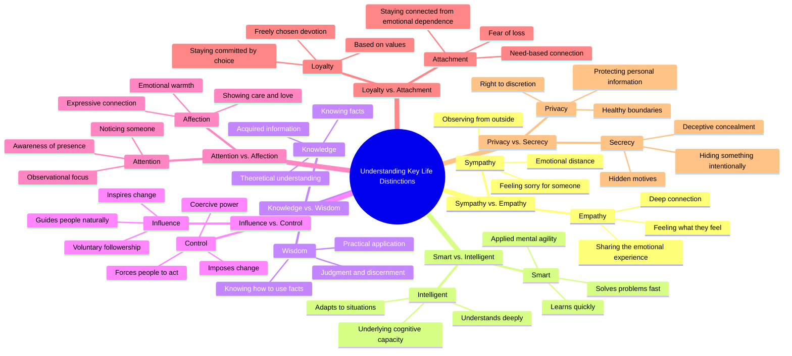

# Sympathy vs Empathy: Key Differences Explained

> 🌐 **Read this in:** [English](../../en/2026-08/tiktok-transcript-what-s-the-difference-difference-learn-psychology-bff7.md) · **中文**

> **Creator:** [@diffstick](https://www.tiktok.com/@diffstick) · **Views:** 4.6M · **Posted:** 2026-08-06 · **Niche:** entertainment
>
> **TL;DR:** The immediate juxtaposition of two similar concepts creates a knowledge gap that compels viewers to watch for the answer.

[Watch original video →](https://vt.tiktok.com/ZS4Qb4Pe7/)

## Why This Went Viral

## 钩子（前3秒）
- **逐字开场：**“这是同情，这是共情。有什么区别？”
- **钩子模式：**对比 + 反问（一种“二元揭示”模式）
- **为何能阻止滑动：**它承诺在人们经常混淆的两个词之间给出一个清晰、即时满足的区分。视觉配对（可能是两个物体或手势）制造了“模式中断”——观众感到自己知识上的即时空白，并想填补它。

## 情绪节奏
1. **好奇（0–3秒）：**“有什么区别？”——这个问题激发了一个知识缺口。
2. **满足（3–6秒）：**同情 vs. 共情——一个快速、干脆的答案带来了小奖励。
3. **期待（6–12秒）：**模式重复（聪明/智慧、知识/智慧）——观众现在*预测*结构，这建立了一种预期奖励的节奏。
4. **升级（12–20秒）：**影响 vs. 控制、关注 vs. 关爱——赌注从认知层面上升到关系/情感层面。
5. **张力（20–26秒）：**忠诚 vs. 依恋——这是情绪峰值；它触及关系、脆弱性和自我意识。
6. **高潮（26–30秒）：**隐私 vs. 秘密——最后一对落在更黑暗、更私密的基调上，留下一个挥之不去的思考，而非一个笑点。
7. **收尾：**没有明确的结尾语——最后一句之后的沉默让观众沉浸于最终的对比中。

**高潮时刻：**“忠诚是出于选择而坚守承诺，而依恋是因情感依赖而保持联系。”——这是最可能被引用、截图或转发的句子。

## 关键词密度
- **“这是”**（重复14次）——结构锚点；驱动模式识别和观看时长。
- **“有什么区别？”**（重复7次）——修辞引擎；激发好奇心和留存。
- **“而”**（重复7次）——对比枢纽；让每一对都显得确定。
- **“感受”/“感觉”**（共情、关爱）——情感拉力；驱动评论区互动。
- **“选择” vs. “依赖”**（忠诚/依恋）——高唤醒词汇，引发争论。
- **“知识”/“智慧”/“聪明”**——励志关键词；提升在自我提升受众中的分享性。

**算法触达驱动因素：**“有什么区别？”（可搜索的问题格式）、“这是”（可循环的结构）。
**情感拉动驱动因素：**“选择”、“依赖”、“隐藏”——这些引发自我反思和评论。

## 为何能传播
- **普遍的知识缺口：**每个人都*曾*互换使用过这些词。视频暴露了观众自身词汇中的一个细微错误——一种低风险的“顿悟”，让人感觉个人化。（例如，“同情是为某人感到难过，而共情是感受他们所感受的。”）
- **节奏可预测性 + 微奖励：**7对结构创造了韵律。一旦观众学会模式，他们就会留下来看每一对新词——一种老虎机效应。（例如，“这是聪明，这是智慧……这是知识，这是智慧。”）
- **高引用性：**忠诚/依恋那句是一个独立的格言。观众截图、配文、转发——把视频变成可分享的文字。
- **评论诱饵式对比：**这些配对并非普遍认同（例如，“聪明 vs. 智慧”是有争议的）。这邀请反驳、纠正和“其实……”式评论——从而提升互动信号。
- **无面孔、无品牌、无废话：**纯文字/视觉格式使其跨平台通用（TikTok、Reels、Shorts、X），且易于混剪或翻译——延长了其在不同受众中的生命周期。

## 你可以借鉴什么
- **使用“二元揭示”结构：**选取两个常被混淆的概念（例如，“自信 vs. 傲慢”、“忙碌 vs. 高效”），给出一个干脆利落的一句话区分。重复模式5–7次以建立节奏。
- **把最具共鸣的一对放在开头：**从你的受众*已经*混淆的一对开始（同情/共情）来钩住他们，然后升级到更具情感冲击力的一对（忠诚/依恋）作为高潮。
- **以思考收尾，而非行动号召：**不要“关注获取更多”或“点赞如果你同意”。最后对比之后的沉默创造了一个反思的停顿——观众更可能分享让他们*思考*的内容，而不是要求他们互动的内容。

## Mind Map

## Full Transcript (Generated by [TokTranscript](https://toktranscript.com/?utm_source=github&utm_medium=breakdown&utm_campaign=tool_attribution))

> 📝 Transcripts on this page are auto-generated and show the first 60%. Want to transcribe any TikTok in 30 seconds and get the full version? [Try TokTranscript free →](https://toktranscript.com/?utm_source=github&utm_medium=breakdown&utm_campaign=transcript_cta)

This is sympathy, this is empathy. What's the difference? Sympathy is feeling sorry for someone, while empathy is feeling what they feel. This is smart, this is intelligent. What's the difference? Being smart is learning and solving quickly, while intelligence is understanding deeply and adapting. This is knowledge, this is wisdom. What's the difference? Knowledge is knowing facts, while wisdom is knowing how to use them. This is influence, this is control. What's the difference? Influence guides people naturally, while control forces people to act a certain way. This is attention, this is affection. Wh

*[Read the full transcript on TokTranscript →](https://toktranscript.com/plaza/tiktok-transcript-what-s-the-difference-difference-learn-psychology-bff7?utm_source=github&utm_medium=breakdown&utm_campaign=transcript_full)*

## Browse More

- All [entertainment](../../by-niche/zh-CN/entertainment.md) breakdowns
- All [Curiosity gap with binary contrast](../../by-pattern/zh-CN/hook-curiosity-gap-with-binary-contrast.md) examples

## Video Info

| | |
|---|---|
| Creator | [@diffstick](https://www.tiktok.com/@diffstick) |
| Original video | [https://vt.tiktok.com/ZS4Qb4Pe7/](https://vt.tiktok.com/ZS4Qb4Pe7/) |
| Original title | What’s The Difference ?   #difference #learn #psychology  |
| Views | 4.6M (4600000) |
| Posted | 2026-08-06 |
| Duration | 0s |
| Niche | `entertainment` |
| Hook pattern | `Curiosity gap with binary contrast` |
| Original language | `en` (this page translated by AI) |
| Available languages | en, zh-CN |
| Generated | 2026-08-07 by [TokTranscript](https://toktranscript.com/) |

---

*This breakdown is for educational analysis under fair use. Original video © [@diffstick](https://www.tiktok.com/@diffstick). All transcripts are auto-generated and may contain errors.*

*Want to analyze your own TikToks like this? [TikTok 转录工具 →](https://toktranscript.com/viral-breakdown?utm_source=github&utm_medium=breakdown&utm_campaign=footer_cta)*