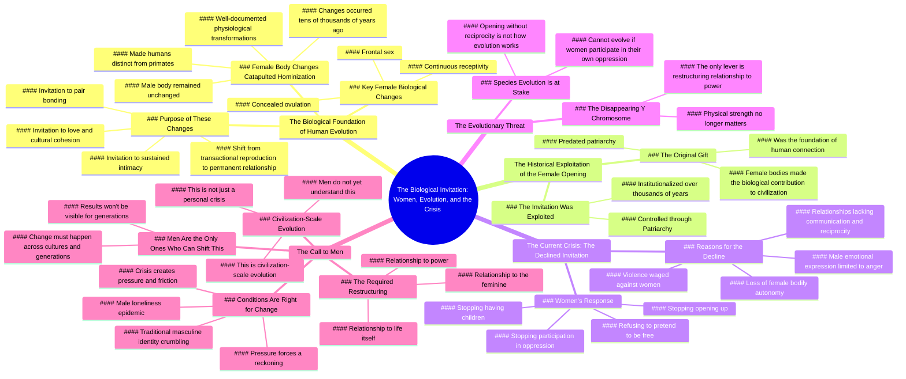

# Why Women Can’t Save Men: A Biological Truth

> 🌐 **Read this in:** [English](../../en/2026-08/tiktok-transcript-women-cannot-save-men-or-the-human-species-will-not-continue-144a.md) · **中文**

> **Creator:** [@kristen1942](https://www.tiktok.com/@kristen1942) · **Views:** 2.2M · **Posted:** 2026-08-06 · **Niche:** other
>
> **TL;DR:** Immediately challenges a common trope, creating curiosity and tension.

[Watch original video →](https://vt.tiktok.com/ZS4QJWLDm/)

## Why This Went Viral

## 钩子（前3秒）
- **逐字开场白：** *“女性无法唤醒男性，我们无法拯救你们，这背后有生物学原因。”*
- **钩子模式：** 大胆断言 + 直接称呼（“你们”）——一种挑衅性的性别论断，立即营造出“我们 vs. 他们”的紧张感。
- **为何能阻止滑动：** 它将一种常见的精神/情感关系套路（“女性唤醒男性”）翻转成一种硬核生物决定论主张。“无法”一词是绝对的，同时挑战了男性的自尊和女性的直觉。它承诺揭示一种隐藏的结构性真相，而非个人观点。

## 情绪节奏
1. **好奇/兴趣** —— 大胆断言在观众心中埋下“为什么？”的疑问。
2. **提升/认同（对女性而言）** —— 转向“仅对女性身体所做的改变使我们成为人类”，赋予女性观众一种历史重要性和自豪感。
3. **紧张/对抗** —— “男性身体没有改变。你们在性行为上仍然和灵长类动物一样运作。”这是一种伪装成人类学的直接侮辱——激起男性的防御心理，同时获得女性的认同。
4. **怀旧/共鸣** —— “那是一份礼物。那是一份邀请。”——将女性生物学重新定义为神圣的，而非羞耻的。
5. **愤怒/怨恨（高潮）** —— “我们无法用爱让男性大规模觉醒……我们无法足够渴望你们。”——情绪巅峰；一种放弃和退出的宣言。
6. **威胁/紧迫感** —— “你染色体中的Y正在消失。”——引入存在性恐惧，将赌注从社会层面提升到物种层面。
7. **行动号召（隐晦的）** —— “现在唯一重要的杠杆是，是否有足够多的你们……选择从根本上重构你们与权力的关系。”——以挑战而非解决方案收尾，留下未解决的紧张感。

**高潮时刻：** *“我们无法用爱让男性大规模觉醒。”* —— 这是会被剪辑、引用和争论的台词。这是情绪的断裂点。

## 关键词密度
- **“女性身体”**（6次）—— 核心生物学锚点；通过性别相关的搜索和辩论推动算法触达。
- **“打开/敞开”**（7次）—— 核心隐喻；情感吸引力（脆弱性）+ 政治吸引力（身体自主权）。
- **“进化/演变”**（5次）—— 伪科学权威；通过“你知道吗”框架提升可分享性。
- **“邀请”**（4次）—— 浪漫化论点；情感共鸣，使其同时感觉像一封情书和一封分手信。
- **“男性”**（5次）—— 直接目标；确保男性观众要么防御性地参与，要么将其分享给其他男性。
- **“压迫”**（3次）—— 政治色彩；在女权/反女权回音室中推动算法触达。
- **“灵长类动物”**（2次）—— 冲击性词汇；侮辱男性观众的同时营造一种“抓到你了”的科学语气。

**算法驱动因素：** “女性身体”、“进化”、“压迫”—— 都是高搜索量且具有强烈辩论潜力的词汇。

**情感吸引力：** “打开”、“邀请”、“无法”—— 这些词承载着关系重量和个人利害关系。

## 为何会传播
1. **披着科学外衣的性别诱饵。** “女性身体使我们成为人类，男性身体没有改变”这一主张是一个完美的愤怒引擎。它给女性一种基于事实的优越叙事，给男性一个需要驳斥的东西——双方出于相反的原因都会分享它。*证据：“是女性身体改变了文化，推动人类成为人类。”*
2. **“Y染色体消失”的钩子。** 这是一个真实的、有文献记载的科学趋势（基因退化），演讲者将其武器化为一种存在性威胁。这是感觉像新闻的点击诱饵。*证据：“你染色体中的Y正在消失。”*
3. **这是一封公开写给男性的分手信。** 情感形式——“我们给了你一份礼物，你利用了它，我们结束了”——在关系层面具有普遍共鸣，即使生物学框架存在争议。*证据：“那份最初的邀请……已被拒绝。”*
4. **未解决的紧张感驱动评论。** 视频以挑战（“现在唯一重要的杠杆是你们是否有足够多的人选择重构”）而非解决方案结束。观众涌入评论区问“但男性到底该做什么？”——这种互动提升了算法权重。*证据：“现在唯一重要的杠杆是，是否有足够多的你们……选择从根本上重构。”*
5. **它将“男性权利”叙事翻转成“女性退出”叙事。** 不是将女性框定为寻求改变的受害者，而是将女性框定为进化的引擎，现在正在*停止*——这一权力动作在女权圈中被当作“麦克风掉落”来分享，在男性圈中被当作行动号召来分享。

## 你可以借鉴什么
1. **以一个挑战常见信念的“无法”主张开头。** 不要说“这是修复X的方法”，而是说“这是X在生物学/结构上不可能的原因”。绝对化的框架迫使人们参与——人们要么想证明你错了，要么把你当作说真话的人分享出去。
2. **使用“礼物 → 剥削 → 退出”的三幕结构。** 将你的主题框定为某种被给予、然后被理所当然地接受、最后被收回的东西。这创造了一个适用于任何主题的叙事弧线——关系、工作、政治——并给观众一种悲剧性的动力感。
3. **以威胁而非解决方案结尾。** 视频中被分享最多的台词（“Y染色体消失”）是一种威胁。让观众面对一个未解决的存在性风险——而不是一个整洁的“该怎么做”——会促使他们评论、争论和分享以征求他人意见。

## Mind Map

## Full Transcript (Generated by [我们用的转录工具](https://toktranscript.com/?utm_source=github&utm_medium=breakdown&utm_campaign=tool_attribution))

> 📝 Transcripts on this page are auto-generated and show the first 60%. Want to transcribe any TikTok in 30 seconds and get the full version? [Try TokTranscript free →](https://toktranscript.com/?utm_source=github&utm_medium=breakdown&utm_campaign=transcript_cta)

There is a biological reason that women cannot awaken men, that we cannot save you. And I don't say that as a criticism or you're on your own. I mean it as a structural, uh, truth about how our species works. Tens of thousands of years ago, changes happen to the female body that are very well documented. And those changes are what catapulted our entire species into hominization. Meaning that changes made solely, or that happened solely to the female body is what made us human. It's what propelled culture forward into something more intimate and more cohesive. And the male body hasn't changed. You guys still operate sexually the same way that primates do. It is the female body that changed culture and pushed humans into being human. That is a documented fact. And what those changes did, primarily frontal sex, concealed ovulation and continuous receptivity. All of that was an invitation to our male partners, an invitation to enter into us with sustained intimacy, an invitation into pair bonding, an invitation into something that looked more like love and cultural cohesion as a permanent state rather than just a seasonal one. A transactional act where we reproduce and move on. So, in a very real sense, the female body opened to the idea of prolonged love and relationship. And what happened over the thousands of years that followed since then is that opening, that opening up of us got exploited, it got institutionalized, it got controlled through Patriarchy. And here we are. But I want. What I want you to understand is this. That original invitation, that original opening, those original changes to the female body that allowed us to cross the chasm from primates to humans. That was a gift. It was an invitation. That was already the thing that women did for this species. That was the biological contribution to human connection and civilization. It was made by female bodies before patriarchy ever had a name. And now that invitation has been declined, seemingly through the loss of our own bodily autonomy, through relationships with no communication, no reciprocity, the only emotion capable of being expressed by our male counterparts being anger. Through the violence that gets waged against us. We cannot just pretend that we are free. We cannot just keep, keep opening. We canno

*[Read the full transcript on TokTranscript →](https://toktranscript.com/plaza/tiktok-transcript-women-cannot-save-men-or-the-human-species-will-not-continue-144a?utm_source=github&utm_medium=breakdown&utm_campaign=transcript_full)*

## Browse More

- All [other](../../by-niche/zh-CN/other.md) breakdowns
- All [Provocative claim](../../by-pattern/zh-CN/hook-provocative-claim.md) examples

## Video Info

| | |
|---|---|
| Creator | [@kristen1942](https://www.tiktok.com/@kristen1942) |
| Original video | [https://vt.tiktok.com/ZS4QJWLDm/](https://vt.tiktok.com/ZS4QJWLDm/) |
| Original title | Women cannot save men or the human species will not continue to evolv... |
| Views | 2.2M (2200000) |
| Posted | 2026-08-06 |
| Duration | 0s |
| Niche | `other` |
| Hook pattern | `Provocative claim` |
| Original language | `en` (this page translated by AI) |
| Available languages | en, zh-CN |
| Generated | 2026-08-07 by [TokTranscript](https://toktranscript.com/) |

---

*This breakdown is for educational analysis under fair use. Original video © [@kristen1942](https://www.tiktok.com/@kristen1942). All transcripts are auto-generated and may contain errors.*

*Want to analyze your own TikToks like this? [我们用的转录工具 →](https://toktranscript.com/viral-breakdown?utm_source=github&utm_medium=breakdown&utm_campaign=footer_cta)*