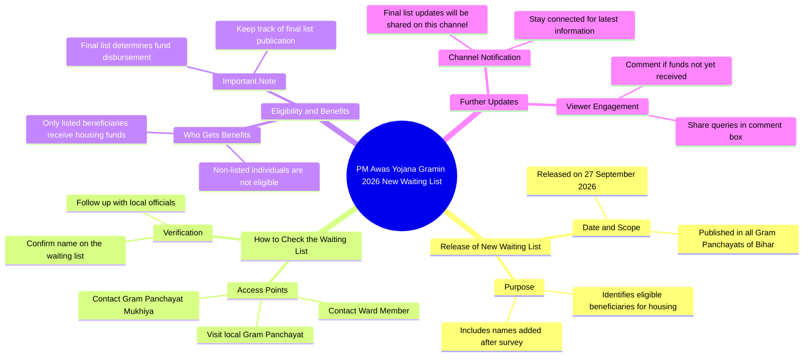

# PM Awas Yojana 2026 New List: Check Your Name

> 🌐 **Read this in:** [English](../../en/2026-09/tiktok-transcript-1-1m-views-18k-reactions-pm-awas-2026-new-list-pm-awas-yojan-a696.md) · **中文**

> **Creator:** [@Bk Online Update](https://www.tiktok.com/@Bk Online Update) · **Views:** 624.5K · **Posted:** 2026-09-28 · **Niche:** other
>
> **TL;DR:** Creates urgency by announcing a major update about a new beneficiary list for a popular government scheme.

[Watch original video →](https://www.facebook.com/share/v/1ErEpsH8hN/)

## Why This Went Viral

## 钩子（前3秒）
- **逐字开场：** “देखे अभी अभी एक बड़ी अपडेट निकल कर आ रही है”（“看，刚刚有一个重大更新出来了”）
- **钩子模式：** 突发新闻式紧迫感 + 大胆断言（“重大更新，刚刚”）叠加一个具名政府计划（Pradhan Mantri Awas Yojana Gramin 2026）。
- **为什么能让人停下滚动：** 它一口气融合了三个停止滚动触发点——时效性（“刚刚”）、规模感（“重大”）和自身利益（观众可能应得的住房补贴）。观众的大脑会立刻问：“我在那份名单上吗？”——这个问题只有视频能回答。

## 情绪节奏
- **0–3秒——警觉/好奇：** “重大更新刚刚发布” + 计划名称 + 日期（2026年9月27日）。
- **3–15秒——紧张升级（害怕被排除）：** “名单已经贴遍比哈尔邦所有村潘查亚特” → 暗示这是一个公开、可核实、时间敏感的事件。焦虑：*我的名字上了吗？*
- **15–25秒——挫败/问题：** “人们找不到信息”——验证观众的痛点，建立信任。
- **25–35秒——缓解/解决方案：** “去问你们的村潘查亚特穆希亚或瓦德成员”——给出具体行动。
- **35–45秒——转折/利害骤升：** “只有名单上的人才能拿到钱；其他人什么都拿不到”——硬性二元对立，损失厌恶达到峰值。
- **45–55秒——留存钩子/行动号召：** “我会先在本频道发布最终名单” + “如果还没收到钱就评论。”
- **高潮：** “उन्हीं लोगों को घर बनाने के लिए पैसा मिलेगा बाकी लोगों को इसका लाब नहीं मिल पाएगा”这句话——全有或全无的利害时刻。

## 关键词密度
- **प्रधान मंत्री आवास योजना ग्रामीण**（计划名称）——算法触达（高搜索量）。
- **नया वेटिंग लिस्ट / वेटिंग लिस्ट**——触达 + 情绪拉力（身份核查）。
- **27 सितंबर 2026**——新鲜度信号，提升时效性排名。
- **बिहार / ग्राम पंचायत**——地理定向，推动本地信息流分发。
- **नाम / लिस्ट में डाल दिया गया**——情绪拉力（归属/排除）。
- **पैसा मिलेगा / लाभ नहीं मिलेगा**——损失厌恶关键词，维持观看时长。
- **मुखिया / वार्ड सदस्य**——实用搜索意图，收藏/分享。
- **कमेंट बॉक्स में बताएं**——互动诱饵，算法提升。
- **触达驱动因素：** 计划名称 + 日期 + 比哈尔/潘查亚特。**情绪驱动因素：** “नाम”、“पैसा मिलेगा”、“लाभ नहीं”。

## 为什么它会传播
- **超本地身份触发：** “बिहार के सभी ग्राम पंचायतों”让每位比哈尔观众都感觉被直接点名——分享会立刻进入家庭WhatsApp群组。
- **二元利害 = 损失厌恶：** “पैसा मिलेगा… बाकी लोगों को लाभ नहीं मिलेगा”迫使观众采取行动（观看、分享、核实），而不是滑过去。
- **信息差 + 权威感：** 视频把自己定位为第一来源（“अभी अभी”、“मैं सूचना पहले दूंगा”）——观众分享是为了在自己的圈子里显得消息灵通。
- **可操作路径：** 点名“मुखिया या वार्ड सदस्य”给出了具体的下一步，把被动观众转化为收藏者/分享者。
- **评论诱饵循环：** “कमेंट बॉक्स में जरूर बताएगा”引发评论洪流，算法会将其解读为高互动并进一步推送。

## 你可以借鉴什么
- **以带时间戳的“刚刚”更新开场**，并绑定你的受众已经在搜索的具名计划/事件——时效性 + 具体性胜过泛泛的钩子。
- **中段围绕二元结果构建**（“你拿到了 / 你没拿到”）——损失厌恶能让观看时长保持高位并推动分享。
- **以两部分行动号召收尾：** 一个承诺（“我会先在这里发布最终名单”）+ 一个与观众个人处境相关的评论提示——这会叠加留存和互动信号。

## Mind Map

## Full Transcript (Generated by [免费 TikTok 文稿生成器](https://toktranscript.com/?utm_source=github&utm_medium=breakdown&utm_campaign=tool_attribution))

> 📝 Transcripts on this page are auto-generated and show the first 60%. Want to transcribe any TikTok in 30 seconds and get the full version? [Try TokTranscript free →](https://toktranscript.com/?utm_source=github&utm_medium=breakdown&utm_campaign=transcript_cta)

देखे अभी अभी एक बड़ी अपडेट निकल कर आ रही है पर्धान मंत्री अवास योजना गरामीन दोहजार चब्विस का नया बेटिंग लिष्ट आज यानि 27 सेप्टेमबर दोहजार चब्विस को बिहार के सभी ग्राम पंचायतों में जाड़ी कर दिया गया है तो इस गयारा सब कुछ हो चुका था लेकिन सर्वे होने के बाद बहुत सारे लोगों का नाम यहां पर बेटिंग लिश्ट में डाल दिया गया है और उन्हीं सभी लोगों का बेटिंग लिश्ट जो है आज यानि 27 सेप्टेंबर 2026 को बिहार के सभी ग्राम पंचैतों में जो है वो अबासे जूरी जनकारी नहीं मिल पाती है तो इसके लिए आपको क्या करना है आपके ग्राम पंचैत के जो भी मुख्या या फिर वाड सदसे हैं उनसे भी इसके बारे में आप पता कर सकते है

*[Read the full transcript on TokTranscript →](https://toktranscript.com/plaza/tiktok-transcript-1-1m-views-18k-reactions-pm-awas-2026-new-list-pm-awas-yojan-a696?utm_source=github&utm_medium=breakdown&utm_campaign=transcript_full)*

## Browse More

- All [other](../../by-niche/zh-CN/other.md) breakdowns
- All [Breaking News Alert](../../by-pattern/zh-CN/hook-breaking-news-alert.md) examples

## Video Info

| | |
|---|---|
| Creator | [@Bk Online Update](https://www.tiktok.com/@Bk Online Update) |
| Original video | [https://www.facebook.com/share/v/1ErEpsH8hN/](https://www.facebook.com/share/v/1ErEpsH8hN/) |
| Original title | 1.1M views · 18K reactions | 🚨 PM Awas 2026 New List जारी! 🏠 PM Awas Yojana New List 2026 कैसे चेक करें? लिस्ट में नाम कैसे चेक करें? 👀 पूरी जानकारी इस वीडियो में बताई गई है।👇 #PMAwasYojana #PMAwasList2026 #PMAY2026 #AwasYojana #BKOnlineUpdate | Bk Online Update |
| Views | 624.5K (624538) |
| Posted | 2026-09-28 |
| Duration | 0s |
| Niche | `other` |
| Hook pattern | `Breaking News Alert` |
| Original language | `en` (this page translated by AI) |
| Available languages | en, zh-CN |
| Generated | 2026-09-29 by [TokTranscript](https://toktranscript.com/) |

---

*This breakdown is for educational analysis under fair use. Original video © [@Bk Online Update](https://www.tiktok.com/@Bk Online Update). All transcripts are auto-generated and may contain errors.*

*Want to analyze your own TikToks like this? [TokTranscript 转录工具 →](https://toktranscript.com/viral-breakdown?utm_source=github&utm_medium=breakdown&utm_campaign=footer_cta)*