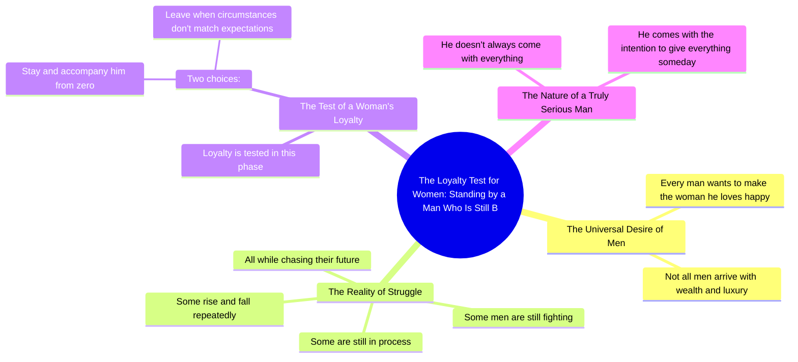

# Loyal Woman Stands by Struggling Man

> 🌐 **Read this in:** [English](../../en/2026-09/tiktok-transcript-1-1m-views-32k-reactions-kadang-mburi-omah-on-reels-98c8.md) · **中文**

> **Creator:** [@Kadang Mburi Omah](https://www.tiktok.com/@Kadang Mburi Omah) · **Views:** 433.7K · **Posted:** 2026-09-30 · **Niche:** entertainment
>
> **TL;DR:** It starts with a relatable universal statement that hooks viewers, then immediately introduces a contrasting reality to create tension.

[Watch original video →](https://www.facebook.com/share/r/19YwqbwfbX/)

## Why This Went Viral

## 钩子（前3秒）
- 开场白逐字引用：“基本上，所有男人都想让自己心爱的女人幸福。”
- 钩子模式：**普遍真理 / 大胆概括**（“基本上，所有男人都想……”）
- 为什么它能让人停下滚动：它在第一句话就对整个性别做出绝对断言。男性观众感到被看见或被挑战；女性观众则用自身经历检验这一说法。“所有”这个词会立即引发自我认同或反对——两者都能让拇指停住。

## 情绪节奏
- 第1拍——**认同**（0–3秒）：“所有男人都想让自己的女人幸福”→ 温暖、包容的开场。
- 第2拍——**现实检验**（3–8秒）：“但并非所有男人都带着财富和奢华而来”→ 轻微泄气，张力引入。
- 第3拍——**挣扎 / 共情**（8–14秒）：“有些人还在奋斗，还在消化，还在跌倒又爬起，追逐未来”→ 建立同情，随着“还在”的重复，节奏加快。
- 第4拍——**考验 / 悬念**（14–20秒）：“这就是女人的忠诚受到考验的地方”→ 转向观众自己的关系；悬念在此达到顶峰。
- 第5拍——**二元选择**（20–24秒）：“从零开始留下陪伴，还是在事情不符合期望时离开”→ 道德分岔，情绪压力。
- 第6拍——**高潮 / 回报**（24–30秒）：“一个真正认真的男人并不总是带着一切而来，但他带着某天给予一切的意图而来”→ 转折将挣扎重新定义为爱的证明。
- **高潮时刻：** 最后一句——从“并不拥有一切”反转为“意图给予一切”。

## 关键词密度
- **男人**——锚定词，推动男性自我认同和评论区争论。
- **女人**——情感承诺的目标；吸引女性观众。
- **所有**——绝对化框架，增强情绪吸引力和分享性。
- **让……幸福**——核心情感关键词。
- **奋斗 / 还在 / 仍然**——“还在”的重复创造节奏，并让挣扎中的人群产生共鸣。
- **忠诚**——张力词；触发内疚、自豪或防御心理。
- **从零开始**——工薪阶层观众的可共鸣钩子。
- **意图**——解决关键词；将信息从抱怨转化为希望。

算法触达：*男人、女人、爱情、忠诚*（广泛、高搜索量的关系词）。情绪吸引力：*还在、奋斗、从零、意图*（个人化、故事驱动）。

## 为什么它会传播
- **性别部落化框架**——“所有男人”和“一个女人的忠诚”将观众分成两个阵营，两个阵营都会评论来辩护或认同。评论就是燃料。
- **“从零开始”的可共鸣性**——“追逐未来”和“从零”直接对大多数并不富有的人说话，让他们感到被代表，并被迫标记伴侣。
- **内置道德考验**——二元的“留下还是离开”迫使观众自我审视自己的关系，将被动观看转化为分享（“这就是我们”）。
- **救赎式转折结局**——“带着给予一切的意图而来”将挣扎重新定义为浪漫，给视频一个可引用的结尾句，人们会截图并转发。
- **零视觉依赖**——信息是纯文本/旁白，因此很容易在转发账号、字幕和语录页面上传播，而不会失去意义。

## 你可以借鉴什么
- **以一个关于某个群体的绝对断言开场**（“每个[某类人]都想……”）来迫使即时自我认同，然后立即用“但并非所有”使其复杂化。
- **使用一个词的节奏性重复**（“还在……还在……还在”）来建立情绪势头，而不增加新信息。
- **以一句反转台词结尾**，将挣扎重新定义为美德——一句观众可以引用、截图并作为自己的话转发的话。

## Mind Map

## Full Transcript (Generated by [TokTranscript](https://toktranscript.com/?utm_source=github&utm_medium=breakdown&utm_campaign=tool_attribution))

> 📝 Transcripts on this page are auto-generated and show the first 60%. Want to transcribe any TikTok in 30 seconds and get the full version? [Try TokTranscript free →](https://toktranscript.com/?utm_source=github&utm_medium=breakdown&utm_campaign=transcript_cta)

Pada dasarnya, semua lelaki ingin membahagiakan wanita yang dicintainya. Tapi tidak semua lelaki langsung datang dengan harta dan kemewahan. Ada yang masih berjuang, masih berproses, masih jatuh bangun, mengejar masa depan. Disitulah kesetiaan seorang wanita diuji. Mau tetap bertahan menemani dari n

*[Read the full transcript on TokTranscript →](https://toktranscript.com/plaza/tiktok-transcript-1-1m-views-32k-reactions-kadang-mburi-omah-on-reels-98c8?utm_source=github&utm_medium=breakdown&utm_campaign=transcript_full)*

## Browse More

- All [entertainment](../../by-niche/zh-CN/entertainment.md) breakdowns
- All [Universal Truth + Contrast](../../by-pattern/zh-CN/hook-universal-truth-contrast.md) examples

## Video Info

| | |
|---|---|
| Creator | [@Kadang Mburi Omah](https://www.tiktok.com/@Kadang Mburi Omah) |
| Original video | [https://www.facebook.com/share/r/19YwqbwfbX/](https://www.facebook.com/share/r/19YwqbwfbX/) |
| Original title | 1.1M views · 32K reactions | Kadang Mburi Omah on Reels |
| Views | 433.7K (433682) |
| Posted | 2026-09-30 |
| Duration | 0s |
| Niche | `entertainment` |
| Hook pattern | `Universal Truth + Contrast` |
| Original language | `en` (this page translated by AI) |
| Available languages | en, zh-CN |
| Generated | 2026-10-01 by [TokTranscript](https://toktranscript.com/) |

---

*This breakdown is for educational analysis under fair use. Original video © [@Kadang Mburi Omah](https://www.tiktok.com/@Kadang Mburi Omah). All transcripts are auto-generated and may contain errors.*

*Want to analyze your own TikToks like this? [免费 TikTok 文稿生成器 →](https://toktranscript.com/viral-breakdown?utm_source=github&utm_medium=breakdown&utm_campaign=footer_cta)*