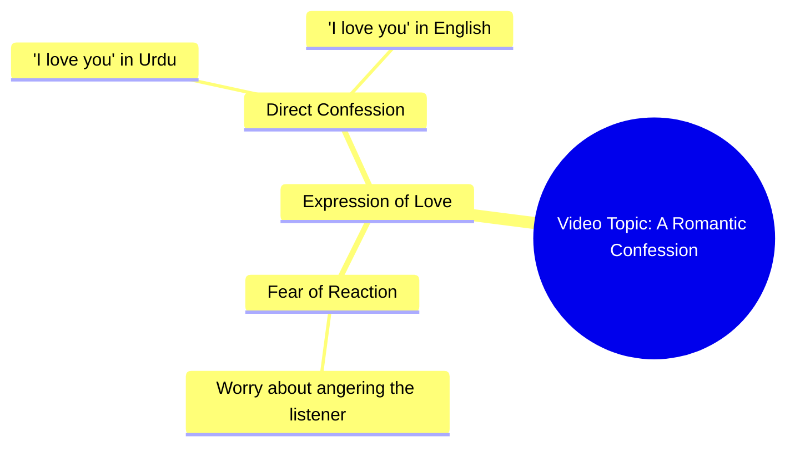

# Woman Says I Love You in Urdu, Asks Not to Get Angry

> 🌐 **Read this in:** [English](../../en/2026-09/tiktok-transcript-1-2m-views-41k-reactions-03045658506-6e79.md) · **中文**

> **Creator:** [@03045658506](https://www.tiktok.com/@03045658506) · **Views:** 436.7K · **Posted:** 2026-09-25 · **Niche:** entertainment
>
> **TL;DR:** The hook immediately engages the viewer by asking a vulnerable question, creating curiosity and emotional investment.

[Watch original video →](https://www.facebook.com/share/r/19cuLzjgdh/)

## Why This Went Viral

## 钩子（前3秒）
- **逐字开场：** “ایک بات کہیں آپ سے غصہ تو نہیں کروگے نا”（“我能跟你说件事吗——你不会生我的气吧？”）
- **钩子模式：** 请求许可 + 隐而未发的告白（一种“告白前”的张力钩子）。这是一个承诺秘密即将揭晓的问题。
- **为什么能让人停下滑动：** 它瞬间触发一个开放循环。观众被置于被提问者的位置，所以这个问题感觉私密而直接。“你不会生气吧？”暗示即将说出某种冒险或脆弱的话——大脑无法让一个未解决的告白悬而未决。

## 情绪节奏
- **第1拍——好奇（0–2秒）：** “我能跟你说件事吗？”打开循环。
- **第2拍——微张力（2–4秒）：** “你不会生气吧？”增加赌注和脆弱感。
- **第3拍——告白/释放（4–6秒）：** “میں تم سے پیار کرتی ہوں”（“我爱你”）——张力骤然化为爱意。
- **第4拍——反转/升级（最后一拍）：** 英语的“I love you”作为轻柔的包袱/强化落下，用第二种语言把告白加倍。
- **高潮时刻：** “میں تم سے پیار کرتی ہوں”落下的那一刻——正是隐而未发的秘密被揭晓的那一秒。
- **共鸣点：** 双语重复（“I love you”）——感觉像一场真实、非脚本的告白，而非表演。

## 关键词密度
- **پیار / love**——情感载荷；驱动收藏和分享。
- **I love you**——英语锚点；将触达范围扩大到非乌尔都语受众。
- **غصہ / mad**——制造张力框架；抓住注意力。
- **آپ / تم / you**——直接称呼代词；让它感觉私密。
- **کہیں / tell**——“告白”动词；设置循环。
- **نا / right?**——寻求安抚的尾缀；柔化语气并邀请回应。
- **算法驱动词：** “I love you”“love”“you”——高频、全球可搜索、引发评论的词汇。
- **情绪驱动词：** “غصہ”（生气）、“پیار”（爱）、“نا”（对吧？）——这些承载着脆弱感和亲密感。

## 为什么它会传播
- **普世告白格式：** “我能跟你说件事吗……你不会生气吧？”是一个任何人都能想象自己收到的模板——它邀请观众把自己投射进这个场景。
- **双语冲击：** 乌尔都语告白之后紧跟英语的“I love you”，让视频能在乌尔都语和英语信息流中同时传播，使可触达受众翻倍。
- **引发评论的结尾：** 直接的“I love you”恳求回复——人们评论“我也爱你”、标记伴侣，或用爱心回应，算法会将其解读为高互动。
- **短且可循环：** 整段内容几秒内播完，所以重播很容易，完播率接近100%。
- **情绪急转：** 从紧张（“你不会生气吧”）到浪漫（“我爱你”）的转变，制造出一个微小却令人满足、值得分享的情绪弧线。

## 你可以借鉴什么
- **用请求许可的问题开场。** “我能跟你说件事吗？”或“别生气，但……”迫使观众留下来看结果。
- **把揭晓最多延迟2–3秒。** 长到足以积累张力，短到足以保持留存。
- **用第二种语言或形式重复你的关键台词。** 把情感载荷加倍（乌尔都语 + 英语）能扩大触达并加深冲击。
- **以要求回复的直接称呼结尾。** “I love you”邀请评论；一个问题邀请得更多。

## Mind Map

## Full Transcript (Generated by [TokTranscript 转录工具](https://toktranscript.com/?utm_source=github&utm_medium=breakdown&utm_campaign=tool_attribution))

> 📝 Transcripts on this page are auto-generated and show the first 60%. Want to transcribe any TikTok in 30 seconds and get the full version? [Try TokTranscript free →](https://toktranscript.com/?utm_source=github&utm_medium=breakdown&utm_campaign=transcript_cta)

ایک بات کہیں آپ سے غصہ تو نہیں کروگے نا میں 

*[Read the full transcript on TokTranscript →](https://toktranscript.com/plaza/tiktok-transcript-1-2m-views-41k-reactions-03045658506-6e79?utm_source=github&utm_medium=breakdown&utm_campaign=transcript_full)*

## Browse More

- All [entertainment](../../by-niche/zh-CN/entertainment.md) breakdowns
- All [Question Hook](../../by-pattern/zh-CN/hook-question-hook.md) examples

## Video Info

| | |
|---|---|
| Creator | [@03045658506](https://www.tiktok.com/@03045658506) |
| Original video | [https://www.facebook.com/share/r/19cuLzjgdh/](https://www.facebook.com/share/r/19cuLzjgdh/) |
| Original title | 1.2M views · 41K reactions | غصا نہیں کرنا | 03045658506 |
| Views | 436.7K (436697) |
| Posted | 2026-09-25 |
| Duration | 0s |
| Niche | `entertainment` |
| Hook pattern | `Question Hook` |
| Original language | `en` (this page translated by AI) |
| Available languages | en, zh-CN |
| Generated | 2026-09-27 by [TokTranscript](https://toktranscript.com/) |

---

*This breakdown is for educational analysis under fair use. Original video © [@03045658506](https://www.tiktok.com/@03045658506). All transcripts are auto-generated and may contain errors.*

*Want to analyze your own TikToks like this? [TokTranscript 转录工具 →](https://toktranscript.com/viral-breakdown?utm_source=github&utm_medium=breakdown&utm_campaign=footer_cta)*