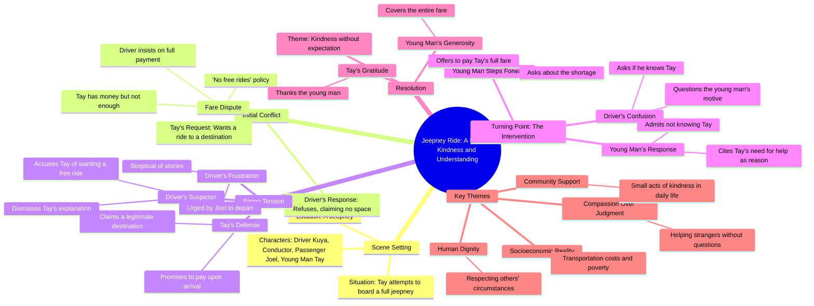

# The Mysterious Old Man — Part 1 | Kwentolohiya

> 🌐 **Read this in:** [English](../../en/2026-09/tiktok-transcript-1-3m-views-25k-reactions-ang-misteryosong-lolo-part-1-kwento-3ed5.md) · **中文**

> **Creator:** [@Kwentolohiya](https://www.tiktok.com/@Kwentolohiya) · **Views:** 746.5K · **Posted:** 2026-09-08 · **Niche:** entertainment
>
> **TL;DR:** The immediate call and polite request creates instant curiosity about the passenger's situation.

[Watch original video →](https://www.facebook.com/share/r/14nqgLXmow1/)

## Why This Went Viral

## 钩子（前3秒）
- **逐字开场白：**“泰！等一下！你要去哪里？本来想搭个便车，孩子。”
- **钩子模式：**场景+急促对话（打断模式）。
- **为何能阻止滑动：**它让你直接落入一段对话中间，两个声音交叠——一个拒绝乘客的司机和一个呼喊的年轻人。紧张感即刻呈现：有人被拒绝，有人介入。观众不知道谁对谁错、发生了什么，于是留下来解开这个悬念。

## 情绪节奏
- **节拍1——困惑/紧张（0–3秒）：**无意中听到的争执；不清楚谁有过错。
- **节拍2——挫败感（3–8秒）：**司机强硬地说“这里没有免费的！”使他成为对立面；观众倾向于反对他。
- **节拍3——同情（8–12秒）：**乘客恳求“到了我会付钱”暴露出脆弱；观众希望有人介入。
- **节拍4——升级（12–15秒）：**司机用“每个人都有自己的故事”打发他——愤世嫉俗引发道德愤怒。
- **节拍5——反转/高潮（15–20秒）：**第三个声音（乔尔）问：“你认识他吗？”陌生人说：“不认识，但他需要帮助”——出乎意料的利他主义深深击中人心。
- **节拍6——释然/感激（20–25秒）：**主动付钱+“谢谢”化解了紧张；留下温暖的余韵。

## 关键词密度
- **“不够”**——重复3次；推动核心冲突和情感牵引。
- **“帮助”**——出现在高潮处；触发共情和道德共鸣。
- **“会付”**——重复2次；框定利害关系（金钱vs信任）。
- **“认识”**——重复2次；为反转埋下伏笔（陌生人的善意）。
- **“车费”**——重复2次；锚定具体、可共鸣的问题。
- **“免费”**——重复2次；通过常见的交通不满情绪扩大算法触达。

## 为何能传播
- **来自陌生人的意外善意。**“不认识，但他需要帮助”这句话是可分享的核心——它证明了利他主义不需要私人关系。观众会@那些也会这样做的好友。
- **可共鸣的日常不公。**“里面没有位置了”和车费纠纷在公共交通中普遍存在；该视频触及共同的挫败感，让人容易在评论区分享个人经历。
- **带有反转的道德清晰度。**司机明显有错，但解决方式不是愤怒——而是慷慨。这种对预期冲突（争吵→善意）的反转让人感觉新颖且值得反复观看。
- **对话驱动的悬念。**简短交叠的台词（“为什么？你认识他吗？”）迫使观众凑近观看，增加观看时长——这是算法的关键信号。
- **干净的情感回报。**最后的“谢谢”在30秒内闭环，使其无需背景或后续说明即可安全分享。

## 你可以借鉴什么
- **从冲突中间开始，而不是从头开始。**让观众直接落入一场激烈的对话，不做任何铺垫。他们想要解开悬念的本能让他们持续观看。
- **让第三方目击者成为英雄。**不要让受害者自救——让旁观者介入。这扩大了情感共鸣，让善意显得更可信。
- **以一句感恩的话收尾。**高潮之后，不要过度解释。简单的“谢谢”让情感冲击自然落地，邀请观众自己去感受这个结局。

## Mind Map

## Full Transcript (Generated by [TikTok 转录工具](https://toktranscript.com/?utm_source=github&utm_medium=breakdown&utm_campaign=tool_attribution))

> 📝 Transcripts on this page are auto-generated and show the first 60%. Want to transcribe any TikTok in 30 seconds and get the full version? [Try TokTranscript free →](https://toktranscript.com/?utm_source=github&utm_medium=breakdown&utm_campaign=transcript_cta)

Tay! Sandali! Saan ka pupunta? Pasakay sana, Iho. Wala nang puwang sa loob. May pamasahe ka ba? May pera ako, pero kulang pa ng kaunti. Hindi pwede yan! Walang libre rito! Baka naman gusto lang makalibre. May pupuntahan lang talaga ako. Babayaran ko pagdating. Lahat na lang may kwento. Joel! Aalis na tayo! Baba na tay

*[Read the full transcript on TokTranscript →](https://toktranscript.com/plaza/tiktok-transcript-1-3m-views-25k-reactions-ang-misteryosong-lolo-part-1-kwento-3ed5?utm_source=github&utm_medium=breakdown&utm_campaign=transcript_full)*

## Browse More

- All [entertainment](../../by-niche/zh-CN/entertainment.md) breakdowns
- All [Interruption + Request](../../by-pattern/zh-CN/hook-interruption-request.md) examples

## Video Info

| | |
|---|---|
| Creator | [@Kwentolohiya](https://www.tiktok.com/@Kwentolohiya) |
| Original video | [https://www.facebook.com/share/r/14nqgLXmow1/](https://www.facebook.com/share/r/14nqgLXmow1/) |
| Original title | 1.3M views · 25K reactions | Ang Misteryosong Lolo — PART 1 | Kwentolohiya |
| Views | 746.5K (746534) |
| Posted | 2026-09-08 |
| Duration | 0s |
| Niche | `entertainment` |
| Hook pattern | `Interruption + Request` |
| Original language | `en` (this page translated by AI) |
| Available languages | en, zh-CN |
| Generated | 2026-09-09 by [TokTranscript](https://toktranscript.com/) |

---

*This breakdown is for educational analysis under fair use. Original video © [@Kwentolohiya](https://www.tiktok.com/@Kwentolohiya). All transcripts are auto-generated and may contain errors.*

*Want to analyze your own TikToks like this? [TokTranscript →](https://toktranscript.com/viral-breakdown?utm_source=github&utm_medium=breakdown&utm_campaign=footer_cta)*