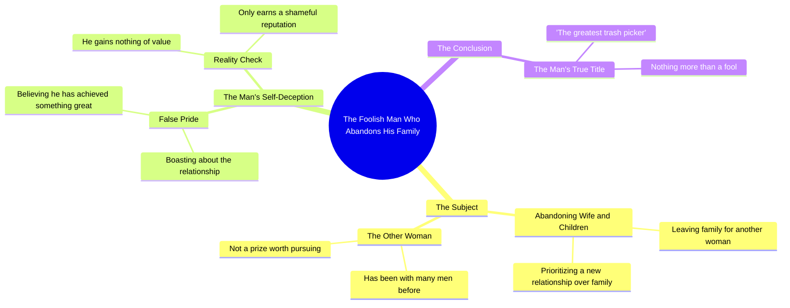

# Man Who Left Wife and Kids for Another Woman

> 🌐 **Read this in:** [English](../../en/2026-09/tiktok-transcript-1-4m-views-32k-reactions-ng-i-n-ng-ng-u-nh-t-m-c-mi-n-0dc0.md) · **中文**

> **Creator:** [@Mộc Miên](https://www.tiktok.com/@Mộc Miên) · **Views:** 658.5K · **Posted:** 2026-09-23 · **Niche:** entertainment
>
> **TL;DR:** Mở đầu bằng lời lăng mạ mạnh mẽ nhắm vào một nhóm người cụ thể, kích thích sự tò mò và tranh cãi.

[Watch original video →](https://www.facebook.com/share/r/14rzeAdxy52/)

## Why This Went Viral

## 钩子（前3秒）
- 逐字开场：“Kiểu đàn ông ngu nhất。”（“最蠢的那种男人。”）
- 钩子模式：**大胆断言 + 侮辱/攻击**（毫无铺垫地抛出一个最高级评判）
- 为什么能让人停下滚动：它点名了一个目标（“最蠢的男人”），却故意留了一拍不定义——大脑需要知道*是谁*以及*为什么*。侮辱指向的是第三方，所以观众暂时还不是受害者，这降低了防御心理，让他们继续看下去，想知道自己是否符合。

## 情绪节奏
- **第1拍 – 挑衅（0–2秒）：**“Kiểu đàn ông ngu nhất”——瞬间评判，没有上下文。好奇 + 轻度愤怒。
- **第2拍 – 具体指控（2–6秒）：**“bỏ vợ bỏ con… đi theo một người đàn bà đã qua tay thằng này thằng kia”——具体的背叛画面。紧张感上升；观众在脑中形成一个反派形象。
- **第3拍 – 嘲笑反派的骄傲（6–10秒）：**“các ông còn tự hào khoe là rất là ngon”——讽刺。目标现在既傲慢*又*愚蠢，把紧张感转化为蔑视/发笑。
- **第4拍 – 高潮（10–13秒）：**“thằng bới rác vĩ đại nhất”（“最伟大的捡垃圾者”）——点睛比喻。这是回报句；它是最可引用、最可分享的时刻。
- **第5拍 – 召唤部落（13–15秒）：**“Chuẩn không các anh?”（“对吧，兄弟们？”）——释放 + 认同。紧张感释放为赞同，并邀请评论。
- **高潮时刻：**“bới rác vĩ đại nhất”这个比喻——它把整段怒斥重新框定成一个画面。

## 关键词密度
- “đàn ông”（男人）——观众身份锚点
- “bỏ vợ bỏ con”（抛妻弃子）——情绪核心
- “người đàn bà”（女人）——对立极
- “qua tay thằng này thằng kia”（经过一个又一个男人之手）——羞辱性短语
- “tự hào”（骄傲）——讽刺触发器
- “ngon”（厉害/有种/酷）——对自尊的嘲弄
- “không được cái gì cả”（你什么都没有）——否定重击
- “bới rác”（捡垃圾）——标志性比喻
- “Chuẩn không các anh?”（对吧，兄弟们？）——互动CTA
- **算法触达：**“đàn ông”“vợ”“con”“đàn bà”——高流量的关系/性别词汇，能把视频推到巨大的内容池中。
- **情绪拉力：**“bỏ vợ bỏ con”“bới rác”“tự hào”——这些承载着道德愤怒和羞辱画面，让人们不只是观看，而是产生反应。

## 为什么会传播
- **对男性的部落式认同：**“Chuẩn không các anh?”直接把男性观众招募进一个共享的内群体，把被动观看变成评论（“chuẩn”/“không chuẩn”）——这是成本最低的互动行为。
- **一个所有人都能认同的反派：**“bỏ vợ bỏ con”是普遍被谴责的行为，所以视频不需要任何细微差别——认同是即时且安全的表达。
- **一个可复用的侮辱比喻：**“thằng bới rác vĩ đại nhất”是一个紧凑、生动、可截图的短语——那种人们会在评论、字幕和合拍中引用的句子。
- **给另一方的愤怒诱饵：**“người đàn bà đã qua tay thằng này thằng kia”是刻意煽动的；它会把争论的批评者拉进来，让两个阵营的评论数都翻倍。
- **零上下文冷开场：**“Kiểu đàn ông ngu nhất”不给任何铺垫，所以好奇的人和被冒犯的人都必须继续看才能确认目标——在15秒短片中最大化观看时长。

## 你可以偷学什么
- **用最高级判词开场，而不是话题。**不要说“我们来聊聊糟糕的关系”，而要说“这是最蠢的那种[人]。”把定义压住2–3秒，强制留存。
- **构建到一个可截图的比喻。**整个视频的可分享性都来自一个单一画面（“bới rác vĩ đại nhất”）。从人们会引用的那句话倒着写你的脚本。
- **用两个词的部落确认收尾。**“Chuẩn không các anh?”以近乎零成本把观众变成评论者。结尾用一个二元的、低摩擦的问题，效果胜过开放式“你们怎么看？”的提示。

## Mind Map

## Full Transcript (Generated by [我们用的转录工具](https://toktranscript.com/?utm_source=github&utm_medium=breakdown&utm_campaign=tool_attribution))

> 📝 Transcripts on this page are auto-generated and show the first 60%. Want to transcribe any TikTok in 30 seconds and get the full version? [Try TokTranscript free →](https://toktranscript.com/?utm_source=github&utm_medium=breakdown&utm_campaign=transcript_cta)

Kiểu đàn ông ngu nhất. Cái kiểu đàn ông bỏ vợ bỏ con của mình để đi theo một người đàn bà đã qua tay thằng này thằng kia. Các ông còn tự hào khoe là rất là ngon. Xin lỗi các ông

*[Read the full transcript on TokTranscript →](https://toktranscript.com/plaza/tiktok-transcript-1-4m-views-32k-reactions-ng-i-n-ng-ng-u-nh-t-m-c-mi-n-0dc0?utm_source=github&utm_medium=breakdown&utm_campaign=transcript_full)*

## Browse More

- All [entertainment](../../by-niche/zh-CN/entertainment.md) breakdowns
- All [Insult Hook](../../by-pattern/zh-CN/hook-insult-hook.md) examples

## Video Info

| | |
|---|---|
| Creator | [@Mộc Miên](https://www.tiktok.com/@Mộc Miên) |
| Original video | [https://www.facebook.com/share/r/14rzeAdxy52/](https://www.facebook.com/share/r/14rzeAdxy52/) |
| Original title | 1.4M views · 32K reactions | Người đàn ông "ngờ u" nhất ! | Mộc Miên |
| Views | 658.5K (658519) |
| Posted | 2026-09-23 |
| Duration | 0s |
| Niche | `entertainment` |
| Hook pattern | `Insult Hook` |
| Original language | `en` (this page translated by AI) |
| Available languages | en, zh-CN |
| Generated | 2026-09-26 by [TokTranscript](https://toktranscript.com/) |

---

*This breakdown is for educational analysis under fair use. Original video © [@Mộc Miên](https://www.tiktok.com/@Mộc Miên). All transcripts are auto-generated and may contain errors.*

*Want to analyze your own TikToks like this? [TikTok 转录工具 →](https://toktranscript.com/viral-breakdown?utm_source=github&utm_medium=breakdown&utm_campaign=footer_cta)*