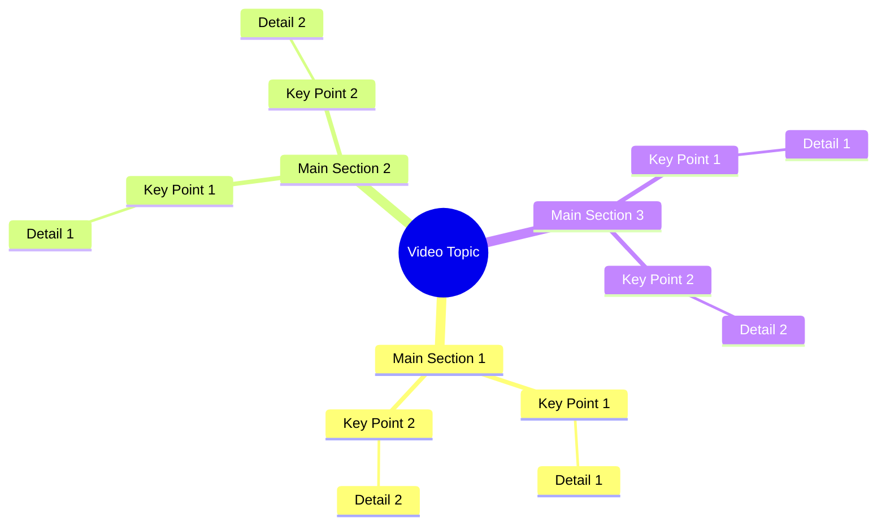

# Woman Recites Shahada on Target Mark in Video

> 🌐 **Read this in:** [English](../../en/2026-09/tiktok-transcript-1-4m-views-84k-reactions-6672.md) · **中文**

> **Creator:** [@شبنم ](https://www.tiktok.com/@شبنم ) · **Views:** 494.1K · **Posted:** 2026-09-25 · **Niche:** other
>
> **TL;DR:** The hook immediately contrasts the speaker with 'other girls' and asserts truthfulness, creating curiosity and emotional intrigue.

[Watch original video →](https://www.facebook.com/share/r/1GnAneW2pn/)

## Why This Went Viral

## 钩子（前3秒）
- **逐字开场白：**“اشہد ان لا الہ الا اللہ میں دوسری لڑکیوں کی طرح جھوٹ نہیں بول رہی”（“我作证万物非主，唯有真主——我没有像其他女孩那样撒谎。”）
- **钩子模式：**誓言 + 对比 + 指控。一段宗教证词（清真言）与一句大胆的社会性宣言（“我和其他女孩不一样”）融合在一起。
- **为什么能让人停下滑动：**清真言是神圣且瞬间可识别的，因此会立即引发注意和尊重；“像其他女孩那样”这句话则触发群体认同和防御心理。神圣与八卦的并置令人错愕——观众会停下来看这究竟是真诚的证词，还是忏悔式的爆料。

## 情绪节奏
- **好奇（0–2秒）：**她为什么在发誓？她即将揭露什么？
- **紧张（2–6秒）：**“تیر کے نشان پہ جائیں”——“去箭标记那里”——一个 cryptic 的指令，暗示着隐藏的地点或证据。
- **期待（6–9秒）：**“وہاں آپ کو میری تصویر مل جائے گی”——“你会在那里找到我的照片。”这制造了一个谜题：一张被放在特定位置、等待被发现的照片。
- **高潮：**“你会在那里找到我的照片”这句——揭示出这个视频是一场寻宝游戏或挑战，而不仅仅是一段陈述。
- **共鸣/反转：**誓言将整条信息框定为真话，因此“找到我的照片”变成了对观众信任和好奇心的挑战。

## 关键词密度
- **اشہد ان لا الہ الا اللہ**（清真言）——通过宗教关键词识别和情感分量推动算法传播。
- **جھوٹ نہیں بول رہی**（没有撒谎）——情感牵引；暗示忏悔或诚实。
- **دوسری لڑکیوں**（其他女孩）——算法和情感双重作用；触发比较和社会身份认同。
- **تیر کے نشان**（箭标记）——推动好奇心和搜索意图；独特短语。
- **میری تصویر**（我的照片）——情感牵引；个人化且视觉化。
- **وہاں**（那里）——制造神秘感和基于地点的悬念。

宗教词汇在穆斯林占多数的受众中推动传播；人称代词和“没有撒谎”推动情感参与和评论。

## 为什么它会传播
- **以神圣誓言作为钩子**——清真言不会被随意使用，因此观众会停下来看它是否真诚。仅这一句就能带来分享和争论。
- **社会比较触发**——“دوسری لڑکیوں کی طرح”（“像其他女孩那样”）邀请女性要么产生共鸣，要么表示反对，从而引发评论区争论。
- **寻宝机制**——“تیر کے نشان پہ جائیں”（“去箭标记那里”）把视频变成了一场现实世界的游戏，鼓励观众实地寻找并发布他们的发现。
- **个人揭露**——“وہاں آپ کو میری تصویر مل جائے گی”（“你会在那里找到我的照片”）承诺了一个回报，因此人们会反复观看并分享以解开谜题。
- **简短、可复制的格式**——整段文字一气呵成，便于合拍、拼接或做成梗。

## 你可以借鉴什么
- **以高风险的誓言或承诺开场**——使用具有文化或个人意义的短语来表明严肃性并让人停下滑动。
- **创建现实或数字寻宝游戏**——给观众一个具体地点或线索（“去箭标记那里”），让他们在屏幕之外参与。
- **用对比触发身份认同**——将一种普世价值（诚实、信仰）与一个分裂性比较（“像其他女孩那样”）配对，以引发评论和分享。

## Mind Map

## Full Transcript (Generated by [TokTranscript](https://toktranscript.com/?utm_source=github&utm_medium=breakdown&utm_campaign=tool_attribution))

> 📝 Transcripts on this page are auto-generated and show the first 60%. Want to transcribe any TikTok in 30 seconds and get the full version? [Try TokTranscript free →](https://toktranscript.com/?utm_source=github&utm_medium=breakdown&utm_campaign=transcript_cta)

اشہد ان لا الہ الا اللہ میں دوسری لڑکیوں کی طرح جھوٹ نہیں بول رہی تیر ک

*[Read the full transcript on TokTranscript →](https://toktranscript.com/plaza/tiktok-transcript-1-4m-views-84k-reactions-6672?utm_source=github&utm_medium=breakdown&utm_campaign=transcript_full)*

## Browse More

- All [other](../../by-niche/zh-CN/other.md) breakdowns
- All [Contrast & Confession](../../by-pattern/zh-CN/hook-contrast-confession.md) examples

## Video Info

| | |
|---|---|
| Creator | [@شبنم ](https://www.tiktok.com/@شبنم ) |
| Original video | [https://www.facebook.com/share/r/1GnAneW2pn/](https://www.facebook.com/share/r/1GnAneW2pn/) |
| Original title | 1.4M views · 84K reactions | اشھد اللہ لاہ اللاہ میں | شبنم |
| Views | 494.1K (494110) |
| Posted | 2026-09-25 |
| Duration | 0s |
| Niche | `other` |
| Hook pattern | `Contrast & Confession` |
| Original language | `en` (this page translated by AI) |
| Available languages | en, zh-CN |
| Generated | 2026-09-27 by [TokTranscript](https://toktranscript.com/) |

---

*This breakdown is for educational analysis under fair use. Original video © [@شبنم ](https://www.tiktok.com/@شبنم ). All transcripts are auto-generated and may contain errors.*

*Want to analyze your own TikToks like this? [拆解你自己的 TikTok →](https://toktranscript.com/viral-breakdown?utm_source=github&utm_medium=breakdown&utm_campaign=footer_cta)*