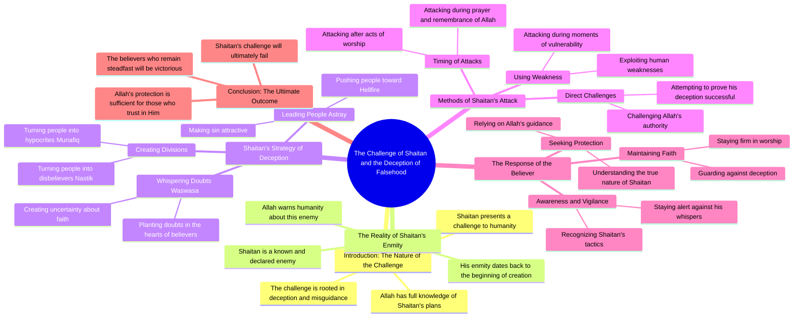

# Perfect Tilapia Fish Cutting Technique by Suman

> 🌐 **Read this in:** [English](../../en/2026-09/tiktok-transcript-1-7m-views-45k-reactions-suman-fish-cutting-7807.md) · **中文**

> **Creator:** [@Suman Fish Cutting](https://www.tiktok.com/@Suman Fish Cutting) · **Views:** 828.5K · **Posted:** 2026-09-05 · **Niche:** other
>
> **TL;DR:** Opens with a provocative challenge from Satan to God, immediately creating tension and curiosity.

[Watch original video →](https://www.facebook.com/share/r/1D5A1H2Qzz/)

## Why This Went Viral

## Hook（前3秒）
- **逐字开场：** “શઈતાન આલાકે ચાલેંજ દેએ છેલો આલાલા આપ્ણે તો જાનાતે ધોકાદે પારબેના એતો ગુલું જાણાત કેનો બાનાલેન જાણનામારો બેશી હલે ભાલો હતો આલ્લેન કેનો？”（翻译：“撒旦向安拉发起挑战，但安拉知道……谁创造了他？”）
- **钩子模式：** 大胆断言 + 反问句。这是一种神学挑衅，被框定为宇宙力量之间的直接对抗。
- **为何能阻止滑动：** 前提本身就带有禁忌性和冲击性——暗示一个撒旦*挑战*安拉的叙事。这立即制造了认知失调和好奇心。观众必须看下去，才能判断这是亵渎、讽刺，还是深层的神学教导。

## 情绪节奏
1. **震惊/难以置信**（0–3秒）：不可能的前提——撒旦挑战安拉——触发“我必须看看”的反射。
2. **紧张/好奇**（3–10秒）：讲述者开始列举类别——“munafiq”（伪信者）、“nastik”（无神论者）、“jahannam”（火狱）——构建一个感觉像布道或辩论的神学框架。
3. **升级**（10–20秒）：“થેકે”（直到）的重复创造出一种有节奏的、近乎催眠的韵律，列举惩罚和考验。随着观众等待结局，张力不断上升。
4. **困惑/共鸣**（20秒以上）：短语“આમરબંદા કુનો તફ્સ્ર્ર્લ કોરણેર માહફીલએશે”（我们仆人的详细聚会）转向社群/宗教语境，将冲击感扎根于熟悉的虔诚语言中。
5. **高潮：** 最后的词语——“નામાજે મસ્ચી”（清真寺礼拜中）——带来突然的解决。整个挑衅性的铺垫崩塌为一个平凡而虔诚的场景。转折在于，“挑战”只是修辞性的——是为宗教讲座服务的框架装置。

## 关键词密度
1. **આલાલા / આલ્લેન（安拉）** — 出现4次以上。既推动算法触达（宗教内容搜索量极高），又承载情感重量（神圣锚点）。
2. **શઈતાન（撒旦）** — 早期反复出现。反派关键词制造了标题党张力和道德极性。
3. **ચેલેંજ（挑战）** — 核心动词。高度紧张、充满竞争性的词语，暗示冲突——这是经过验证的病毒式传播触发器。
4. **થેકે（直到）** — 重复5次以上。创造节奏韵律和必然感，让观众保持锁定。
5. **જાણાત（已知/知识）** — 反复出现。与宗教权威和“秘传知识”的吸引力相关联。
6. **બાનીએ（言语/话语）** — 反复出现。暗示神学论述，增加感知深度。
7. **નામાજ（礼拜）** — 最后的词语。为穆斯林受众提升可搜索性，并提供“安全”的结局，使分享不会招致反弹。

## 为何能传播
- **禁忌挑衅 + 安全着陆：** 开场白（“撒旦挑战安拉”）是愤怒诱饵，推动评论和分享。但结尾（“清真寺礼拜中”）揭示这是虔诚的信息——因此观众可以分享它*而不会*被指责传播亵渎。这种“诱饵转换”是完美的病毒式传播公式。
- **宗教身份机制：** 文本使用古吉拉特语（一个主要侨民语言），并引用特定的伊斯兰概念（munafiq、nastik、jahannam、namaz）。这创造了内群体信号——观众分享它来确认自己的信仰身份并教育他人，赋予视频一种传教使命。
- **节奏性、吟唱式的表达：** “થેકે…… થેકે…… થેકે”的重复模仿布道或纳希德（伊斯兰吟唱）的韵律。这让视频感觉像一场表演，而非仅仅是信息——观众更可能看完，提升留存指标。
- **反问句钩子：** 开场问题（“谁创造了他？”）在前3秒内无法回答——迫使观众留下来听解释。它完美地利用了好奇心缺口。
- **逆向框架：** 通过将撒旦置于主动角色（“挑战”、“低语”），视频将信仰框定为一场*战斗*——一种戏剧性的叙事，比被动的虔诚讲座更容易被分享。

## 你可以借鉴什么
- **“禁忌框架”技巧：** 以你的主题最 shocking、最逆向的版本开场（撒旦挑战上帝），然后将其化解为主流、可接受的结论（礼拜）。这在不造成永久争议的情况下产生初始点击。
- **“连祷”节奏：** 使用一个重复的词语或短语（“直到……直到……直到……”）来建立催眠般的韵律。这能让观众看到最后，提升完播率——这是第一算法信号。
- **“内群体”召唤：** 包含特定的社群语言和概念（甚至不翻译），让你的核心受众感觉自己是内部人。这推动那些想表明归属感并教育外部人士的人进行分享——给你的视频带来双重受众（内群体 + 好奇的外部人士）。

## Mind Map

## Full Transcript (Generated by [TokTranscript 转录工具](https://toktranscript.com/?utm_source=github&utm_medium=breakdown&utm_campaign=tool_attribution))

> 📝 Transcripts on this page are auto-generated and show the first 60%. Want to transcribe any TikTok in 30 seconds and get the full version? [Try TokTranscript free →](https://toktranscript.com/?utm_source=github&utm_medium=breakdown&utm_campaign=transcript_cta)

શઈતાન આલાકે ચાલેંજ દેએ છેલો આલાલા આપ્ણે તો જાનાતે ધોકાદે પારબેના એતો ગુલું જાણાત કેનો બાનાલેન જાણનામારો બેશી હલે ભાલો હતો આલ્લેન કેનો? શહઈતાણ બોલે આલાલે આમી વસવસા દીએ મુનાફિક બાનીએ નસતિક બાનીએ જહાના મે ધુકાબો આમી ચેલેંજ દિલામ

*[Read the full transcript on TokTranscript →](https://toktranscript.com/plaza/tiktok-transcript-1-7m-views-45k-reactions-suman-fish-cutting-7807?utm_source=github&utm_medium=breakdown&utm_campaign=transcript_full)*

## Browse More

- All [other](../../by-niche/zh-CN/other.md) breakdowns
- All [Rhetorical question + challenge](../../by-pattern/zh-CN/hook-rhetorical-question-challenge.md) examples

## Video Info

| | |
|---|---|
| Creator | [@Suman Fish Cutting](https://www.tiktok.com/@Suman Fish Cutting) |
| Original video | [https://www.facebook.com/share/r/1D5A1H2Qzz/](https://www.facebook.com/share/r/1D5A1H2Qzz/) |
| Original title | 1.7M views · 45K reactions | এই তেলাপিয়া মাছটা কিভাবে নিখুঁতভাবে কাটা হচ্ছে 😱 | Suman Fish Cutting |
| Views | 828.5K (828471) |
| Posted | 2026-09-05 |
| Duration | 0s |
| Niche | `other` |
| Hook pattern | `Rhetorical question + challenge` |
| Original language | `en` (this page translated by AI) |
| Available languages | en, zh-CN |
| Generated | 2026-09-06 by [TokTranscript](https://toktranscript.com/) |

---

*This breakdown is for educational analysis under fair use. Original video © [@Suman Fish Cutting](https://www.tiktok.com/@Suman Fish Cutting). All transcripts are auto-generated and may contain errors.*

*Want to analyze your own TikToks like this? [TokTranscript 转录工具 →](https://toktranscript.com/viral-breakdown?utm_source=github&utm_medium=breakdown&utm_campaign=footer_cta)*