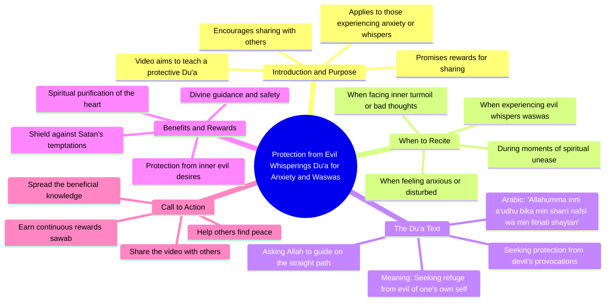

# Amazing Rohu Fish Cutting Skills Video

> 🌐 **Read this in:** [English](../../en/2026-09/tiktok-transcript-1-8m-views-36k-reactions-foryoupage-reelschallenge-fishingli-6e60.md) · **中文**

> **Creator:** [@Suman Fish Cutting](https://www.tiktok.com/@Suman Fish Cutting) · **Views:** 867.6K · **Posted:** 2026-09-05 · **Niche:** other
>
> **TL;DR:** Opens with a clear promise of protection and rewards for sharing, creating immediate value and urgency.

[Watch original video →](https://www.facebook.com/share/r/1GHtp41LPE/)

## Why This Went Viral

## 钩子（前3秒）
- **逐字开场：** “জেনা থেকے বাচার দোয়া”（免受此害的祈祷）——立即发出保护性祈祷的信号。
- **钩子模式：** **大胆声明 + 实用承诺** ——它承诺一个具体、高风险的益处（免受邪恶/罪孽的保护）。
- **为何能阻止滑动：** 它触及了既有的恐惧和精神需求。观看者瞬间想到“我需要这个”，因为它针对无形的威胁（不良欲望、恶魔的低语）提供了解决方案，而非物质需求。

## 情绪节奏
1. **紧迫感（0–3秒）：** “免受此害”——制造未知危险的缺口。
2. **期待感（3–8秒）：** 回报的承诺（“শেষমুস্ত স্বাব”——终极回赐）构建了交易式的希望。
3. **张力（8–12秒）：** 条件从句——“当你产生不良欲望时……你就念这段祈祷”——让观看者自我诊断自身的软弱时刻。
4. **释放（12–15秒）：** 实际诵读阿拉伯语祈祷词——一种神圣、平静的听觉转换。
5. **共鸣（最后几句）：** 译文切中个人：“从我自身的不良欲望和恶魔的教唆中”——一种普世的内心挣扎。
- **高潮时刻：** 阿拉伯语祈祷词本身的诵读。从孟加拉语讲解转向阿拉伯语古兰经文，营造出一种真实而有力的精神巅峰。

## 关键词密度
- **“দোয়া”（祈祷/祷告）** ——3次——*算法覆盖：* 高搜索量的宗教术语，具有永久需求。
- **“বাঁচার”（得救/免受）** ——2次——*情感吸引力：* 基于恐惧的触发点，推动分享。
- **“শয়তান”（恶魔）** ——2次——*情感吸引力：* 点名敌人，使解决方案具体化。
- **“নফস”（私欲/欲望）** ——1次（通过“খারাপ ইচ্ছা”隐含）——*情感吸引力：* 人人都能共鸣的内心挣扎。
- **“সওয়াব”（回赐/报酬）** ——1次——*算法+情感：* 激励收藏备用。
- **“আল্লাহ”（安拉）** ——1次——*算法：* 核心宗教关键词，确保视频出现在信仰类信息流中。

## 为何能传播
- **恐惧+解决方案循环：** 开头的“免受此害”制造了未指名的威胁，视频在15秒内解决了它。观看者将其作为保护性举动分享给亲人（“我在给你发送保护”）。
- **脚本中嵌入直接行动指令：** “分享这个视频，让你的亲人也能念诵”——文字稿明确指示分享，将被动观看者转化为传播者。
- **神圣音频切换：** 从口语孟加拉语转向阿拉伯语诵读，改变了音频质感。这触发反射性的“收藏”或“分享”，因为它感觉像宗教圣物，而非普通内容。
- **普世的内心冲突：** 这段祈祷针对“不良欲望”和“恶魔的教唆”——这些挣扎超越了穆斯林受众中的年龄、阶层或国籍。它不是小众的，而是普世的。
- **简短+可操作：** 视频教授一段两行的祈祷词，可即时记忆。低学习成本=高分享意愿。

## 你可以借鉴什么
- **以结果开场，而非解释：** 以“要让自己免受X之害，请看这个”开头——不要自我介绍；直接引入你要解决的恐惧或欲望。
- **在脚本中嵌入字面的分享指令：** 在前10秒内说“把这个发给需要的人”或“与你的家人分享”，而不仅仅写在标题里。
- **以感官转换作为高潮：** 如果你的视频在解释某件事，在巅峰时刻切换到不同的表达方式（例如，从说话转为朗读引文，从音乐转为静默），让它感觉像一份礼物，而非一场说教。

## Mind Map

## Full Transcript (Generated by [TokTranscript 转录工具](https://toktranscript.com/?utm_source=github&utm_medium=breakdown&utm_campaign=tool_attribution))

> 📝 Transcripts on this page are auto-generated and show the first 60%. Want to transcribe any TikTok in 30 seconds and get the full version? [Try TokTranscript free →](https://toktranscript.com/?utm_source=github&utm_medium=breakdown&utm_campaign=transcript_cta)

जेना थेके बाचार दोआ ए वीडियो टी आपनी जोतो पारें शेयर कुरे दिन आपना रुसीला एके उजुदी जेना थेके बेचे जेते पारे शेशमुस्त स्वाब आपनी पावेन जोखन अपनी अनुभग कुर्वेन जोपनी पापेड दीके जुखे पुर्चन तोखन अपनी एई दू-ाथी पाथ कुर्वेन अल्लाहु

*[Read the full transcript on TokTranscript →](https://toktranscript.com/plaza/tiktok-transcript-1-8m-views-36k-reactions-foryoupage-reelschallenge-fishingli-6e60?utm_source=github&utm_medium=breakdown&utm_campaign=transcript_full)*

## Browse More

- All [other](../../by-niche/zh-CN/other.md) breakdowns
- All [Direct benefit + urgency + share incentive](../../by-pattern/zh-CN/hook-direct-benefit-urgency-share-incentive.md) examples

## Video Info

| | |
|---|---|
| Creator | [@Suman Fish Cutting](https://www.tiktok.com/@Suman Fish Cutting) |
| Original video | [https://www.facebook.com/share/r/1GHtp41LPE/](https://www.facebook.com/share/r/1GHtp41LPE/) |
| Original title | 1.8M views · 36K reactions | অসাধারণ কাতল মাছ কাটার ভিডিও দেখলেই ভালো লাগবে 🔪😱 #foryoupageシ #reelschallenge #fishinglife #Amazing #millionviews | Suman Fish Cutting |
| Views | 867.6K (867596) |
| Posted | 2026-09-05 |
| Duration | 0s |
| Niche | `other` |
| Hook pattern | `Direct benefit + urgency + share incentive` |
| Original language | `en` (this page translated by AI) |
| Available languages | en, zh-CN |
| Generated | 2026-09-06 by [TokTranscript](https://toktranscript.com/) |

---

*This breakdown is for educational analysis under fair use. Original video © [@Suman Fish Cutting](https://www.tiktok.com/@Suman Fish Cutting). All transcripts are auto-generated and may contain errors.*

*Want to analyze your own TikToks like this? [TokTranscript →](https://toktranscript.com/viral-breakdown?utm_source=github&utm_medium=breakdown&utm_campaign=footer_cta)*