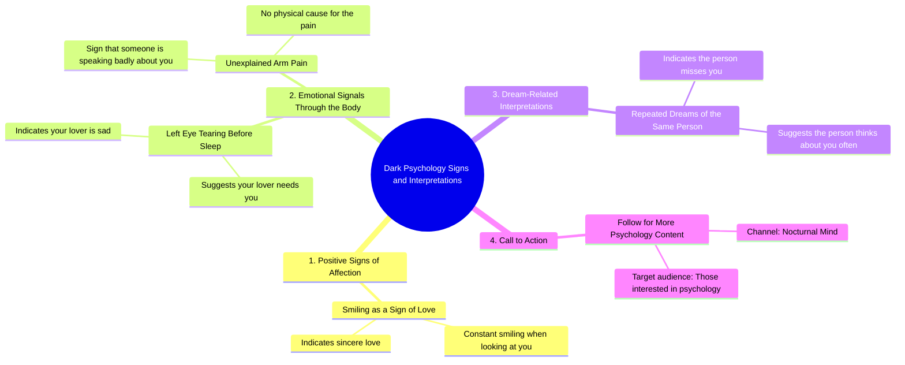

# 5 Dark Psychology Signs You Need to Know

> 🌐 **Read this in:** [English](../../en/2026-09/tiktok-transcript-1-9m-views-109k-reactions-5-dark-psychology-signs-you-need-t-bb54.md) · **中文**

> **Creator:** [@Nocturnal Mind](https://www.tiktok.com/@Nocturnal Mind) · **Views:** 978.8K · **Posted:** 2026-09-02 · **Niche:** entertainment
>
> **TL;DR:** The phrase 'dark psychology' creates intrigue and promises hidden knowledge, while the numbered list structure encourages viewers to watch until the end.

[Watch original video →](https://www.facebook.com/share/r/1GEhLt126X/)

## Why This Went Viral

## 钩子（前3秒）
- **逐字开场：** “黑暗心理学第一条，如果有人看着你并一直微笑，那说明他们真心爱你。”
- **钩子模式：** **反差 + 列表格式**（“黑暗心理学”搭配温暖浪漫的说法——颠覆了人们对“黑暗”内容的预期）。
- **为何能让人停下滑动：** “黑暗”一词引发好奇和轻微恐惧，但第一条内容在情感上却柔软而私人。这种错位制造了认知失调——观众必须继续观看才能化解。此外，“第一条”暗示这是一个编号列表，会激发大脑对完整性的追求（蔡格尼克效应）。

## 情绪节奏
- **节拍1 — 好奇（0–2秒）：** “黑暗心理学”奠定了一种神秘、略带禁忌的基调。
- **节拍2 — 温暖/认同（2–6秒）：** 第一条（微笑=爱）带来多巴胺式的安心感。
- **节拍3 — 关切/共情（6–10秒）：** 第二条（左眼流泪=爱人在难过）转向一种更柔和、近乎灵性的亲密感——观众感到被看见。
- **节拍4 — 好奇/超自然牵引（10–15秒）：** 第三条（反复做梦=对方在想你）偏向迷信和浪漫思念——对处于迷恋或心碎状态的人有强烈共鸣。
- **节拍5 — 轻度焦虑（15–19秒）：** 第四条（手臂疼痛=有人在说你坏话）引入轻微恐惧峰值——这是标题承诺的“黑暗”回报。
- **节拍6 — 收尾/行动号召（19–21秒）：** “如果你喜欢心理学，关注……”——一个软着陆，将情感投入转化为关注行为。
- **高潮时刻：** 第四条（手臂疼痛）——这是唯一真正“黑暗”的内容，且放在最后，在行动号召前制造了一个张力峰值。

## 关键词密度
- **“心理学”**（2次，含标题）——推动算法触达（高搜索量词）。
- **“你/你的”**（5次以上）——人称代词创造直接对话感，提升观看时长和共鸣感。
- **“黑暗”**（1次，开场处）——高点击、高好奇心的修饰词；与“心理学”搭配利于搜索。
- **“爱/爱人”**（2次）——情感牵引；触及广泛的浪漫兴趣。
- **“迹象”**（通过“表明”/“意味着”暗示）——将内容框定为秘密知识，推动收藏。
- **“关注”**（1次）——明确的转化关键词。

**算法驱动词：** “心理学”、“黑暗”、“关注”——它们匹配搜索和推荐模式。
**情感驱动词：** “你”、“爱”、“梦”、“难过”——它们触发个人相关性和情感共鸣。

## 为何能广泛传播
- **迷信作为可分享的社交货币：** 像“左眼流泪=爱人在难过”这样的说法是伪神秘主义的。观众会分享给朋友并配文“这太真实了”——它变成了一种社交测试，而不仅仅是一个视频。
- **个性化陷阱：** 每一条都用“你”或“你的”——观众感到被直接点名，这增加了他们@某个人的冲动（“这让我想到了你”）。
- **低门槛、高情感的列表式内容：** 编号格式（1–5）让观众在心理上“收集”这些说法并对照自己的经历——这是一个内置的互动循环。
- **“黑暗”的挂羊头卖狗肉：** 只有一条（手臂疼痛）真正是黑暗的。其余都是浪漫而治愈的。这扩大了受众范围——既吸引对心理学好奇的人，也吸引沉迷于感情话题的人。
- **行动号召放在情绪峰值之后：** 通过在张力峰值（第四条）之后放置行动号召，观众被引导做出冲动行为——他们想要更多这种“秘密知识”。

## 你可以借鉴什么
- **用“黑暗”或禁忌框架包装柔软内容：** 把一个温暖、有共鸣的想法贴上带刺激感的标签（“黑暗”、“禁忌”、“秘密”）。这种反差能提升点击率和观看时长。
- **用编号列表结构并逐步升级情感张力：** 从温暖开始，逐渐变得奇特，最后以最具挑衅性的说法收尾。这能保持高留存率，并给观众一个看完的理由。
- **让每一条都直接指向观众：** 在每条内容中使用“你”和“你的”。最后以低门槛的关注行动号召收尾——情绪峰值是请求订阅的最佳时机。

## Mind Map

## Full Transcript (Generated by [我们用的转录工具](https://toktranscript.com/?utm_source=github&utm_medium=breakdown&utm_campaign=tool_attribution))

> 📝 Transcripts on this page are auto-generated and show the first 60%. Want to transcribe any TikTok in 30 seconds and get the full version? [Try TokTranscript free →](https://toktranscript.com/?utm_source=github&utm_medium=breakdown&utm_campaign=transcript_cta)

Dark psychology number one, if someone looks at you and constantly smiles, it means they sincerely love you. Number two, if your left eye tears up before you sleep, it shows that your lover is sad and needs you. Number three, seeing the same person repeatedly in your dreams means they miss you

*[Read the full transcript on TokTranscript →](https://toktranscript.com/plaza/tiktok-transcript-1-9m-views-109k-reactions-5-dark-psychology-signs-you-need-t-bb54?utm_source=github&utm_medium=breakdown&utm_campaign=transcript_full)*

## Browse More

- All [entertainment](../../by-niche/zh-CN/entertainment.md) breakdowns
- All [Listicle with curiosity gap](../../by-pattern/zh-CN/hook-listicle-with-curiosity-gap.md) examples

## Video Info

| | |
|---|---|
| Creator | [@Nocturnal Mind](https://www.tiktok.com/@Nocturnal Mind) |
| Original video | [https://www.facebook.com/share/r/1GEhLt126X/](https://www.facebook.com/share/r/1GEhLt126X/) |
| Original title | 1.9M views · 109K reactions | 5 Dark Psychology Signs You Need to Know | Human Behavior & Body Language #DarkPsychology #BodyLanguage #NocturnalMind | Nocturnal Mind |
| Views | 978.8K (978775) |
| Posted | 2026-09-02 |
| Duration | 0s |
| Niche | `entertainment` |
| Hook pattern | `Listicle with curiosity gap` |
| Original language | `en` (this page translated by AI) |
| Available languages | en, zh-CN |
| Generated | 2026-09-03 by [TokTranscript](https://toktranscript.com/) |

---

*This breakdown is for educational analysis under fair use. Original video © [@Nocturnal Mind](https://www.tiktok.com/@Nocturnal Mind). All transcripts are auto-generated and may contain errors.*

*Want to analyze your own TikToks like this? [TokTranscript →](https://toktranscript.com/viral-breakdown?utm_source=github&utm_medium=breakdown&utm_campaign=footer_cta)*