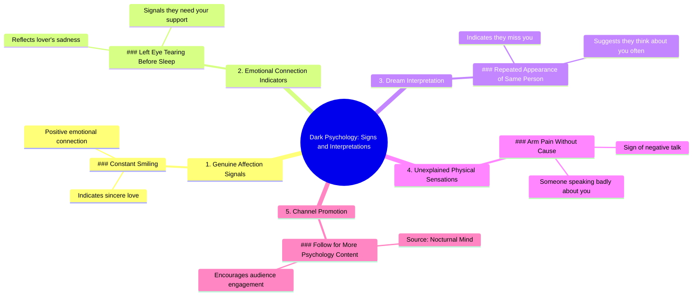

# 5 Dark Psychology Signs You Need to Know

> 🌐 **Read this in:** [English](../../en/2026-09/tiktok-transcript-1-9m-views-110k-reactions-5-dark-psychology-signs-you-need-t-3ba2.md) · **中文**

> **Creator:** [@Nocturnal Mind](https://www.tiktok.com/@Nocturnal Mind) · **Views:** 979.8K · **Posted:** 2026-09-04 · **Niche:** entertainment
>
> **TL;DR:** The phrase 'dark psychology' creates intrigue and promises hidden knowledge, while the numbered list structure hooks viewers to watch for all items.

[Watch original video →](https://www.facebook.com/share/r/19D1qSDV6P/)

## Why This Went Viral

## 钩子（前3秒）
- **逐字开场：** “黑暗心理学第一则，如果有人看着你并一直微笑，那说明他们真心爱你。”
- **钩子模式：** **大胆断言 + 列表格式**（“黑暗心理学第一则……”）——立刻传递出编号式、碎片化的知识干货感。
- **为何能阻止滑动：** 它把“黑暗”这个词（禁忌、隐秘知识）与一个柔和、浪漫的结果（“真心爱你”）并置。这种反差制造了认知失调——观众预期看到操控技巧，却得到一个爱情测试。这种张力迫使人们停下来。

## 情绪节奏
- **节拍1——好奇/猎奇：** “黑暗心理学”让大脑预感到秘密或危险。
- **节拍2——温暖/认同（第1条）：** 微笑=爱。感觉良好，瞬间引发共鸣。
- **节拍3——共情/关切（第2条）：** 左眼流泪=爱人在难过。情绪从自我关注转向他人关注。
- **节拍4——迷信/希望（第3条）：** 反复做梦=他们在想你。触动浪漫的渴望。
- **节拍5——多疑/警觉（第4条）：** 无法解释的手臂疼痛=有人在说你坏话。一阵焦虑冲击——打破了爱情的魔咒。
- **节拍6——行动号召式的释放（第5条）：** “关注获取更多”——一个减压阀，低门槛的承诺。
- **高潮时刻：** 第4条（手臂疼痛）——这是最离谱的说法，却因为身体上可验证而激发出最高的情绪唤起。这就是反转点：内容从情感层面跳到了身体证据层面。

## 关键词密度
- **“心理学”**（2次）——自我提升/好奇心领域的算法磁石。
- **“爱”**（通过“爱人”“爱你”“想你”间接体现）——高情绪吸引力，覆盖面广。
- **“第”/“则”**（5次）——暗示结构感，提升观看时长（观众会为了数完而留下）。
- **“你”**（6次）——第二人称直接对话，增强个性化，提升互动率。
- **“迹象”**（1次，通过“表明”“意味着”“迹象”体现）——触发模式寻找行为。
- **“黑暗”**（1次）——“隐秘知识”类型的高点击关键词。
- **算法驱动词：** “心理学”“关注”（直接行动号召）“第”（列表式留存）。
- **情绪拉动词：** “爱”“难过”“想你”“说坏话”——都是人人能共情的人类状态。

## 为何能广泛传播
- **迷信式可分享性：** “如果你的左眼流泪……”——观众截图发给伴侣或朋友，去验证是否“属实”。这些说法无法证实，因此非常适合群聊传播。
- **个人验证循环：** 每一句都指向“你”——观众觉得被单独针对。这触发了“这是在说我”的反射，推动评论区出现“我昨天手臂疼了！！”之类的留言。
- **模式打断：** 荒谬程度逐级上升的列表（爱→悲伤→梦境→身体疼痛）让大脑持续猜测。从情绪到身体的跳跃出乎意料，减少了中途划走率。
- **低成本、高回报的行动号召：** 最后一句“关注获取更多”是自然的延续，而非硬性推销。任何一条让观众感到被验证的内容，都会促使他们关注以获取更多“迹象”。
- **文化神秘主义吸引力：** 将流行心理学与民间迷信融合——这种形式在多种文化中（拉丁美洲、南亚、菲律宾）都表现优异，因为这些文化中精神/情感层面的解释具有天然共鸣。

## 你可以借鉴什么
- **使用“编号秘密”格式：** 以“黑暗[主题]第X则……”开场——“黑暗”或“秘密”一词放在编号列表前，立刻提升感知价值。适用于任何领域：“黑暗效率技巧第1则……”
- **混合情感与身体层面的断言：** 在感受（“难过”“爱”）和身体迹象（“手臂疼”“流泪”）之间交替。这创造了一种节奏，让观众持续投入，也让内容感觉更“真实”、更可验证。
- **以柔和、垂直领域专属的行动号召收尾：** 不要只说“关注获取更多”，而是说“如果你喜欢[主题]，关注[账号]获取更多”。把它作为列表中的第5条——这样不破坏格式，感觉像自然的额外福利，而不是广告。

## Mind Map

## Full Transcript (Generated by [TikTok 转录工具](https://toktranscript.com/?utm_source=github&utm_medium=breakdown&utm_campaign=tool_attribution))

> 📝 Transcripts on this page are auto-generated and show the first 60%. Want to transcribe any TikTok in 30 seconds and get the full version? [Try TokTranscript free →](https://toktranscript.com/?utm_source=github&utm_medium=breakdown&utm_campaign=transcript_cta)

Dark psychology number one, if someone looks at you and constantly smiles, it means they sincerely love you. Number two, if your left eye tears up before you sleep, it shows that your lover is sad and needs you. Number three, seeing the same person repeatedly in your dreams means they miss you

*[Read the full transcript on TokTranscript →](https://toktranscript.com/plaza/tiktok-transcript-1-9m-views-110k-reactions-5-dark-psychology-signs-you-need-t-3ba2?utm_source=github&utm_medium=breakdown&utm_campaign=transcript_full)*

## Browse More

- All [entertainment](../../by-niche/zh-CN/entertainment.md) breakdowns
- All [Listicle with curiosity gap](../../by-pattern/zh-CN/hook-listicle-with-curiosity-gap.md) examples

## Video Info

| | |
|---|---|
| Creator | [@Nocturnal Mind](https://www.tiktok.com/@Nocturnal Mind) |
| Original video | [https://www.facebook.com/share/r/19D1qSDV6P/](https://www.facebook.com/share/r/19D1qSDV6P/) |
| Original title | 1.9M views · 110K reactions | 5 Dark Psychology Signs You Need to Know | Human Behavior & Body Language #DarkPsychology #BodyLanguage #NocturnalMind | Nocturnal Mind |
| Views | 979.8K (979779) |
| Posted | 2026-09-04 |
| Duration | 0s |
| Niche | `entertainment` |
| Hook pattern | `Listicle with curiosity gap` |
| Original language | `en` (this page translated by AI) |
| Available languages | en, zh-CN |
| Generated | 2026-09-05 by [TokTranscript](https://toktranscript.com/) |

---

*This breakdown is for educational analysis under fair use. Original video © [@Nocturnal Mind](https://www.tiktok.com/@Nocturnal Mind). All transcripts are auto-generated and may contain errors.*

*Want to analyze your own TikToks like this? [TokTranscript →](https://toktranscript.com/viral-breakdown?utm_source=github&utm_medium=breakdown&utm_campaign=footer_cta)*