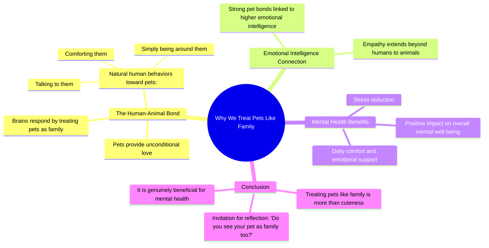

# Why People Treat Their Pets Like Humans

> 🌐 **Read this in:** [English](../../en/2026-09/tiktok-transcript-1-9m-views-63k-reactions-why-some-people-treat-their-pets-li-5438.md) · **中文**

> **Creator:** [@Lockedinangelo](https://www.tiktok.com/@Lockedinangelo) · **Views:** 834.9K · **Posted:** 2026-09-10 · **Niche:** other
>
> **TL;DR:** Starts with a relatable observation and immediately promises a deeper explanation.

[Watch original video →](https://www.facebook.com/share/r/18sP6jux6h/)

## Why This Went Viral

## 钩子（前3秒）
- **逐字开场白：**“你有没有注意到，有些人把宠物当人一样对待？”
- **钩子模式：**提问+场景设定（一个伪装成问题的、能引起共鸣的观察）。
- **为什么它能阻止滑动：**它瞬间验证了观众可能每天都会展现或目睹的一种行为。它在不到2秒内制造出一个“这就是我”的时刻，迫使观众在视频继续之前先在内心暂停一下来回答这个问题。

## 情绪节奏
- **第1拍——好奇/认同（0–3秒）：**这个问题让观众感到被看见，触发轻微的自尊提升（“我就是这样”）。
- **第2拍——智识升华（3–7秒）：**从“可爱”转向“无条件的爱”和“你的大脑会回应”。这增加了伪科学的分量，让观众因为与宠物建立情感联结而觉得自己很聪明。
- **第3拍——温暖/安慰（7–12秒）：**“令人安慰”“自然”“减轻压力”等词营造出一种舒缓、安全的情绪平台。
- **第4拍——自豪/肯定（12–15秒）：**关于“更高情绪智力”的说法是高潮。它用地位提升来奖励观众——观看这个视频让他们觉得自己是更好的人。
- **第5拍——行动号召/社群（15–17秒）：**结尾问题（“你也把宠物当家人吗？”）将内在认同转化为外部互动，邀请评论。

## 关键词密度
- **宠物**（推动搜索/表层触达）
- **人类/家人**（情绪牵引——制造核心对比）
- **无条件的爱**（高情绪短语；触发分享性）
- **大脑会回应**（面向科学好奇细分领域的权威/算法钩子）
- **情绪智力**（地位关键词；让观众感到优越）
- **压力/安慰**（缓解类关键词；在健康领域的算法触达）
- **自然**（使这种行为正常化，降低被感知到的怪异感）

## 为什么它会传播
- **确认偏误循环：**整个脚本就是一连串肯定。像“和它们说话感觉完全自然”和“这实际上对你的心理健康有好处”这样的句子，给了观众继续做他们已经在做的事情的许可——并把它作为证据分享出去。
- **身份徽章：**“更高情绪智力”这句是病毒式传播的有效载荷。观众分享的不是视频；他们分享的是它赋予他们的*身份*。他们会标记其他宠物主人说：“看到了吗？我们才是聪明的那群。”
- **低风险争议：**通过说“有些人”而不是“你”，它制造出一种微妙的圈内/圈外动态。宠物主人会对非宠物主人产生一种温和的优越感，这会推动诸如“我的狗就是我的孩子”之类的评论。
- **带有转折的普遍共鸣：**前半段是泛泛的轻松内容（可爱宠物），但后半段转向心理健康益处。这让它感觉有信息量，而不只是煽情，从而提高收藏量。
- **开放式结尾：**最后的问题是一个直接邀请。它不是在要求点赞；它是在要求一个个人化的回答，这是短视频中驱动评论最多的策略。

## 你可以借鉴什么
- **用一个“你”的问题开头，而不是一个“看看这个”的陈述。**先让观众识别自己的行为。这能为你争取3秒的主动注意力。
- **在脚本中段插入一个提升地位的说法。**不要只是认同；要升华。说“做X的人有更高的Y”会把被动观众变成自豪的传播者。
- **以一个个人化、开放式的问题结尾。**避免“在下面评论”。相反，问“你也这样做吗？”或“只有我这样吗？”——这会迫使观众留下自我反思式的评论，而不是泛泛的评论。

## Mind Map

## Full Transcript (Generated by [免费 TikTok 文稿生成器](https://toktranscript.com/?utm_source=github&utm_medium=breakdown&utm_campaign=tool_attribution))

> 📝 Transcripts on this page are auto-generated and show the first 60%. Want to transcribe any TikTok in 30 seconds and get the full version? [Try TokTranscript free →](https://toktranscript.com/?utm_source=github&utm_medium=breakdown&utm_campaign=transcript_cta)

Have you noticed how some people treat their pets like humans? It's more than just being cute. Pets give unconditional love, and your brain responds by treating them like family. Talking to them, comforting them, or just being around them feels completely natural. People who bond strongly with pets often 

*[Read the full transcript on TokTranscript →](https://toktranscript.com/plaza/tiktok-transcript-1-9m-views-63k-reactions-why-some-people-treat-their-pets-li-5438?utm_source=github&utm_medium=breakdown&utm_campaign=transcript_full)*

## Browse More

- All [other](../../by-niche/zh-CN/other.md) breakdowns
- All [Rhetorical question + curiosity gap](../../by-pattern/zh-CN/hook-rhetorical-question-curiosity-gap.md) examples

## Video Info

| | |
|---|---|
| Creator | [@Lockedinangelo](https://www.tiktok.com/@Lockedinangelo) |
| Original video | [https://www.facebook.com/share/r/18sP6jux6h/](https://www.facebook.com/share/r/18sP6jux6h/) |
| Original title | 1.9M views · 63K reactions | Why Some People Treat Their Pets Like Humans #psychologyfacts #pets | Lockedinangelo |
| Views | 834.9K (834931) |
| Posted | 2026-09-10 |
| Duration | 0s |
| Niche | `other` |
| Hook pattern | `Rhetorical question + curiosity gap` |
| Original language | `en` (this page translated by AI) |
| Available languages | en, zh-CN |
| Generated | 2026-09-10 by [TokTranscript](https://toktranscript.com/) |

---

*This breakdown is for educational analysis under fair use. Original video © [@Lockedinangelo](https://www.tiktok.com/@Lockedinangelo). All transcripts are auto-generated and may contain errors.*

*Want to analyze your own TikToks like this? [TikTok 转录工具 →](https://toktranscript.com/viral-breakdown?utm_source=github&utm_medium=breakdown&utm_campaign=footer_cta)*