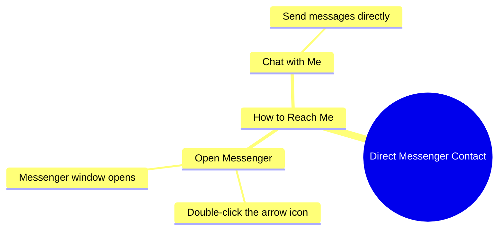

# How To Message Me Directly On Messenger

> 🌐 **Read this in:** [English](../../en/2026-09/tiktok-transcript-1-9m-views-67k-reactions-wafa-world-facebookreels-reels-tren-98f2.md) · **中文**

> **Creator:** [@afreen khan](https://www.tiktok.com/@afreen khan) · **Views:** 686.6K · **Posted:** 2026-09-26 · **Niche:** other
>
> **TL;DR:** Immediately offers a direct communication benefit, grabbing viewer attention.

[Watch original video →](https://www.facebook.com/reel/2185758796158018/)

## Why This Went Viral

## 钩子（前3秒）
- 逐字开场：“अब आप मुझे सीधा मेसेंजर से बात कर सकते हैं”（“现在你可以直接在 Messenger 上和我聊天”）
- 钩子模式：**直接接触 / 大胆宣称**——承诺与创作者进行个人化的一对一联系。
- 为什么它能让人停止滑动：它打破了通常的创作者与受众之间的墙。观众不再是被动观看，而是被告知*他们*现在可以联系到屏幕上的人。这是一个即时的、个人化的“这是给我的”触发点，而“अब”（现在）这个词暗示了一个值得关注的变化。

## 情绪节奏
- **好奇**——“你可以直接和我聊天”引出了问题：怎么聊？为什么是现在？
- **张力（微小）**——观众一时不知道机制，制造了一个小小的信息缺口。
- **缓解 / 回报**——“जैसे तीर वाली निशान पे दो बार क्लिक करोगे, मेसेंजर खुल जाएगा”用一个极其简单的指令解决了它。
- **邀请 / 温暖**——“आप वहाँ पे बात कर सकते हो मुझ से”以开放、欢迎的语气收尾。
- 高潮时刻：指令“तीर वाली निशान पे दो बार क्लिक करोगे”——谜团转化为可执行步骤的确切一秒。

## 关键词密度
- आप（你）
- मुझे / मुझ से（我 / 和我）
- मेसेंजर（Messenger）——重复出现
- सीधा（直接）
- बात कर सकते हो（可以聊天）
- तीर वाली निशान（箭头图标）
- दो बार क्लिक（双击）
- खुल जाएगा（将会打开）
- 算法触达驱动词：“मेसेंजर”、“क्लिक”、“खुल जाएगा”——这些平台/动作词传递互动信号，可能提升参与度指标。
- 情绪拉动驱动词：“आप”、“मुझे/मुझ से”、“सीधा”、“बात कर सकते हो”——这些词营造出个人化、直接关系的感觉。

## 为什么它会传播
- **互惠触发**——“आप मुझे सीधा मेसेंजर से बात कर सकते हैं”为受众提供了某种稀缺的东西（直接接触），这让人想要行动并分享。
- **零阻力 CTA**——“तीर वाली निशान पे दो बार क्लिक करोगे, मेसेंजर खुल जाएगा”消除了所有猜测。清晰、一步式的指令会被遵循并再次分享。
- **个人化称呼**——反复出现的“आप”和“मुझ से”让它感觉像一条私信，而不是广播，从而推动评论和私信。
- **好奇心缺口快速闭合**——承诺（“सीधा... बात कर सकते हैं”）立即得到回答（“मेसेंजर खुल जाएगा”），因此观众在几秒内就获得一个完整、令人满足的闭环——非常适合重播和分享。
- **接触的新鲜感**——“अब”标志着一种新能力，让内容显得及时，值得转发给其他也想要同样接触机会的人。

## 你可以借鉴什么
1. **以接触机会开头，而不是信息。** 先说出观众*能得到*什么（“你现在可以直接联系我”），再解释怎么做——承诺本身就是钩子。
2. **使用“现在”框架。** 像“अब”这样的词让内容显得新鲜且紧迫，因此观众会停下来看看发生了什么变化。
3. **给出一步式、物理性的指令。** “双击箭头图标”具体且可视化——用观众可以立即完成的单次点击/轻触，取代抽象的 CTA。

## Mind Map

## Full Transcript (Generated by [拆解你自己的 TikTok](https://toktranscript.com/?utm_source=github&utm_medium=breakdown&utm_campaign=tool_attribution))

> 📝 Transcripts on this page are auto-generated and show the first 60%. Want to transcribe any TikTok in 30 seconds and get the full version? [Try TokTranscript free →](https://toktranscript.com/?utm_source=github&utm_medium=breakdown&utm_campaign=transcript_cta)

अब आप मुझे सीधा मेसेंजर से बात कर सकते हैं, जैसे तीर वाली निशान पे दो बार क्लिक करो

*[Read the full transcript on TokTranscript →](https://toktranscript.com/plaza/tiktok-transcript-1-9m-views-67k-reactions-wafa-world-facebookreels-reels-tren-98f2?utm_source=github&utm_medium=breakdown&utm_campaign=transcript_full)*

## Browse More

- All [other](../../by-niche/zh-CN/other.md) breakdowns
- All [Direct Benefit Hook](../../by-pattern/zh-CN/hook-direct-benefit-hook.md) examples

## Video Info

| | |
|---|---|
| Creator | [@afreen khan](https://www.tiktok.com/@afreen khan) |
| Original video | [https://www.facebook.com/reel/2185758796158018/](https://www.facebook.com/reel/2185758796158018/) |
| Original title | 1.9M views · 67K reactions | Wafa World 😘🥀 #FacebookReels #Reels #TrendingReels #ReelsVideo #ShortVideo #ViralVideo #Explore #ForYou #Dosti #Friendship #OnlineDosti #DesiVibes #UrduPosts #followformore | afreen khan |
| Views | 686.6K (686581) |
| Posted | 2026-09-26 |
| Duration | 0s |
| Niche | `other` |
| Hook pattern | `Direct Benefit Hook` |
| Original language | `en` (this page translated by AI) |
| Available languages | en, zh-CN |
| Generated | 2026-09-27 by [TokTranscript](https://toktranscript.com/) |

---

*This breakdown is for educational analysis under fair use. Original video © [@afreen khan](https://www.tiktok.com/@afreen khan). All transcripts are auto-generated and may contain errors.*

*Want to analyze your own TikToks like this? [我们用的转录工具 →](https://toktranscript.com/viral-breakdown?utm_source=github&utm_medium=breakdown&utm_campaign=footer_cta)*