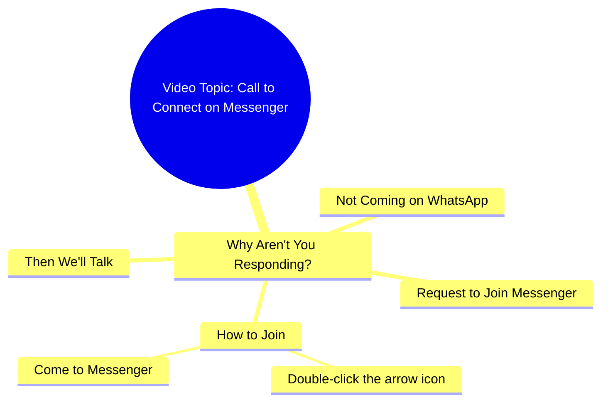

# Why Don't You Come Talk on Messenger

> 🌐 **Read this in:** [English](../../en/2026-09/tiktok-transcript-13m-views-328k-reactions-03045658506-d988.md) · **中文**

> **Creator:** [@03045658506](https://www.tiktok.com/@03045658506) · **Views:** 4.1M · **Posted:** 2026-09-22 · **Niche:** other
>
> **TL;DR:** The hook immediately engages the viewer by asking a direct, relatable question about messaging habits.

[Watch original video →](https://www.facebook.com/reel/1092072726808312/?app=fbl)

## Why This Went Viral

## 钩子（前3秒）
- 逐字开场：“आप लोग क्यों नहीं आते हो, WhatsApp पे तो नहीं आ रहे हो, Messenger पे तो आ जाओ...”
- 钩子模式：**直接指责 / 点名式提问**（“你们为什么不来？”），直指观众。
- 为什么能让人停下滚动：它感觉像是一条专门发给*你*的私人消息，而不是广播。这种带有指责意味的“तुम लोग”框架会触发瞬间的防御反射——“等等，他是在说我吗？”——这是信息流能产生的最强打断。

## 情绪节奏
- **第1拍（0–1秒）：对峙**——“क्यों नहीं आते हो”带来轻微的愧疚/指责感。
- **第2拍（1–3秒）：升级**——“WhatsApp पे तो नहीं आ रहे हो”继续叠加愧疚感，并点名观众每天实际在用的平台。
- **第3拍（3–5秒）：转向指令**——“Messenger पे तो आ जाओ”从责备转向具体、容易做到的要求。紧张感转化为行动。
- **第4拍（5–7秒）：微指令 / 仪式**——“तीर के निशान पे दो बार क्लिक करो”——一个极小、几乎像孩子气的任务。这是**高潮**：情绪峰值就是观众被明确告知*到底*该做什么的那一刻，消除了所有阻力。
- **第5拍（7–8秒）：奖励承诺**——“फिर बात करते हैं”——柔和、亲密的回报。释然 + 好奇（“我们会聊什么？”）。
- 高潮落在**双击指令**上——整个视频就是被设计成在CTA处达到峰值。

## 关键词密度
- **आ जाओ / आते हो**（“来 / 不来”）——情绪脊柱；重复3次。
- **Messenger**——重复2次；算法触达关键词（平台名 = 可搜索、可暗示）。
- **WhatsApp**——触达关键词；触发识别和平台联想。
- **बात करते हैं**（“我们聊聊”）——情绪牵引；承诺的是关系，不是交易。
- **क्यों नहीं**（“为什么不”）——牵引关键词；愧疚 + 好奇的组合。
- **तीर के निशान / दो बार क्लिक**（“箭头标记 / 双击”）——指令关键词；驱动实际互动指标。
- 触达驱动因素：**Messenger、WhatsApp**（平台名会喂给推荐系统）。
- 情绪驱动因素：**क्यों नहीं、बात करते हैं**（愧疚 + 亲密）。

## 为什么它会传播
- **它把愧疚武器化成钩子。**“आप लोग क्यों नहीं आते हो”让观众觉得自己被单独点名——机制和朋友发来的被动攻击式短信一样。人们分享它，是为了说“他说的就是你。”
- **它点名了观众本来就在用的真实平台。**“WhatsApp पे तो नहीं आ रहे हो, Messenger पे तो आ जाओ”——这不是抽象的；它指向观众口袋里的确切应用，压缩了内容和行为之间的距离。
- **CTA被伪装成随口指令，而不是恳求。**“तीर के निशान पे दो बार क्लिक करो”听起来像朋友在解释UI，而不是创作者在乞求互动。低阻力，高配合。
- **结尾制造了一个开放循环。**“फिर बात करते हैं”承诺了未来的一次对话，却没有揭示它——观众必须关注/评论才能闭合这个循环。
- **它短到可以循环播放。**整个内容大约8秒；开头的那句指责在重播时会再次触发，从而叠加观看时长。

## 你可以偷走什么
- **用直接指责或点名开场，而不是问候。**“你们这些人为什么不……”比“嗨大家好”表现更好，因为它会在1秒内迫使观众产生自我指涉的反应。
- **点名你想要的准确平台或行为。**不要说“关注我”——要说“双击箭头”或“在Instagram上私信我”。具体性会带来转化。
- **用开放承诺收尾，而不是封闭收尾。**“फिर बात करते हैं”有效，是因为它暗示还有更多。把“感谢观看”替换成下一次互动的钩子。

## Mind Map

## Full Transcript (Generated by [TikTok 转录工具](https://toktranscript.com/?utm_source=github&utm_medium=breakdown&utm_campaign=tool_attribution))

> 📝 Transcripts on this page are auto-generated and show the first 60%. Want to transcribe any TikTok in 30 seconds and get the full version? [Try TokTranscript free →](https://toktranscript.com/?utm_source=github&utm_medium=breakdown&utm_campaign=transcript_cta)

आप लोग क्यों नहीं आते हो, WhatsApp पे तो नहीं आ रहे हो, Messenger पे तो आ जाओ, तीर के निश

*[Read the full transcript on TokTranscript →](https://toktranscript.com/plaza/tiktok-transcript-13m-views-328k-reactions-03045658506-d988?utm_source=github&utm_medium=breakdown&utm_campaign=transcript_full)*

## Browse More

- All [other](../../by-niche/zh-CN/other.md) breakdowns
- All [Direct Question](../../by-pattern/zh-CN/hook-direct-question.md) examples

## Video Info

| | |
|---|---|
| Creator | [@03045658506](https://www.tiktok.com/@03045658506) |
| Original video | [https://www.facebook.com/reel/1092072726808312/?app=fbl](https://www.facebook.com/reel/1092072726808312/?app=fbl) |
| Original title | 13M views · 328K reactions | آپ کیوں نہیں آتے ہو | 03045658506 |
| Views | 4.1M (4077557) |
| Posted | 2026-09-22 |
| Duration | 0s |
| Niche | `other` |
| Hook pattern | `Direct Question` |
| Original language | `en` (this page translated by AI) |
| Available languages | en, zh-CN |
| Generated | 2026-09-23 by [TokTranscript](https://toktranscript.com/) |

---

*This breakdown is for educational analysis under fair use. Original video © [@03045658506](https://www.tiktok.com/@03045658506). All transcripts are auto-generated and may contain errors.*

*Want to analyze your own TikToks like this? [拆解你自己的 TikTok →](https://toktranscript.com/viral-breakdown?utm_source=github&utm_medium=breakdown&utm_campaign=footer_cta)*