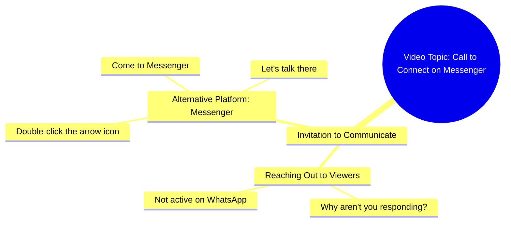

# Why Don't You Come on Messenger

> 🌐 **Read this in:** [English](../../en/2026-09/tiktok-transcript-14m-views-339k-reactions-03045658506-31e0.md) · **中文**

> **Creator:** [@03045658506](https://www.tiktok.com/@03045658506) · **Views:** 4.2M · **Posted:** 2026-09-25 · **Niche:** other
>
> **TL;DR:** The hook immediately engages the audience with a relatable question about messaging habits, creating curiosity and personal relevance.

[Watch original video →](https://www.facebook.com/share/r/1Mrhv594w2/)

## Why This Went Viral

## 钩子（前3秒）
- **逐字开场白：** “你们为什么不来，WhatsApp上也不来，那就来Messenger吧……”
- **钩子模式：** 直接指责 + 点名（“你们为什么不来？”）——一个直冲观众而来的对抗式提问。
- **为什么能让人停下滑动：** 它感觉像一条私人消息，而不是内容。观众被称作“你们”，并被指责无视说话者——瞬间触发“等等，这是在说我吗？”的条件反射。未解开的“为什么”制造了一个大脑想要闭合的微小缺口。

## 情绪节奏
- **节拍1——对抗/好奇（0–2秒）：** “你们为什么不来”——轻度内疚 + 好奇。观众感觉自己被单独点名。
- **节拍2——升级/重复（2–5秒）：** “WhatsApp上也不来，那就来Messenger吧”——说话者不断点名平台，营造出一种唠叨而熟悉的节奏。
- **节拍3——指令/紧张（5–8秒）：** “在箭头标记上点两次”——一个异常具体的动作（“在箭头标记上点两次”）。这是悬念峰值：什么箭头？在哪里？
- **节拍4——回报/邀请（8–10秒）：** “来Messenger吧，然后我们聊聊”——柔和的收尾，一个开放式承诺（“然后我们聊聊”）。
- **高潮时刻：** “在箭头标记上点两次”——这个隐晦、极度具体的指令是转折点，让视频感觉像一个内部玩笑或隐藏谜题。

## 关键词密度
- **你们**（你们）——情绪拉力；直接称呼。
- **为什么不来**（为什么不来）——情绪拉力；内疚/好奇驱动。
- **WhatsApp**——算法触达；平台名称识别。
- **Messenger**（重复两次）——算法触达 + 行动号召锚点。
- **来吧**（来）——重复的祈使句；营造紧迫感。
- **箭头标记**（箭头标记）——情绪拉力；神秘钩子。
- **点两次**（点两次）——行动触发；驱动评论/回复。
- **然后我们聊聊**（然后我们聊聊）——情绪拉力；开放循环。

**触达 vs. 拉力：** WhatsApp/Messenger/点击驱动可发现性和平台信号关联。“你们”、“为什么不来”和“箭头标记”驱动“这是在说我 / 什么箭头？”的情绪拉力。

## 为什么它会传播
- **它是一条消息，不是一个视频。** 整个文字稿读起来像一条观众忘了回复的私信——“你们为什么不来”让分享感觉像在转发朋友的抱怨。
- **“箭头标记”谜题。** “在箭头标记上点两次”故意隐晦，所以观众会评论“哪个箭头？”——而评论是最强的分发信号。
- **平台乒乓。** 接连点名WhatsApp和Messenger让它感觉跨平台且紧急，促使观众在已经打开的任意应用上回复。
- **开放循环结尾。** “然后我们聊聊”扣住了实际对话，所以视频以未完成的事情结束——这是人们重看或回复的经典原因。
- **低门槛共鸣。** 唠叨、非正式的语气模仿了人们实际给朋友发消息的方式，所以它会被当作玩笑标签分享（“这是给你的”）。

## 你可以借鉴什么
- **用直接指责开场，而不是问候。** 把“大家好”换成“你们为什么……”——让观众在第一秒就感觉被单独点名。
- **埋一个隐晦指令。** 一个具体、稍微令人困惑的动作（“在箭头标记上点两次”）会迫使评论要求澄清——免费的互动燃料。
- **以未完成的承诺结尾。** 用“然后我们聊聊”式的开放循环收尾，而不是硬性行动号召，这样视频感觉像对话的开始，而不是结束。

## Mind Map

## Full Transcript (Generated by [免费 TikTok 文稿生成器](https://toktranscript.com/?utm_source=github&utm_medium=breakdown&utm_campaign=tool_attribution))

> 📝 Transcripts on this page are auto-generated and show the first 60%. Want to transcribe any TikTok in 30 seconds and get the full version? [Try TokTranscript free →](https://toktranscript.com/?utm_source=github&utm_medium=breakdown&utm_campaign=transcript_cta)

आप लोग क्यों नहीं आते हो, WhatsApp पे तो नहीं आ रहे हो, Messenger पे तो आ जाओ, तीर के निश

*[Read the full transcript on TokTranscript →](https://toktranscript.com/plaza/tiktok-transcript-14m-views-339k-reactions-03045658506-31e0?utm_source=github&utm_medium=breakdown&utm_campaign=transcript_full)*

## Browse More

- All [other](../../by-niche/zh-CN/other.md) breakdowns
- All [Direct Question](../../by-pattern/zh-CN/hook-direct-question.md) examples

## Video Info

| | |
|---|---|
| Creator | [@03045658506](https://www.tiktok.com/@03045658506) |
| Original video | [https://www.facebook.com/share/r/1Mrhv594w2/](https://www.facebook.com/share/r/1Mrhv594w2/) |
| Original title | 14M views · 339K reactions | آپ کیوں نہیں آتے ہو | 03045658506 |
| Views | 4.2M (4248975) |
| Posted | 2026-09-25 |
| Duration | 0s |
| Niche | `other` |
| Hook pattern | `Direct Question` |
| Original language | `en` (this page translated by AI) |
| Available languages | en, zh-CN |
| Generated | 2026-09-26 by [TokTranscript](https://toktranscript.com/) |

---

*This breakdown is for educational analysis under fair use. Original video © [@03045658506](https://www.tiktok.com/@03045658506). All transcripts are auto-generated and may contain errors.*

*Want to analyze your own TikToks like this? [拆解你自己的 TikTok →](https://toktranscript.com/viral-breakdown?utm_source=github&utm_medium=breakdown&utm_campaign=footer_cta)*