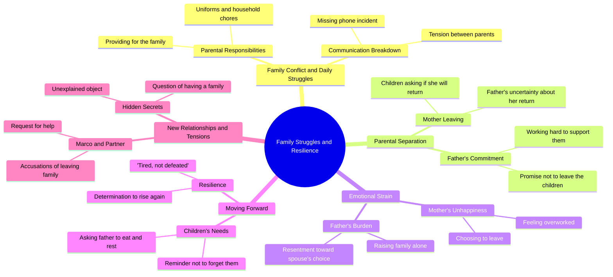

# Silent Burden Episode 2: Ramon Fights for His Kids

> 🌐 **Read this in:** [English](../../en/2026-09/tiktok-transcript-14m-views-398k-reactions-tahimik-na-pasanin-episode-2-iniwan-a815.md) · **中文**

> **Creator:** [@Tagalog Real Talks](https://www.tiktok.com/@Tagalog Real Talks) · **Views:** 7.2M · **Posted:** 2026-09-12 · **Niche:** entertainment
>
> **TL;DR:** The opening question immediately engages viewers by tapping into a common parental concern, setting a relatable and emotional tone.

[Watch original video →](https://www.facebook.com/share/v/1CYNNv2NNV/)

## Why This Went Viral

## 钩子（前3秒）
- **逐字开场白：**“Nakakain na ba mga bata?”（“孩子们，你们吃了吗？”）——一位父亲在关心自己的孩子，紧接着是“Ewan ko”和妻子尖锐的“Ano ba Ramon? Pagod ako.”
- **钩子模式：** **场景／直入式家庭冲突**——没有铺垫，没有背景，你被直接丢进一场家庭争吵中。
- **为什么能让人停下滑动：** 它以一个未解决的情感交易开场（疲惫的妻子、心不在焉的丈夫、饿着的孩子）。观众被训练成在一秒内就能察觉*冲突*，而那种短促、重叠的对话传递出真实的家庭紧张感——大脑会留下来弄清楚谁对谁错、什么会崩塌。

## 情绪节奏
- **0–3秒——好奇：**“Nakakain na ba mga bata?”确立了一个照顾者的角色；紧接着一句“Pagod ako”立刻动摇了它。
- **3–15秒——紧张升级：** 连珠炮式的家庭怨言——洗衣、找不到的手机、“Babalik pa ba si Mama?”孩子的问题把这场争吵重新定义为遗弃。
- **15–30秒——悲伤／共鸣：**“Nandito lang ako. At hindi ko kayo iiwan.”父亲成了锚。观众从评判转向共情。
- **30–50秒——冲突升级：** 妻子回来收拾东西——“Hindi na ako masaya, Ramon. Puro trabaho ka na lang.”背叛此刻变得明确。
- **50–65秒——反转／道德转折：**“Umalis ka man bilang asawa, huwag ka sanang tuluyang mawala bilang ina.”框架翻转了——这不是关于婚姻，而是关于孩子。
- **高潮：**“Iniwan ko ang pamilya ko para sa'yo. Kasalanan ko ba yun?”——妻子自己的遗弃被反照回她身上。然后是父亲平静的“Pagod lang. Hindi talo. Babangon tayo.”
- **最后一拍——悬念钩子：**“May pamilya ka?”——一个悬念式问题，逼出第二部／重看。

## 关键词密度
- **“Mama”／“ina”**——情感核心；每一句孩子的台词都围绕这个词。
- **“Pamilya”**——主题关键词；整条视频的道德论点。
- **“Pagod”**——重复4次以上；这种共同的疲惫把父亲和妻子连在一起。
- **“Hindi ko kayo iiwan”／“hindi ka iiwan”**——承诺母题，被妻子的离开所反转。
- **“Trabaho”**——分手所陈述的理由；实际的反派。
- **“Ramon”**——点名道姓让场景显得真实，而非泛泛。
- **“Babalik pa ba?”**——反复出现的问题，驱动着情感循环。
- **算法驱动因素：** *pamilya, ina, anak, pagod*——高搜索量的他加禄语家庭剧词汇，把视频推入“家庭／OFW／hugot”推荐集群。
- **情感驱动因素：** *iiwan, babangon, hindi talo*——这些是观众在评论中引用的词，而正是这些真正推动了分享。

## 为什么它会传播
- **它把“hugot”反射武器化了。** 像“Umalis ka man bilang asawa, huwag ka sanang tuluyang mawala bilang ina”这样的台词被设计成可截图、可转发——它们是伪装成对话的格言。
- **每个观众都会选边站。** 妻子（“Hindi na ako masaya”）对父亲（“may binubuhay akong pamilya”）是一场刻意平衡的冲突，所以评论区会炸开“Kawawa si Ramon”对“Naiintindihan ko si Misis”。评论大战＝算法燃料。
- **孩子的问题就是分享触发器。**“Babalik pa ba si Mama?”触动了菲律宾观众中OFW／破碎家庭的那根神经——正是会把这类内容分享到Facebook的那群人。
- **反转重新框定了责任。**“Iniwan ko ang pamilya ko para sa'yo”用一句话把妻子从反派变成伪君子——一个奖励重看和剪辑搬运的迷你反转。
- **开放式结局强制互动。**“May pamilya ka?”是对观众的直接发问。它把被动观看转化为评论、合拍和催更第二部。

## 你可以偷学什么
- **从冲突中途开场，而不是从铺垫中途开场。** 从争吵中最尖锐的一句开始（“Ano ba Ramon? Pagod ako”）——没有定场镜头，没有背景。观众两秒内就能跟上，并留下来等回报。
- **埋一个孩子的问题作为情感锚点。**“Babalik pa ba si Mama?”比任何成人独白都更有用。一个天真的、反复出现的问题可以承载整条叙事弧线。
- **以直接向观众发问收尾。**“May pamilya ka?”把一次被动的滑动转化为一条评论、一次分享，或一个第二部的催更——短内容中最便宜的互动杠杆。

## Mind Map

## Full Transcript (Generated by [TokTranscript](https://toktranscript.com/?utm_source=github&utm_medium=breakdown&utm_campaign=tool_attribution))

> 📝 Transcripts on this page are auto-generated and show the first 60%. Want to transcribe any TikTok in 30 seconds and get the full version? [Try TokTranscript free →](https://toktranscript.com/?utm_source=github&utm_medium=breakdown&utm_campaign=transcript_cta)

Nakakain na ba mga bata? Ewan ko. Alas sa is na. Ano ba Ramon? Pagod ako. Hindi mo na labahan uniform ko? Kailangan ko yan bukas. E di labhan mo. Ramon! Nasaan phone ko? Kung ayaw niya na sa atin, ako ang bubuhay sa inyo. Babalik pa ba si Mama? Pa, nandiyan ka pa? Nandito lang ako. At hindi ko kayo iiwan. Pa, babalik pa ba si Mama? Hindi ko alam. Pero ako, hindi ako titigil para sa inyo. Kita mo, hindi mo na kailangang magtiis doon. Parang ngayon lang ako nakahinga. Sa akin, hindi ka mahihirapan. Tatay, kumain ka na ba? Mamaya pa Kayo muna Kailangan lang nating lumaban Kukunin ko lang yung mga gamit ko Hindi kita pipigilan Pero huwag mong kalimutan na may mga batang na iwan dito Hindi na ako masaya, Ramon. Puro trabaho ka na lang. Puro trabaho. Kasi 

*[Read the full transcript on TokTranscript →](https://toktranscript.com/plaza/tiktok-transcript-14m-views-398k-reactions-tahimik-na-pasanin-episode-2-iniwan-a815?utm_source=github&utm_medium=breakdown&utm_campaign=transcript_full)*

## Browse More

- All [entertainment](../../by-niche/zh-CN/entertainment.md) breakdowns
- All [Relatable Question](../../by-pattern/zh-CN/hook-relatable-question.md) examples

## Video Info

| | |
|---|---|
| Creator | [@Tagalog Real Talks](https://www.tiktok.com/@Tagalog Real Talks) |
| Original video | [https://www.facebook.com/share/v/1CYNNv2NNV/](https://www.facebook.com/share/v/1CYNNv2NNV/) |
| Original title | 14M views · 398K reactions | TAHIMIK NA PASANIN — EPISODE 2 Iniwan niya ang pamilya para sa buhay na akala niya’y mas magiging masaya. Habang si Ramon ay tahimik na lumalaban para sa kanilang mga anak, unti-unti namang lumalabas ang tunay na mukha ng lalaking pinili ni Liza. May mga desisyong sa umpisa ay parang kalayaan… hanggang dumating ang araw na singilin ka ng kapalit. #tagalogstory #PinoyDrama #DramaSeries | Tagalog Real Talks |
| Views | 7.2M (7192204) |
| Posted | 2026-09-12 |
| Duration | 0s |
| Niche | `entertainment` |
| Hook pattern | `Relatable Question` |
| Original language | `en` (this page translated by AI) |
| Available languages | en, zh-CN |
| Generated | 2026-09-13 by [TokTranscript](https://toktranscript.com/) |

---

*This breakdown is for educational analysis under fair use. Original video © [@Tagalog Real Talks](https://www.tiktok.com/@Tagalog Real Talks). All transcripts are auto-generated and may contain errors.*

*Want to analyze your own TikToks like this? [TokTranscript 转录工具 →](https://toktranscript.com/viral-breakdown?utm_source=github&utm_medium=breakdown&utm_campaign=footer_cta)*