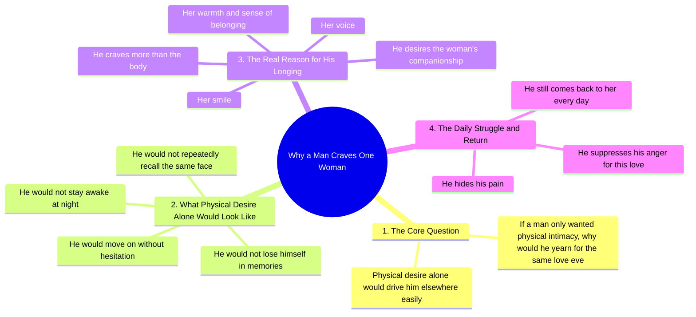

# A Man's Life Is Not Easy, He Just Hides His Pain

> 🌐 **Read this in:** [English](../../en/2026-09/tiktok-transcript-14m-views-607k-reactions-husband-myhusband-lovemyhusband-hus-4d1f.md) · **中文**

> **Creator:** [@ai video ki duniya](https://www.tiktok.com/@ai video ki duniya) · **Views:** 6.0M · **Posted:** 2026-09-05 · **Niche:** entertainment
>
> **TL;DR:** A provocative rhetorical question challenges common assumptions and immediately hooks the audience.

[Watch original video →](https://www.facebook.com/share/r/1DfqAZMP24/)

## Why This Went Viral

## 开头（前3秒）
- **逐字开场白：** “如果男人只想要身体，那他为什么每天为同一份爱而煎熬？”（“If a man only wanted a body, why would he yearn for the same love every day?”）
- **钩子模式：** 反问句 + 大胆断言（“身体”与“爱/渴望”之间的对比）
- **为何能阻止滑动：** 它直接挑战了一种刻板印象。观众感到被针对，要么强烈认同，要么想要反驳——两种反应都能促成完整观看。这个问题在大脑中制造了一种即时的“回答我”的张力。

## 情绪节奏
1. **防御性认同**（0–3秒）：这个问题让感到被误解的男性获得认同——瞬间产生共鸣。
2. **递进式对比**（3–10秒）：“他本可以轻易去别处”——构建了一种“但他没有”的张力，营造出忠诚正在被证明的感觉。
3. **怀旧之痛**（10–15秒）：提及回忆、不眠之夜、反复浮现的一张脸——将观众拉入一种忧郁而浪漫化的状态。
4. **温柔的解答**（15–20秒）：从身体转向声音、微笑、温暖——对开头问题给出一个情感上的“答案”。
5. **无声的牺牲**（20秒至结尾）：“他压抑怒火，隐藏痛苦，却依然归来”——高潮落在宽恕与奉献上。这是情感峰值：它将男性的爱重新定义为耐心的承受。
- **高潮时刻：** 最后一句——“然后他依然归来”（“and still he comes back”）——同时带来钦佩与心碎的冲击。

## 关键词密度
- **تڑپتا ہے（煎熬/渴望）** ——出现两次；驱动情感拉力，暗示情感深度。
- **صرف جسم（只想要身体）** ——开头重复出现；构建了推动论证的对比。
- **محبت（爱）** ——反复出现；算法触达（乌尔都语内容中高流量的浪漫关键词）。
- **چاہیے（想要/需要）** ——多次使用；将欲望框定为情感而非生理。
- **لوٹ آتا ہے（归来）** ——结尾锚点；忠诚与宽恕的情感拉力。
- **یادیں（回忆）、راتیں（夜晚）、چہرہ（脸）** ——感官词汇，驱动情感共鸣和评论区故事分享。
- **算法触达驱动词：** محبت、عورت、مرد（爱、女人、男人）——高搜索量的关系类关键词。
- **情感拉力驱动词：** تڑپتا、لوٹ آتا ہے、یاد کرتا（煎熬、归来、想念）——这些词在评论区触发个人故事分享。

## 为何能传播
- **它把一种基于性别的假设变成了武器。** “如果他只想要身体，他早就去别处了”这句话将一种对男性的常见批评翻转成了辩护。这引发了评论区争论——男性互相@（“这就是我们”），女性@伴侣（“这就是你”）——推动分享。
- **它提供了一个救赎叙事。** 从“身体”到“声音、微笑、温暖”的递进，给了观众一个诗意的弧线，他们想把它作为状态或故事转发。它适合引用——整段文字读起来就像一段可以直接当文案的宣言。
- **它以牺牲而非浪漫收尾。** “他压抑怒火，隐藏痛苦，却依然归来”——这是出人意料的。它将爱定位为忍耐，这比典型的浪漫内容更显真实。这种转折让它显得深刻而非俗套。
- **它针对特定性别，但所有人都能看。** 男性观看是为了被看见；女性观看是为了理解或验证。这种双重受众使潜在分享池翻倍。
- **语言富有节奏感和催眠性。** 重复的结构（“不是……不是……不是……而是……”）创造了一种口语诗的韵律，鼓励完整重播和基于音频的分享（例如配在其他画面上使用）。

## 你可以借鉴什么
- **用一个打破刻板印象的反问句开场。** 将你的主题框定为“所有人都以为X，但真相是——”这能制造即时张力，并给观众一个看到答案的理由。
- **使用“不是……不是……不是……而是……”的递进结构。** 堆叠三个否定来制造悬念，然后用一个肯定的解答释放。这种节奏能保持高完播率，让结尾显得水到渠成。
- **以无声的牺牲而非胜利收尾。** 不要用圆满结局，而是用一句暗示持续挣扎的话收尾（“而他依然归来”）。这会留下情感余韵——观众评论、@、分享，因为他们被留下了一种感受，而不仅仅是一个结论。

## Mind Map

## Full Transcript (Generated by [TokTranscript 转录工具](https://toktranscript.com/?utm_source=github&utm_medium=breakdown&utm_campaign=tool_attribution))

> 📝 Transcripts on this page are auto-generated and show the first 60%. Want to transcribe any TikTok in 30 seconds and get the full version? [Try TokTranscript free →](https://toktranscript.com/?utm_source=github&utm_medium=breakdown&utm_campaign=transcript_cta)

اگر مرد کو صرف جسم چاہیے ہوتا تو وہ ہر دن ایک ہی محبت کے لیے کیوں تڑپتا ہے؟ اگر صرف جسم کی چاہ ہوتی تو وہ آسانی سے کہیں اور چلا جاتا نہ یادوں میں کھوتا نہ راتوں کو جاگتا نہ ایک ہی چہرے کو بار بار یاد کرتا لیکن وہ تڑپتا ہے کیونکہ اسے صرف جسم نہ

*[Read the full transcript on TokTranscript →](https://toktranscript.com/plaza/tiktok-transcript-14m-views-607k-reactions-husband-myhusband-lovemyhusband-hus-4d1f?utm_source=github&utm_medium=breakdown&utm_campaign=transcript_full)*

## Browse More

- All [entertainment](../../by-niche/zh-CN/entertainment.md) breakdowns
- All [Rhetorical Question](../../by-pattern/zh-CN/hook-rhetorical-question.md) examples

## Video Info

| | |
|---|---|
| Creator | [@ai video ki duniya](https://www.tiktok.com/@ai video ki duniya) |
| Original video | [https://www.facebook.com/share/r/1DfqAZMP24/](https://www.facebook.com/share/r/1DfqAZMP24/) |
| Original title | 14M views · 607K reactions | مرد کی زندگی بھی آسان نہیں ہوتی، بس وہ درد چھپا لیتا ہےHusband #MyHusband #LoveMyHusband #HusbandLove #CoupleGoals #MarriageLove #MyLove #Hubby #WifeAndHusband #LoveForever #marriedlife | ai video ki duniya |
| Views | 6.0M (6026195) |
| Posted | 2026-09-05 |
| Duration | 0s |
| Niche | `entertainment` |
| Hook pattern | `Rhetorical Question` |
| Original language | `en` (this page translated by AI) |
| Available languages | en, zh-CN |
| Generated | 2026-09-06 by [TokTranscript](https://toktranscript.com/) |

---

*This breakdown is for educational analysis under fair use. Original video © [@ai video ki duniya](https://www.tiktok.com/@ai video ki duniya). All transcripts are auto-generated and may contain errors.*

*Want to analyze your own TikToks like this? [TokTranscript →](https://toktranscript.com/viral-breakdown?utm_source=github&utm_medium=breakdown&utm_campaign=footer_cta)*