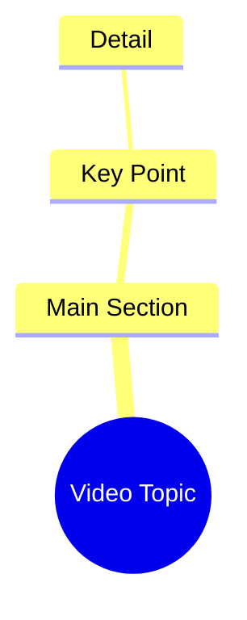

# Woman Says She Wants a Long Hug in Hindi Reel

> 🌐 **Read this in:** [English](../../en/2026-09/tiktok-transcript-1m-views-37k-reactions-facebookreels-viralreels-trendingreel-9d27.md) · **中文**

> **Creator:** [@Deepika](https://www.tiktok.com/@Deepika) · **Views:** 388.8K · **Posted:** 2026-09-28 · **Niche:** entertainment
>
> **TL;DR:** The hook directly expresses a desire for a hug, creating an immediate emotional connection with the viewer.

[Watch original video →](https://www.facebook.com/share/r/1FDrr4KSva/)

## Why This Went Viral

## 钩子（前3秒）
- 开场白逐字引用：“ओए मुझे तुमसे गले मिलना है और बहुत देर तक गले मिलना है”（“嘿，我想拥抱你，而且想拥抱很久很久”）
- 钩子模式：**直接称呼 + 情感告白**（第二人称“你” + 脆弱的渴望）
- 为什么能让人停下滑动：它直接对观众说话，仿佛观众就是被倾诉的对象，瞬间触发准社交/浪漫反射——大脑将其视为私人信息而非内容，因此拇指在理性大脑反应过来之前就停住了。

## 情感节奏
- **节拍1 – 亲密告白（0–3秒）：** 直白地表达渴望（“我想拥抱你很久很久”）→ 好奇 + 温暖。
- **节拍2 – 条件式邀请（3–6秒）：** “अगर तुम भी मिलना चाहते हो तो कमेंट करके बताओ”（“如果你也想见面，就评论告诉我”）→ 紧张感 + 主动权交给观众。
- **节拍3 – 开放循环/未解决的结尾：** 没有展示回报——拥抱从未在屏幕上发生 → 悬念无限期保持。
- **高潮时刻：** 转折词“अगर”（“如果”）——视频从单向告白转变为双向交易的确切一秒，将情感转化为行动要求。

## 关键词密度
- **गले मिलना / मिलना**（“拥抱”/“见面”）——重复3次；核心情感牵引力，锚定幻想。
- **बहुत देर तक**（“很久很久”）——增强渴望的强化词；情感牵引力。
- **तुम / तुम भी**（“你”/“你也”）——第二人称称呼；驱动准社交互动。
- **कमेंट करके बताओ**（“评论告诉我”）——算法触达驱动（明确的行动号召）。
- **चाहते हो**（“你想要吗”）——互惠触发器；将被动观看转化为评论。
- **ओए**（“嘿”）——非正式亲密标记；表示亲近而非正式。

算法触达：“कमेंट करके बताओ” + “तुम”（评论速度 + 回复诱饵）。情感牵引力：“गले मिलना” + “बहुत देर तक”（未满足的渴望）。

## 为什么它会传播
- **评论诱饵互惠：** “अगर तुम भी मिलना चाहते हो तो कमेंट करके बताओ”将每个观众变成潜在回应者——评论爆发，因为回应感觉像是在接受告白，而不是在留言。
- **准社交第二人称框架：** “मुझे तुमसे गले मिलना है”让创作者成为说话者，观众成为被爱者——每个观众都感觉被个人选中，因此他们分享它来向别人传递同样的感受。
- **未解决的情感循环：** 拥抱被承诺但从未在屏幕上兑现（“बहुत देर तक गले मिलना है”始终是一个愿望），迫使重复观看和“完成”这一刻的合拍/拼接。
- **低投入、高情感格式：** 一句话，一个请求——可即时混搭，因此其他人用自己面孔/声音复制模板，使趋势倍增。
- **普遍渴望触发器：** 这句话适用于浪漫、柏拉图式或怀旧语境，因此无需改动一个字就能跨越受众群体。

## 你可以借鉴什么
1. **以第二人称告白开场，而非推销。** 称呼“你”并在前3秒陈述一个渴望——它读起来像私人信息，胜过任何“大家好”的开场。
2. **将情感转化为一步行动号召。** 将感受与单一、低摩擦的行动配对（“评论告诉我”）——驱动回复的是互惠，而非指令。
3. **将回报留在屏幕之外。** 承诺拥抱、答案、揭晓——但不要展示它。未解决的循环才是推动评论、重复观看和混搭的动力。

## Mind Map

## Full Transcript (Generated by [TokTranscript 转录工具](https://toktranscript.com/?utm_source=github&utm_medium=breakdown&utm_campaign=tool_attribution))

> 📝 Transcripts on this page are auto-generated and show the first 60%. Want to transcribe any TikTok in 30 seconds and get the full version? [Try TokTranscript free →](https://toktranscript.com/?utm_source=github&utm_medium=breakdown&utm_campaign=transcript_cta)

ओए मुझे तुमसे गले मिलना है और बहुत देर तक गले मिलना है अगर 

*[Read the full transcript on TokTranscript →](https://toktranscript.com/plaza/tiktok-transcript-1m-views-37k-reactions-facebookreels-viralreels-trendingreel-9d27?utm_source=github&utm_medium=breakdown&utm_campaign=transcript_full)*

## Browse More

- All [entertainment](../../by-niche/zh-CN/entertainment.md) breakdowns
- All [Direct Emotional Request](../../by-pattern/zh-CN/hook-direct-emotional-request.md) examples

## Video Info

| | |
|---|---|
| Creator | [@Deepika](https://www.tiktok.com/@Deepika) |
| Original video | [https://www.facebook.com/share/r/1FDrr4KSva/](https://www.facebook.com/share/r/1FDrr4KSva/) |
| Original title | 1M views · 37K reactions | “मुझे तुमसे गले मिलना है… बहुत देर तक ❤️🥰” #FacebookReels #ViralReels #TrendingReels | Deepika |
| Views | 388.8K (388765) |
| Posted | 2026-09-28 |
| Duration | 0s |
| Niche | `entertainment` |
| Hook pattern | `Direct Emotional Request` |
| Original language | `en` (this page translated by AI) |
| Available languages | en, zh-CN |
| Generated | 2026-09-29 by [TokTranscript](https://toktranscript.com/) |

---

*This breakdown is for educational analysis under fair use. Original video © [@Deepika](https://www.tiktok.com/@Deepika). All transcripts are auto-generated and may contain errors.*

*Want to analyze your own TikToks like this? [TokTranscript →](https://toktranscript.com/viral-breakdown?utm_source=github&utm_medium=breakdown&utm_campaign=footer_cta)*