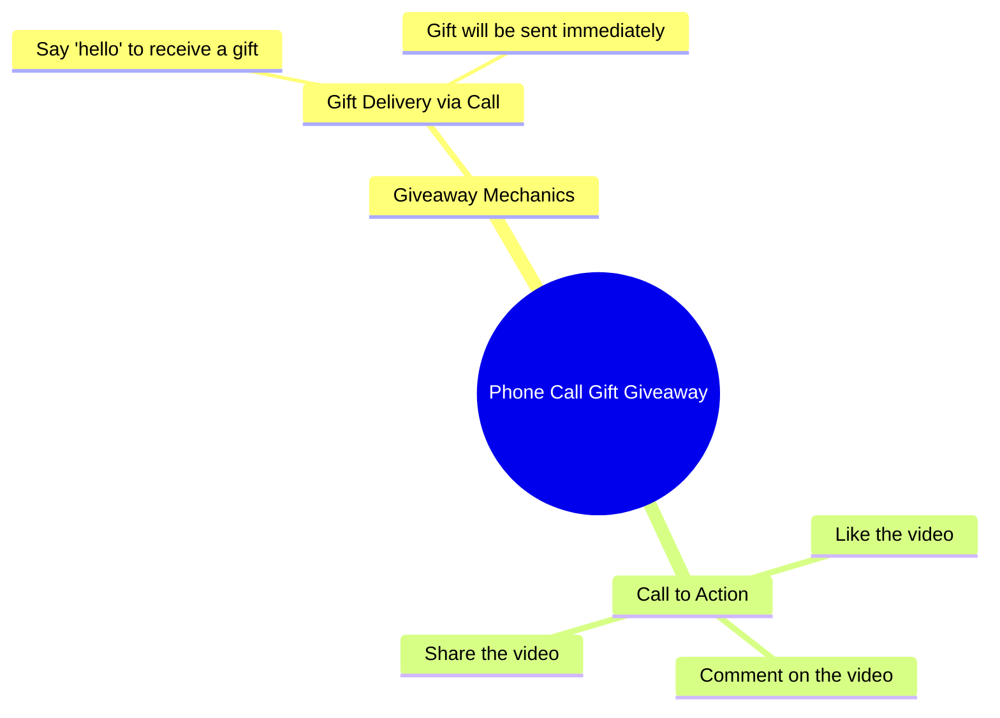

# Alawi Family Gift Giveaway via Call for Commenters

> 🌐 **Read this in:** [English](../../en/2026-09/tiktok-transcript-2-4m-views-150k-reactions-comment-nyo-na-mga-boss-baka-sa-in-24fb.md) · **中文**

> **Creator:** [@𝗔𝗟𝗮𝘄𝗶 𝗙𝗮𝗺𝗶𝗹𝗹𝘆'](https://www.tiktok.com/@𝗔𝗟𝗮𝘄𝗶 𝗙𝗮𝗺𝗶𝗹𝗹𝘆') · **Views:** 938.8K · **Posted:** 2026-09-13 · **Niche:** entertainment
>
> **TL;DR:** It immediately offers a free gift via a simple phone call, creating curiosity and a clear incentive to keep watching.

[Watch original video →](https://www.facebook.com/share/r/19DFFehRRQ/?mibextid=wwXIfr)

## Why This Went Viral

## 钩子（前3秒）
- 逐字开场白：“Padadalhan kita ng regalo sa pamamagitan ng tawag.”（“我会通过一通电话送你一份礼物。”）
- 钩子模式：**大胆承诺 / 条件式赠礼**——直接以第二人称给出奖励。
- 为什么能让人停下滚动：它瞬间制造了一个“这可能是给我的”的自我利益循环，以及一个好奇心缺口（什么礼物？什么电话？）。承诺具体但未解释，所以观众会等待揭晓。

## 情绪节奏
- 节拍1——**好奇/期待**：“Padadalhan kita ng regalo...”设定了一个没有细节的奖励。
- 节拍2——**降低门槛/放松**：“Sabihin mo lang ang hello”让参与变得毫不费力。
- 节拍3——**安心/释放紧张**：“talagang makakatanggap ka ng regalo”确认了承诺并消除疑虑。
- 节拍4——**行动/收尾**：“Sige, ipapadala ko na sa iyo”表示礼物现在就要送出。
- 节拍5——**CTA飙升**：“i-like, i-comment at i-share”把情绪转化为平台行为。
- 高潮时刻：“talagang makakatanggap ka ng regalo”——最强的情绪峰值，因为它验证了观众的希望。

## 关键词密度
- regalo（礼物）——主要情绪拉力，也是继续观看的理由。
- tawag（电话）——制造神秘机制；驱动好奇心。
- hello——低门槛行动提示；让参与显得容易。
- makakatanggap（将会收到）——承诺/利益语言；强化奖励。
- ipapadala（将会发送）——即时回报语言；降低怀疑。
- i-like, i-comment, i-share——算法触达驱动因素；明确的互动指令。
- Sige（好/来吧）——对话推进词；保持语气随意且有紧迫感。

算法触达关键词：like、comment、share。情绪拉力关键词：regalo、makakatanggap、ipapadala。

## 为什么它会传播
- **直接的第二人称承诺**——“Padadalhan kita ng regalo”让每个观众都感觉被单独点名，这会提高观看时长和评论意愿。
- **低门槛参与触发**——“Sabihin mo lang ang hello”降低了互动门槛，所以评论会用一个词大量涌入。
- **未解决的好奇心缺口**——视频从不解释礼物或电话，所以观众会重看、留言提问并分享以求弄明白。
- **明确的互动指令**——“i-like, i-comment at i-share”告诉观众具体该做什么，把被动观看者转化为传播者。
- **奖励框架 + 紧迫感**——“ipapadala ko na sa iyo”暗示礼物现在就在发生，这会施压让人立即行动并分享。

## 你可以借鉴什么
- **用直接的第二人称承诺开场**，点明一个具体奖励但保留细节——这会瞬间制造好奇心缺口。
- **让参与步骤简单到离谱**——一个词、一次点击、一条评论——这样互动会显得毫不费力，并能规模化发生。
- **以清晰、叠加的CTA收尾**——like、comment、share——用与视频其余部分相同的语气自然说出，这样它不会像广告插播。

## Mind Map

## Full Transcript (Generated by [TokTranscript](https://toktranscript.com/?utm_source=github&utm_medium=breakdown&utm_campaign=tool_attribution))

> 📝 Transcripts on this page are auto-generated and show the first 60%. Want to transcribe any TikTok in 30 seconds and get the full version? [Try TokTranscript free →](https://toktranscript.com/?utm_source=github&utm_medium=breakdown&utm_campaign=transcript_cta)

Padadalhan kita ng regalo sa pamamagitan ng tawag. Sabihin mo lang ang hello ha, talagang makakatanggap ka ng regalo. Sige, ip

*[Read the full transcript on TokTranscript →](https://toktranscript.com/plaza/tiktok-transcript-2-4m-views-150k-reactions-comment-nyo-na-mga-boss-baka-sa-in-24fb?utm_source=github&utm_medium=breakdown&utm_campaign=transcript_full)*

## Browse More

- All [entertainment](../../by-niche/zh-CN/entertainment.md) breakdowns
- All [Direct Promise](../../by-pattern/zh-CN/hook-direct-promise.md) examples

## Video Info

| | |
|---|---|
| Creator | [@𝗔𝗟𝗮𝘄𝗶 𝗙𝗮𝗺𝗶𝗹𝗹𝘆'](https://www.tiktok.com/@𝗔𝗟𝗮𝘄𝗶 𝗙𝗮𝗺𝗶𝗹𝗹𝘆') |
| Original video | [https://www.facebook.com/share/r/19DFFehRRQ/?mibextid=wwXIfr](https://www.facebook.com/share/r/19DFFehRRQ/?mibextid=wwXIfr) |
| Original title | 2.4M views · 150K reactions | Comment nyo na mga boss baka sa inyo na sunod! #ivanaalawi #monaalawi #ivanaalawireall #laptopwarehouse #lapag #dailyvlog #laptop #bossa #BossA #Pamorma #CrisHippers #Kuyamoboss #fistbump #TisayShin #filipina #iphone #pera | 𝗔𝗟𝗮𝘄𝗶 𝗙𝗮𝗺𝗶𝗹𝗹𝘆' |
| Views | 938.8K (938759) |
| Posted | 2026-09-13 |
| Duration | 0s |
| Niche | `entertainment` |
| Hook pattern | `Direct Promise` |
| Original language | `en` (this page translated by AI) |
| Available languages | en, zh-CN |
| Generated | 2026-09-16 by [TokTranscript](https://toktranscript.com/) |

---

*This breakdown is for educational analysis under fair use. Original video © [@𝗔𝗟𝗮𝘄𝗶 𝗙𝗮𝗺𝗶𝗹𝗹𝘆'](https://www.tiktok.com/@𝗔𝗟𝗮𝘄𝗶 𝗙𝗮𝗺𝗶𝗹𝗹𝘆'). All transcripts are auto-generated and may contain errors.*

*Want to analyze your own TikToks like this? [TokTranscript →](https://toktranscript.com/viral-breakdown?utm_source=github&utm_medium=breakdown&utm_campaign=footer_cta)*