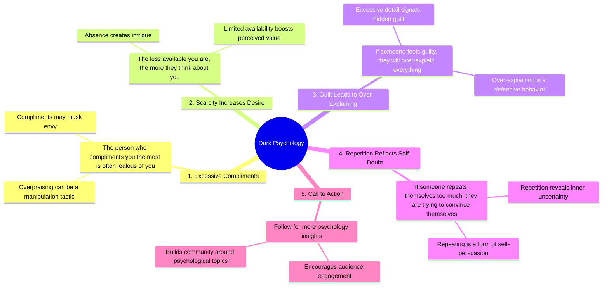

# Dark Psychology Facts: Over-Explaining Signals Guilt

> 🌐 **Read this in:** [English](../../en/2026-09/tiktok-transcript-2-4m-views-53k-reactions-read-3-again-darkpsychology-psychol-12d9.md) · **中文**

> **Creator:** [@PsychSora](https://www.tiktok.com/@PsychSora) · **Views:** 1.1M · **Posted:** 2026-09-07 · **Niche:** entertainment
>
> **TL;DR:** Immediately challenges a common belief, creating curiosity and a sense of insider knowledge.

[Watch original video →](https://www.facebook.com/share/r/1GJyJgALQu/)

## Why This Went Viral

## Hook（前3秒）
- **逐字内容：** 开场白是“黑暗心理学。”紧接着是“第一，最常赞美你的人往往嫉妒你。”
- **钩子模式类型：** **大胆断言 + 清单模式**（一种伪装成编号规则的挑衅性陈述）。
- **为何能让观众停止滑动：** “黑暗心理学”一词暗示着禁忌或内部知识。第一个断言（“最常赞美你的人往往嫉妒你”）是对社会规范的直接、愤世嫉俗的反驳——它瞬间制造了认知失调。观众会停下来验证这是否适用于自己的人际关系。

## 情绪节奏
- **节拍1 — 好奇（0–1秒）：** “黑暗心理学”设定了一种神秘、略带禁忌的基调。
- **节拍2 — 震惊/认同（1–3秒）：** 断言#1将积极行为（赞美）翻转成消极动机（嫉妒）。这触发了“等等，这是真的吗？”的反应。
- **节拍3 — 紧张（3–6秒）：** 断言#2和#3（“不那么可得”和“内疚→过度解释”）升级了操控性框架，让观众感到略微被揭露或得到验证。
- **节拍4 — 自我反思（6–8秒）：** 断言#4（“重复自己→说服自己”）落地为一种微妙的指责。观众可能会在内心审视自己的说话模式。
- **节拍5 — 行动号召/收尾（8–10秒）：** “如果你喜欢心理学，关注。”这是一个温和的、建立社群的结尾，将好奇心转化为关注，而非硬性推销。
- **高潮时刻：** 断言#4（“如果一个人过度重复自己，他们是在试图说服自己”）——这是最具个人侵入性的观点，让观众感到被“看穿”或被抓住。

## 关键词密度
1. **“第一/第二/第三/第四”** — 结构性重复，创造节奏感并暗示一个有限、易于消化的清单。
2. **“你/你的”** — 直接称呼，使每个断言都个性化。
3. **“他们/他们”** — 制造“我们vs.他们”的动态（观众vs.操控者）。
4. **“心理学”** — 核心关键词；推动算法触达，因为它是高搜索量、常青话题。
5. **“赞美”/“嫉妒”** — 触发社会比较的情绪化词汇。
6. **“可得”** — 与约会/依恋理论相关，这是一个参与度极高的大众细分领域。
7. **“内疚”/“说服”** — 驱动评论的负面情绪触发器（人们争论或赞同）。

**算法触达驱动因素：** “心理学”、“黑暗”、“关注”——这些是可搜索且符合潮流的。
**情绪拉动驱动因素：** “嫉妒”、“内疚”、“说服”——这些激发诸如“这太真实了”或“这是有毒的建议”之类的评论。

## 为何能传播
- **通过矛盾引发评论：** 这些断言是绝对且愤世嫉俗的。观众要么评论“这太准确了”，要么评论“这是操控性的垃圾”——两者都能推动参与度。文字记录中的“第一”一行是主要触发器。
- **自我指涉陷阱：** 断言#4（“重复自己→说服自己”）让重看或分享视频的观众质疑自己的动机——一个让他们更长时间保持参与的元循环。
- **通过清单格式制造错失恐惧：** 编号结构（“第一……第二……第三……”）承诺一个完整集合。观众必须看到最后才能获得所有规则，而“再读一遍”一行（在#3之后）强制重读，增加观看时长。
- **小众+普适重叠：** “黑暗心理学”是小众兴趣，但例子（赞美、可得性、内疚）是普适的社交情境。这使得视频能够在心理学、约会和自我提升受众之间交叉传播。
- **低投入、高实用性的保存：** 内容具有清单式且可参考的特点。观众保存它以“以后”用于朋友或伴侣，这向算法发出信号表明它是有价值的。

## 你可以借鉴什么
- **以禁忌或反直觉的断言开头，而非提问。** “黑暗心理学”+具体指控优于“你知道为什么人们赞美你吗？”因为它宣示权威并立即制造失调感。
- **使用编号微规则强制看完。** 即使你只有4个要点，编号也会制造“必须看完清单”的强迫感。在中间添加“再读一遍”或“保存这个”以人为提升观看时长。
- **以细分领域特定的关注号召结尾，而非通用版本。** “如果你喜欢心理学，关注”是有针对性的。将“关注获取更多”替换为“如果你喜欢[你的细分领域]，关注”——它能精确筛选出算法想要推送你内容的目标受众。

## Mind Map

## Full Transcript (Generated by [免费 TikTok 文稿生成器](https://toktranscript.com/?utm_source=github&utm_medium=breakdown&utm_campaign=tool_attribution))

> 📝 Transcripts on this page are auto-generated and show the first 60%. Want to transcribe any TikTok in 30 seconds and get the full version? [Try TokTranscript free →](https://toktranscript.com/?utm_source=github&utm_medium=breakdown&utm_campaign=transcript_cta)

Dark psychology. Number one, the person who compliments you the most is often jealous of you. Number two, the less available you are, the more they think about you. Number three, if someone feels guilty, they will over-explain every

*[Read the full transcript on TokTranscript →](https://toktranscript.com/plaza/tiktok-transcript-2-4m-views-53k-reactions-read-3-again-darkpsychology-psychol-12d9?utm_source=github&utm_medium=breakdown&utm_campaign=transcript_full)*

## Browse More

- All [entertainment](../../by-niche/zh-CN/entertainment.md) breakdowns
- All [Contrarian listicle](../../by-pattern/zh-CN/hook-contrarian-listicle.md) examples

## Video Info

| | |
|---|---|
| Creator | [@PsychSora](https://www.tiktok.com/@PsychSora) |
| Original video | [https://www.facebook.com/share/r/1GJyJgALQu/](https://www.facebook.com/share/r/1GJyJgALQu/) |
| Original title | 2.4M views · 53K reactions | Read #3 again. #DarkPsychology #PsychologyFacts #HumanBehavior #mindset #shorts | PsychSora |
| Views | 1.1M (1071696) |
| Posted | 2026-09-07 |
| Duration | 0s |
| Niche | `entertainment` |
| Hook pattern | `Contrarian listicle` |
| Original language | `en` (this page translated by AI) |
| Available languages | en, zh-CN |
| Generated | 2026-09-08 by [TokTranscript](https://toktranscript.com/) |

---

*This breakdown is for educational analysis under fair use. Original video © [@PsychSora](https://www.tiktok.com/@PsychSora). All transcripts are auto-generated and may contain errors.*

*Want to analyze your own TikToks like this? [拆解你自己的 TikTok →](https://toktranscript.com/viral-breakdown?utm_source=github&utm_medium=breakdown&utm_campaign=footer_cta)*